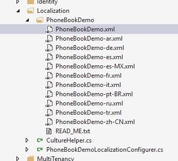
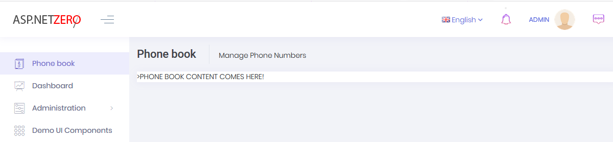
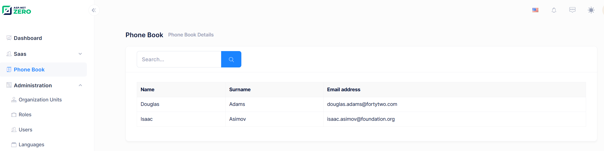
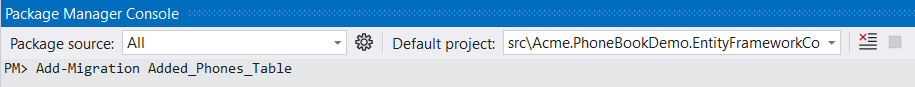

### Introduction

In this document, we will create a sample **phonebook application**
based on ASP.NET Zero (ASP.NET Core version) step by step. After all
steps, we will have a multi-tenant, localized, authorized, configurable,
testable... application.

### Creating The Project

We're creating and downloading the solution named
"**Acme.PhoneBookDemo**" as described in [Getting
Started](Getting-Started.md) document. After opening solution in
Visual Studio, we see an NLayered solution that consists of eight
projects:

Also, run database migrations, create the database and login to the
application as described in [Getting Started](Getting-Started.md)
document. After all completed and logged in to the application, we see a
dashboard as shown below:

Logout from the application for now. We will make our application
**single-tenant** (we will convert it to multi-tenant later). So, we
open PhoneBookDemoConsts class in the Acme.PhoneBookDemo.Core project
and disable multi-tenancy as shown below:

    public class PhoneBookDemoConsts
    {
        public const string LocalizationSourceName = "PhoneBookDemo";

        public const string ConnectionStringName = "Default";

        public const bool MultiTenancyEnabled = false;

        public const int PaymentCacheDurationInMinutes = 30;
    }

### Adding a New Page

Let's begin from UI and create a new page named "**Phone book**".

#### Defining a menu item

**AppNavigationProvider** class defines menus in the application. When
we change this class, menus are automatically changed. Open this class
and create new menu item as shown below (You can add it right after the
dashboard menu item).

    .AddItem(new MenuItemDefinition(
        AppPageNames.Tenant.PhoneBook,
        L("PhoneBook"),
        url: "App/PhoneBook",
        icon: "glyphicon glyphicon-book"
        )
    )

Every menu item must have a **unique name** to identify this menu item.
Menu names are defined in AppPageNames class as constants. We add a new
constant: "**PhoneBook**".

#### Localizing Menu Item Display Name

A menu item should also have a **localizable shown name**. It's used to
display menu item on the page. **L("PhoneBook")** is the localized name of
our new menu. **L** method is a helper method gets a localization key
and simply returns a **LocalizableString** object (see
AppNavigationProvider class).

Localization strings are defined in **XML** files in **.Core** project
as shown below:

Open PhoneBook.xml (the **default**, **English** localization
dictionary) and add the following line:

    <text name="PhoneBook">Phone book</text>

If we don't define "PhoneBook"s value for other localization
dictionaries, default value is shown in all languages. We can define it
also for Turkish in PhoneBook-tr.xml file:

    <text name="PhoneBook">Telefon Rehberi</text>

#### Other menu item properties

**url** can be a URL (it's URL of an **MVC Action** here) that will be
redirected when we click the menu item.

Lastly, **icon** is the shown menu icon for new menu item. It can be a
**css** class. We can use Glyphicon, Font-Awesome or another css font
library here.

See [navigation
document](https://aspnetboilerplate.com/Pages/Documents/Navigation) for
more information on menu definitions.

### Creating the Page

After creating the menu item, we can create an empty page.

#### Controller

Creating the **PhoneBookController** under **Areas/App/Controllers**
folder in the Web project:

    [Area("App")]
    public class PhoneBookController : PhoneBookDemoControllerBase
    {
        public ActionResult Index()
        {
            return View();
        }
    }

We inherited from **PhoneBookDemoControllerBase** (will be
*YourProjectName*ControllerBase for your projects) instead of MVC's
standard Controller class. While it will work if we derive from the
standard Controller, PhoneBookDemoControllerBase provides very useful
base properties and methods. So, always inherit from this class unless
it has a disadvantage for your case.

#### View

Creating an empty view, **Index.cshtml** under
**Areas/App/Views/PhoneBook** folder:

    @using System.Threading.Tasks
    @using Acme.PhoneBookDemo.Web.Areas.App.Startup

    @{
    ViewBag.CurrentPageName = AppPageNames.Tenant.PhoneBook;
    }

    

        

            

                <h3 class="m-subheader__title m-subheader__title--separator">
                    @L("PhoneBook")
                </h3>
                
                    @L("PhoneBookInfo")
                
            

        

    

    

        
PHONE BOOK CONTENT COMES HERE!

    

We set ViewBag.CurrentPageName to the current page's name to
automatically highlight the related menu item when this page is active.
Now, it's time to run application and see the new phone book page:

Menu item display name and page title are localized. Try to change UI
language to see difference.

### Creating Person Entity

We define entities in **.Core** (domain) project. We can define a
**Person** entity (mapped to **PbPersons** table in database) to
represent a person in phone book as shown below:

    [Table("PbPersons")]
    public class Person : FullAuditedEntity
    {
        [Required]
        [MaxLength(PersonConsts.MaxNameLength)]
        public virtual string Name { get; set; }

        [Required]
        [MaxLength(PersonConsts.MaxSurnameLength)]
        public virtual string Surname { get; set; }

        [MaxLength(PersonConsts.MaxEmailAddressLength)]
        public virtual string EmailAddress { get; set; }
    }

Person's **primary key** type is **int** (as default). It inherits
**FullAuditedEntity** that contains **creation**, **modification** and
**deletion** audit properties. It's also **soft-delete**. When we delete
a person, it's not deleted by database but marked as deleted (see
[entity](https://aspnetboilerplate.com/Pages/Documents/Entities) and
[data
filters](https://aspnetboilerplate.com/Pages/Documents/Data-Filters)
documentations for more information). We created **PersonConsts** in
**Core.Shared** project for **MaxLength** properties. This is a good
practice since we will use same values later.

    public class PersonConsts
    {
        public const int MaxNameLength = 32;
        public const int MaxSurnameLength = 32;
        public const int MaxEmailAddressLength = 255;
    }

We add a DbSet property for Person entity to **PhoneBookDemoDbContext**
class defined in **.EntityFrameworkCore** project.

    public class PhoneBookDemoDbContext : AbpZeroDbContext<Tenant, Role, User>
    {
        public virtual DbSet<Person> Persons { get; set; }

        //...other entities

        public PhoneBookDemoDbContext()
            : base("Default")
        {

        }

        //...other codes
    }

### Database Migrations

We use **EntityFramework Code-First migrations** to migrate database
schema. Since we added **Person entity**, our DbContext model is
changed. So, we should create a **new migration** to create the new
table in the database.

Open **Package Manager Console**, run the **Add-Migration
"Added\_Persons\_Table"** command as shown below:

This command will add a **migration class** named
"**Added\_Persons\_Table**" as shown below:

    public partial class Added_Persons_Table : Migration
    {
        protected override void Up(MigrationBuilder migrationBuilder)
        {
            migrationBuilder.CreateTable(
                name: "PbPersons",
                columns: table => new
                {
                    Id = table.Column(nullable: false)
                        .Annotation("SqlServer:ValueGenerationStrategy", SqlServerValueGenerationStrategy.IdentityColumn),
                    CreationTime = table.Column(nullable: false),
                    CreatorUserId = table.Column(nullable: true),
                    DeleterUserId = table.Column(nullable: true),
                    DeletionTime = table.Column(nullable: true),
                    EmailAddress = table.Column(maxLength: 255, nullable: true),
                    IsDeleted = table.Column(nullable: false),
                    LastModificationTime = table.Column(nullable: true),
                    LastModifierUserId = table.Column(nullable: true),
                    Name = table.Column(maxLength: 32, nullable: false),
                    Surname = table.Column(maxLength: 32, nullable: false)
                },
                constraints: table =>
                {
                    table.PrimaryKey("PK_PbPersons", x => x.Id);
                });
        }

        protected override void Down(MigrationBuilder migrationBuilder)
        {
            migrationBuilder.DropTable(
                name: "PbPersons");
        }
    }

We don't have to know so much about format and rules of this file. But,
it's suggested to have a basic understanding of migrations. In the same
Package Manager Console, we write **Update-Database** command in order
to apply the new migration to database. After updating, we can see that
**PbPersons table** is added to database.

But this new table is empty. In ASP.NET Zero, there are some classes to
fill initial data for users and settings:

So, we can add a separated class to fill some people to database as
shown below:

    namespace Acme.PhoneBookDemo.Migrations.Seed.Host
    {
        public class InitialPeopleCreator
        {
            private readonly PhoneBookDemoDbContext _context;

            public InitialPeopleCreator(PhoneBookDemoDbContext context)
            {
                _context = context;
            }

            public void Create()
            {
                var douglas = _context.Persons.FirstOrDefault(p => p.EmailAddress == "douglas.adams@fortytwo.com");
                if (douglas == null)
                {
                    _context.Persons.Add(
                        new Person
                        {
                            Name = "Douglas",
                            Surname = "Adams",
                            EmailAddress = "douglas.adams@fortytwo.com"
                        });
                }

                var asimov = _context.Persons.FirstOrDefault(p => p.EmailAddress == "isaac.asimov@foundation.org");
                if (asimov == null)
                {
                    _context.Persons.Add(
                        new Person
                        {
                            Name = "Isaac",
                            Surname = "Asimov",
                            EmailAddress = "isaac.asimov@foundation.org"
                        });
                }
            }
        }
    }

These type of default data is good since we can also use these data in
**unit tests**. Surely, we should be careful about seed data since this
code will always be executed in each **PostInitialize** of your
PhoneBookEntityFrameworkCoreModule. This class (InitialPeopleCreator) is
created and called in **InitialHostDbBuilder** class. This is not so
important, just for a good code organization (see source codes).

    public class InitialHostDbBuilder
    {
        //existing codes...

        public void Create()
        {
            //existing codes...
            new InitialPeopleCreator(_context).Create();

            _context.SaveChanges();
        }
    }

We run our project again, it runs seed and adds two people to PbPersons
table:

### Creating Person Application Service

An Application Service is used from client (presentation layer) to
perform operations (use cases) in the application.

Application services are located in **.Application** project and their
interfaces are located in **Application.Shared** project. We create
first application service to get people from server. We're creating an
**interface** to define the person application service (while this
interface is optional, we suggest you to create it):

    public interface IPersonAppService : IApplicationService
    {
        ListResultDto<PersonListDto> GetPeople(GetPeopleInput input);
    }

An application service method gets/returns **DTO**s. We Place them in
**Application.Shared** project. **ListResultDto** is a pre-build helper
DTO to return a list of another DTO. **GetPeopleInput** is a DTO to pass
request parameters to **GetPeople** method. So, GetPeopleIntput and
PersonListDto are defined as shown below:

    public class GetPeopleInput
    {
        public string Filter { get; set; }
    }

    public class PersonListDto : FullAuditedEntityDto
    {
        public string Name { get; set; }

        public string Surname { get; set; }

        public string EmailAddress { get; set; }
    }

**CustomDtoMapper.cs** is used to create mapping from **Person** to
**PersonListDto**. **FullAuditedEntityDto** is inherited to
implement audit properties automatically. See [application
service](https://aspnetboilerplate.com/Pages/Documents/Application-Services)
and
[DTO](https://aspnetboilerplate.com/Pages/Documents/Data-Transfer-Objects)
documentations for more information. We are adding the following mappings.

    ...
    // PhoneBook (we will comment out other lines when the new DTOs are added)
    configuration.CreateMap<Person, PersonListDto>();
    //configuration.CreateMap<AddPhoneInput, Phone>();
    //configuration.CreateMap<CreatePersonInput, Person>();
    //configuration.CreateMap<Person, GetPersonForEditOutput>();
    //configuration.CreateMap<Phone, PhoneInPersonListDto>();

After defining interface, we can implement it as shown below:

    public class PersonAppService : PhoneBookDemoAppServiceBase, IPersonAppService
    {
        private readonly IRepository<Person> _personRepository;

        public PersonAppService(IRepository<Person> personRepository)
        {
            _personRepository = personRepository;
        }

        public ListResultDto<PersonListDto> GetPeople(GetPeopleInput input)
        {
            var persons = _personRepository
                .GetAll()
                .WhereIf(
                    !input.Filter.IsNullOrEmpty(),
                    p => p.Name.Contains(input.Filter) ||
                            p.Surname.Contains(input.Filter) ||
                            p.EmailAddress.Contains(input.Filter)
                )
                .OrderBy(p => p.Name)
                .ThenBy(p => p.Surname)
                .ToList();

            return new ListResultDto<PersonListDto>(ObjectMapper.Map<List<PersonListDto>>(persons));
        }
    }

We're injecting **person repository** (it's automatically created by
ABP) and using it to filter and get people from database.

**WhereIf** is an extension method here (defined in Abp.Linq.Extensions
namespace). It performs Where condition, only if filter is not null or
empty. **IsNullOrEmpty** is also an extension method (defined in
Abp.Extensions namespace). ABP has many similar shortcut extension
methods. **ObjectMapper.Map** method automatically converts list of
Person entities to list of PersonListDto objects with using
configurations in **CustomDtoMapper.cs** in **.Application** project.

#### Connection & Transaction Management

We don't manually open database connection or start/commit transactions
manually. It's automatically done with ABP framework's Unit Of Work
system. See [UOW
documentation](https://aspnetboilerplate.com/Pages/Documents/Unit-Of-Work)
for more.

#### Exception Handling

We don't handle exceptions manually (using a try-catch block). Because
ABP framework automatically handles all exceptions on the web layer and
returns appropriate error messages to the client. It then handles errors
on the client and shows needed error information to the user. See
[exception handling
document](https://aspnetboilerplate.com/Pages/Documents/Handling-Exceptions)
for more.

### Creating Unit Tests For PersonAppService

You can skip this section if you don't interest in **automated
testing**.

By writing unit test, we can test **PersonAppService.GetPeople** method
without creating a user interface that calls it and shows people on the
screen.

We write unit test in .**Tests** project in the solution. Let's create
first test to verify getting people without any filter:

    public class PersonAppService_Tests : AppTestBase
    {
        private readonly IPersonAppService _personAppService;

        public PersonAppService_Tests()
        {
            _personAppService = Resolve<IPersonAppService>();
        }

        [Fact]
        public void Should_Get_All_People_Without_Any_Filter()
        {
            //Act
            var persons = _personAppService.GetPeople(new GetPeopleInput());

            //Assert
            persons.Items.Count.ShouldBe(2);
        }
    }

We derived test class from **AppTestBase**. AppTestBase class
initializes all system, creates an in-memory fake database, seeds
initial data (that we created before) to database and logins to
application as admin. So, this is actually an **integration test** since
it tests all server-side codes from entity framework mapping to
application services, validation and authorization.

In constructor, we get (resolve) an **IPersonAppService** from
**dependency injection** container. It creates the **PersonAppService**
class with all dependencies. Then we can use it in test methods.

Since we're using [xUnit](http://xunit.github.io/), we add **Fact**
attribute to each test method. In the test method, we called
**GetPeople** method and checked if there are **two people** in the
returned list as we know that there were 2 people in **initial**
database.

Let's run the **all unit tests** in Test Explorer and see if it works:

As you see, it worked **successfully**. Now, we know that
PersonAppService works properly without any filter. Let's add a new unit
test to get filtered people:

    [Fact]
    public void Should_Get_People_With_Filter()
    {
        //Act
        var persons = _personAppService.GetPeople(
            new GetPeopleInput
            {
                Filter = "adams"
            });

        //Assert
        persons.Items.Count.ShouldBe(1);
        persons.Items[0].Name.ShouldBe("Douglas");
        persons.Items[0].Surname.ShouldBe("Adams");
    }

Again, since we know initial database, we can check returned results
easily. Here, initial test data is important. When we change initial
data, our test may fail even if our services are correct. So, it's
better to write unit tests independent of initial data as much as
possible. We could check incoming data to see if every people contains
"adams" in his/her name, surname or email. Thus, if we add new people to
initial data, our tests remain working.

There are many techniques on unit testing, I kept it simple here. But
ASP.NET Zero template makes very easy to write unit and integration
tests by base classes and pre-build test codes.

### Testing PersonAppService From Browser Console

Now, lets run and **login** to the application again, open Chrome
Developer Console (or similar tools in other browsers) and write the
following command:

This command performs an **AJAX** call to PersonAppService.**GetPeople**
method. We can see the request if we open **Network** tab:

As we see, an AJAX request made and people are got successfully.

So, how this happen? How we could make a call to a C\# class method
(notice that it's not an MVC Controller, just a plain C\# class) from
javascript like calling a javascript method? This is provided by ASP.NET
Boilerplate. See [AspNet
Core](https://aspnetboilerplate.com/Pages/Documents/AspNet-Core#application-services-as-controllers)
documentation for more information. You can always call application
services from console to debug or see returned JSON structure.

We can also check Audit Logs to see the request. Open **AbpAuditLogs**
table in PhoneBook database to see the call information:

There are some other fields not shown here. So, we see that User with
Id=2 called GetPeople method of the PersonAppService in recorded time
with the shown parameters and it's executed in 134 ms.

### Using GetPeople Method From MVC Controller

It's time to open **PhoneBookController** and get people to show on the
view:

    [Area("App")]
    public class PhoneBookController : PhoneBookDemoControllerBase
    {
        private readonly IPersonAppService _personAppService;

        public PhoneBookController(IPersonAppService personAppService)
        {
            _personAppService = personAppService;
        }

        public ActionResult Index(GetPeopleInput input)
        {
            var output = _personAppService.GetPeople(input);
            var model = new IndexViewModel(output);

            return View(model);
        }
    }

We inject **IPersonAppService** and call its **GetPeople** method
(which is created and tested before) to get list of people. Then we
created a ViewModel object and passes to the view. Let's see the
**IndexViewModel** class:

    [AutoMapFrom(typeof(ListResultDto<PersonListDto>))]
    public class IndexViewModel : ListResultDto<PersonListDto>
    {
        public IndexViewModel(ListResultDto<PersonListDto> output)
        {
            output.MapTo(this);
        }
    }

Here, we're extending the output of the PersonAppService.GetPeople method.
We get the output from the constructor and map it to this object.

#### Application Services and ViewModels

We created an **Application Service** (PersonAppService) and used it
from the **Controller**. Instead, we could access **Repository**
directly from Controller and completely discard the application service.
ASP.NET Zero does not enforce any architecture here. In ASP.NET Zero, we
use the application layer (application services and DTOs). Therefore, we
implemented it **independent** from ASP.NET MVC. This makes application
layer re-usable from different presentation layers. But if you will only
develop ASP.NET MVC, you can implement application logic inside
controllers and access to the repositories from controllers. This may
simplify your architecture and development model.

If you decide to develop application services and use them in
controllers then you can use application service's **output** as your
view model. We did not prefer it and wrapped output by a dedicated
**ViewModel** (IndexViewModel here) since we think that we may add some
**additional properties/methods** for our view model. Again, it's your
choice of implementation.

### Rendering People In MVC View

We show people on the page is most basic form. See the changed view
below:

    ...
    @model Acme.PhoneBookDemo.Web.Areas.App.Models.PhoneBook.IndexViewModel
    ...
            <h5 class="m-subheader__title m-subheader">@L("AllPeople")</h5>

        

        @foreach (var person in Model.Items)
        {
            <a href="javascript:;" style="color: black" class="list-group-item">
                <h5 class="list-group-item-heading" style="font-weight: lighter">
                    @person.Name @person.Surname
                </h5>
                

                    @person.EmailAddress
                

            </a>
        }
        

    ...

We declared the **@model** and used a foreach loop to render people. See
the result:

We successfully retrieved list of people from database to the page.

#### About Showing Tabular Data

We normally use a javascript based rich table/grid library to show
tabular data, instead of manually rendering data like that. For example,
we used to use [datatables](https://datatables.net/) library to show users on the
Users page of ASP.NET Zero. Always use such components since they make
things much more easier and provides a much better user experience.

We did not use a table component here, because we want to show basics of
MVC instead of going details of a 3rd party library.

### Creating a New Person

Next step is to create a modal to add a new item to phone book.

#### Add a CreatePerson Method to PersonAppService

We first define **CreatePerson** method in **IPersonAppService**
interface:

    Task CreatePerson(CreatePersonInput input);

Then we create **CreatePersonInput** DTO that defines parameters of the
method:

    public class CreatePersonInput
    {
        [Required]
        [MaxLength(PersonConsts.MaxNameLength)]
        public string Name { get; set; }

        [Required]
        [MaxLength(PersonConsts.MaxSurnameLength)]
        public string Surname { get; set; }

        [EmailAddress]
        [MaxLength(PersonConsts.MaxEmailAddressLength)]
        public string EmailAddress { get; set; }
    }

**CreatePersonInput** is mapped to **Person** entity (comment out
related line in CustomDtoMapper.cs and we will use mapping below).
All properties are decorated with **data annotation attributes**
to provide automatic
**[validation](https://aspnetboilerplate.com/Pages/Documents/Validating-Data-Transfer-Objects)**.
Notice that we use same consts defined in Person entity for
**MaxLength** properties.

Here, the implementation of CreatePerson method:

    public async Task CreatePerson(CreatePersonInput input)
    {
        var person = ObjectMapper.Map<Person>(input);
        await _personRepository.InsertAsync(person);
    }

A Person entity is created by mapping given input, then inserted to
database. We used **async/await** pattern here. All methods in ASP.NET
Zero startup project is **async**. It's advised to use async/await
wherever possible.

#### Test CreatePerson Method

You can skip this section if you don't interest in **automated
testing**.

We can create a unit test method to test CreatePerson method as shown
below:

    [Fact]
    public async Task Should_Create_Person_With_Valid_Arguments()
    {
        //Act
        await _personAppService.CreatePerson(
            new CreatePersonInput
            {
                Name = "John",
                Surname = "Nash",
                EmailAddress = "john.nash@abeautifulmind.com"
            });

        //Assert
        UsingDbContext(
            context =>
            {
                var john = context.Persons.FirstOrDefault(p => p.EmailAddress == "john.nash@abeautifulmind.com");
                john.ShouldNotBe(null);
                john.Name.ShouldBe("John");
            });
    }

Test method also written using **async/await** pattern since calling
method is async. We called CreatePerson method, then checked if given
person is in the database. **UsingDbContext** method is a helper method
of **AppTestBase** class (which we inherited this unit test class from).
It's used to easily get a reference to DbContext and use it directly to
perform database operations.

This method successfully works since all required fields are supplied.
Let's try to create a test for **invalid arguments**:

    [Fact]
    public async Task Should_Not_Create_Person_With_Invalid_Arguments()
    {
        //Act and Assert
        await Assert.ThrowsAsync<AbpValidationException>(
            async () =>
                    {
                        await _personAppService.CreatePerson(
                            new CreatePersonInput
                            {
                                Name = "John"
                            });
                    });
    }

We did not set **Surname** property of CreatePersonInput despite it being
**required**. So, it throws **AbpValidationException** automatically.
Also, we can not send null to CreatePerson method since validation
system also checks it. This test calls CreatePerson with invalid
arguments and asserts that it throws AbpValidationException. See
[validation
document](https://aspnetboilerplate.com/Pages/Documents/Validating-Data-Transfer-Objects)
for more information.

#### Creating a Modal

We will create a Bootstrap Modal to create a new person. First of all,
you can create modal and save as you already know and like. But AspNet
Zero has some helper scripts to make it easier if you use it. We will
use them here.

We can **copy** cshtml and js files from
**Areas/App/Views/Common/Modals/Empty** folder as a base for a new modal
to **Areas/App/Views/PhoneBook/\_CreatePersonModal.cshtml**.

Copied and modified the view code as shown below
(\_CreatePersonModal.cshtml): 

    @using Acme.PhoneBookDemo.People
    @using Acme.PhoneBookDemo.Web.Areas.App.Models.Common.Modals

    @Html.Partial("~/Areas/App/Views/Common/Modals/_ModalHeader.cshtml", new ModalHeaderViewModel(L("CreateNewPerson")))

    

        <form role="form" novalidate class="form-validation">
            

                <input class="form-control" type="text" name="Name" required maxlength="@PersonConsts.MaxNameLength">
                <label>@L("Name")</label>
            

            

                <input type="text" name="Surname" class="form-control" required maxlength="@PersonConsts.MaxSurnameLength">
                <label>@L("Surname")</label>
            

            

                <input type="email" name="EmailAddress" class="form-control" maxlength="@PersonConsts.MaxEmailAddressLength">
                <label>@L("EmailAddress")</label>
            

        </form>
    

    @Html.Partial("~/Areas/App/Views/Common/Modals/_ModalFooterWithSaveAndCancel.cshtml")

Modal header and footer code comes from the template. We just changed
inside of modal-body.

We have a form with three input (name, surname and email address). We're
using **Person** entity's const values in view to set same **maxlength**
to input controls.

Also, copied the \_**Empty.js** from
**view-resources/Areas/App/Views/Common/Modals/Empty** to
**view-resources/Areas/App/Views/PhoneBook** and modified as shown below
(\_CreatePersonModal.js):

    (function($) {
        app.modals.CreatePersonModal = function () {

            var _modalManager;

            this.init = function(modalManager) {
                _modalManager = modalManager;

                //Initialize your modal here...
            };

            this.save = function () {
                //Save your modal here...
            };
        };
    })(jQuery);

Just named the modal as '**CreatePersonModal**'. We will fill the
javascript code later.

#### Opening the Modal

We need to put a "Create new person" button to the 'people list page'
and write some javascript code to open the modal when clicked to the
button.

So, changing the **Index.cshtml** view header as shown below:

    @using System.Threading.Tasks
    @using Acme.PhoneBook.Web.Areas.App.Startup
    @model Acme.PhoneBook.Web.Areas.App.Models.PhoneBook.IndexViewModel

    @{
        ViewBag.CurrentPageName = AppPageNames.Tenant.PhoneBook;
    }

    @section Scripts
    {
        <environment names="Development">
            
            
        </environment>
    }

    

        

            

                

                    <h1>
                        @L("PhoneBook")
                    </h1>
                

            

        

        

            <button id="CreateNewPersonButton" class="btn btn-primary"><i class="fa fa-plus"></i> @L("CreateNewPerson")</button>
        

    

    

        

            <h3>@L("AllPeople")</h3>

            

                @foreach (var person in Model.Items)
                {
                    <a href="javascript:;" class="list-group-item">
                        <h4 class="list-group-item-heading">
                            @person.Name @person.Surname
                        </h4>
                        

                            @person.EmailAddress
                        

                    </a>
                }
            

        

    

We included modal's javascript (\_CreatePersonModal.js) and a
**Index.js** file which is defined as shown below:

    (function () {
        var _createPersonModal = new app.ModalManager({
            viewUrl: abp.appPath + 'App/PhoneBook/CreatePersonModal',
            scriptUrl: abp.appPath + 'view-resources/Areas/App/Views/PhoneBook/_CreatePersonModal.js',
            modalClass: 'CreatePersonModal'
        });

        $('#CreateNewPersonButton').click(function (e) {
            e.preventDefault();
            _createPersonModal.open();
        });
    })();

**ModalManager** is a predefined modal helper javascript class of AspNet
Zero. It accepts a **viewUrl** (which is actually an MVC action to load
the view), a **scriptUrl** (javascript file of the modal) and a
**modalClass** (which is set when we define the modal above).

ModalManager's **open** method loads view and javascript (if needed) and
opens the modal.

Lastly, we should create the MVC action defined as
App/PhoneBook/CreatePersonModal. So, open the **PhoneBookController**
again and add the following action:

    public PartialViewResult CreatePersonModal()
    {
        return PartialView("_CreatePersonModal");
    }

Now, we can run the application and open the modal by clicking the
'Create New Person' button:

#### Saving The Person

Finally, we can save the person when user clicks the the save button. We
implement it in the \_CreatePersonModal.js file:

    (function($) {
        app.modals.CreatePersonModal = function () {

            var _modalManager;
            var _personService = abp.services.app.person;
            var _$form = null;

            this.init = function(modalManager) {
                _modalManager = modalManager;

                _$form = _modalManager.getModal().find('form');
                _$form.validate();
            };

            this.save = function () {
                if (!_$form.valid()) {
                    return;
                }

                var person = _$form.serializeFormToObject();

                _modalManager.setBusy(true);
                _personService.createPerson(person).done(function () {
                    _modalManager.close();
                    location.reload();
                }).always(function () {
                    _modalManager.setBusy(false);
                });
            };
        };
    })(jQuery);

In the **init** function, we got a reference to the **form** and enable
**validation**.

In the **save** method, we first **validate** the **form**. Then we
convert the form to a **javascript object** (since server waits for
JSON). Then we use PersonAppService's **createPerson** method to save
the person. **setBusy** method automatically disables save and cancel
buttons. In the **done** method, we simple **reload**ed the page to show
new user in the page (In a real application, we could add new person to
the page dynamically using jQuery)

Notice that; We used PersonAppService's createPerson method directly
from javascript. This is possible by ABP's [dynamic javascript proxy
system](https://aspnetboilerplate.com/Pages/Documents/AspNet-Core#client-proxies).

### Authorization For Phone Book

At this point, anyone can enter phone book page since no authorization
defined. We will define two permission:

-   A permission to **enter phone book page**.
-   A permission to **create new person** (which is a child permission
    of first one, as naturally).

#### Permission for Entering Phone Book Page

##### Define the permission

Go to **AppAuthorizationProvider** class and add a new permission as
shown below:

    pages.CreateChildPermission(AppPermissions.Pages_Tenant_PhoneBook, L("PhoneBook"), multiTenancySides: MultiTenancySides.Tenant);

A permission should have a unique name. We define permission names as
constant strings in **AppPermissions** class. It's a simple constant
string:

    public const string Pages_Tenant_PhoneBook = "Pages.Tenant.PhoneBook";

Unique name of this permission is "**Pages.Tenant.PhoneBook**". While
you can set any string (as long as it's unique), it's suggested to use
this convention. A permission can have a localizable display name:
"**PhoneBook**" here. (See "Adding a New Page" section for more about
localization, since it's very similar). Lastly, we set this as a
**tenant** level permission.

##### Add AbpAuthorize attribute

**AbpAuthorize** attribute can be used as **class level** or **method
level** to protect an application service or service method from
unauthorized users. Since all server side code is located in
PersonAppService class, we can declare a class level attribute as shown
below:

    [AbpAuthorize(AppPermissions.Pages_Tenant_PhoneBook)]
    public class PersonAppService : PhoneBookAppServiceBase, IPersonAppService
    {
        //...
    }

Now, let's try to enter Phone Book page by clicking the menu item:

We get an error message. This exception is thrown when any method of
PersonAppService is called without required permission.

##### Hide Unauthorized Menu Item

This secures the service, but we should also **hide** the Phone book
**menu item**. It's easy, open **AppNavigationProvider** and add
requiredPermissionName as shown below:

    new MenuItemDefinition(
        PageNames.App.Tenant.PhoneBook,
        L("PhoneBook"),
        url: "tenant.phonebook",
        icon: "glyphicon glyphicon-book",
        requiredPermissionName: AppPermissions.Pages_Tenant_PhoneBook
    )

##### Grant permission

So, how we can enter the page now? Simple, go to **Role Management**
page and edit **admin** role:

We see that a **new permission** named "**Phone book**" added to
**permissions** tab. So, we can check it and save the role. After
saving, we need to **refresh** the whole page to refresh permissions for
the current user. We could also grant this permission for a specific
user (see [development guide document](Development-Guide.md) for
details about roles and users).

Now, we can enter the Phone book page again.

#### Permission for Create New Person

While a permission for a page is useful and probably needed always, we
may need to define additional permissions to perform some **specific
actions** on a page, like creating a new person.

##### Define the Permission

Defining a permission is similar:

    var phoneBook = pages.CreateChildPermission(AppPermissions.Pages_Tenant_PhoneBook, L("PhoneBook"), multiTenancySides: MultiTenancySides.Tenant);
    phoneBook.CreateChildPermission(AppPermissions.Pages_Tenant_PhoneBook_CreatePerson, L("CreateNewPerson"), multiTenancySides: MultiTenancySides.Tenant);

First permission was defined before. In the second line, we are creating
a child permission of first one.

##### Add AbpAuthorize Attribute

This time, we're declaring **AbpAuthorize** attribute just for
**CreatePerson** method:

    [AbpAuthorize(AppPermissions.Pages_Tenant_PhoneBook_CreatePerson)]
    public async Task CreatePerson(CreatePersonInput input)
    {
        //...
    }

##### Hide Unauthorized Button

If we run the application and try to create a person, we get an
authorization error after clicking the save button. But, it's good to
**completely hide Create New Person button** if we don't have the
permission. It's very simple:

Open the **index.cshtml** razor view and use **IsGranted** method:

    @if (IsGranted(AppPermissions.Pages_Tenant_PhoneBook_CreatePerson))
    {
        <button id="CreateNewPersonButton" class="btn btn-primary blue"><i class="fa fa-plus"></i> @L("CreateNewPerson")</button>
    }

In this way, the "Create New Person" button does not rendered in server
and user can not see this button.

##### Grant permission

To see the button again, we can go to role or user manager and grant
related permission as shown below:

As shown above, **Create new person** permission is a child permission
of the **Phone book**.

#### Authorization for MVC Controllers

We added Authorize attributes to PersonAppService. This prevents
unauthorized calls to this service. But unauthorized clients **still can
call** actions of PhoneBookController actions. Since PhoneBookController
uses PersonAppService, they will get authorization exception and can not
use the service. But we can also secure MVC Controllers. This is
suggested since some MVC actions may not use application services. Also,
it's better to prevent unauthorized attempts at the very beginning.

We use **AbpMvcAuthorize** attribute for MVC Controllers as shown below:

    [AbpMvcAuthorize(AppPermissions.Pages_Tenant_PhoneBook)]
    public class PhoneBookController : PhoneBookControllerBase
    {
        ...

        [AbpMvcAuthorize(AppPermissions.Pages_Tenant_PhoneBook_CreatePerson)]
        public PartialViewResult CreatePersonModal()
        {
            ...
        }

        ...
    }

See [authorization
documentation](https://aspnetboilerplate.com/Pages/Documents/Authorization)
for more information on authorization.

### Deleting a Person

Let's add a delete button in people list as shown below:

We're starting from UI in this case.

#### View

We're changing **index.cshtml** view to add a button (related part is
shown here):

    

        @foreach (var person in Model.Items)
        {
            <a href="javascript:;" class="list-group-item" data-person-id="@person.Id">
                <h4 class="list-group-item-heading">
                    @person.Name @person.Surname
            @if (IsGranted(AppPermissions.Pages_Tenant_PhoneBook_DeletePerson))
            {
                <button title="@L("Delete")" class="btn btn-circle btn-icon-only btn-danger delete-person" href="javascript:;">
                    <i class="la la-trash"></i>
                </button>
            }
                </h4>
                

                    @person.EmailAddress
                

            </a>
        }
    

Surely, we defined 'delete person' permission as like before.

#### Style

We're using a **[LESS](http://lesscss.org/)** style here to take button
right. Created a file named **index.less** and added following lines:

    #AllPeopleList {
        .list-group-item-heading {
            button.delete-person {
                float: right;
            }
        }
    }

And add the style to your Index.cshtml page (You can also add minified
versions of styles for other environments like production and staging):

    @section Styles
    {
        <environment names="Development">
            <link rel="stylesheet" href="~/view-resources/Areas/App/Views/PhoneBook/Index.css" asp-append-version="true" />
        </environment>
    }

#### Javascript

Now, adding code to delete person (to Index.js):

    var _personService = abp.services.app.person;

    $('#AllPeopleList button.delete-person').click(function (e) {
        e.preventDefault();

        var $listItem = $(this).closest('.list-group-item');
        var personId = $listItem.attr('data-person-id');

        abp.message.confirm(
            app.localize('AreYouSureToDeleteThePerson'),
            function(isConfirmed) {
                if (isConfirmed) {
                    _personService.deletePerson({
                        id: personId
                    }).done(function () {
                        abp.notify.info(app.localize('SuccessfullyDeleted'));
                        $listItem.remove();
                    });
                }
            }
        );
    });

It first shows a confirmation message when we click the delete button:

If we click Yes, it simply calls **deletePerson** method of
**PersonAppService** and shows a
**[notification](https://aspnetboilerplate.com/Pages/Documents/Javascript-API/Notification)**
if operation succeed. Also, removes the person from the page using
jQuery's **remove** function.

#### Application Service

First, adding a new method definition to **IPersonAppService** interface
as always:

    Task DeletePerson(EntityDto input);

**EntityDto** is a shortcut of ABP if we only get an id value.
Implementation (in **PersonAppService**) is very simple:

    [AbpAuthorize(AppPermissions.Pages_Tenant_PhoneBook_DeletePerson)]
    public async Task DeletePerson(EntityDto input)
    {
        await _personRepository.DeleteAsync(input.Id);
    }

We also **authorized** deleting a person as did before for creating a
person.

We also need to define **Pages\_Tenant\_PhoneBook\_DeletePerson**
constant in AppPermissions and define related permission in
**AppAuthorizationProvider**.

### Filtering people

Now, we will implement **search** functionality of **GetPeople** method.
UI is shown below:

We added a search input to filter people (showing the related part of
the code):

    

        

            <h5 class="m-subheader__title m-subheader">@L("AllPeople") (@Model.Items.Count)</h5>
            

                

                    <form action="@Url.Action("Index")" method="GET">
                        

                            <input id="FilterPeopleText" name="Filter" value="@Model.Filter" class="form-control" placeholder="@L("SearchWithThreeDot")" type="text">
                            
                                <button id="FilterPeopleButton" class="btn default btn-success" type="submit"><i class="la la-search-plus"></i></button>
                            
                        

                    </form>
                

            

        

        

            ...

        

    

And added Filter property to the IndexViewModel:

    public class IndexViewModel : ListResultDto<PersonListDto>
    {
        public string Filter { get; set; }

        public IndexViewModel(ListResultDto<PersonListDto> output, string filter = null)
        {
            output.MapTo(this);
            Filter = filter;
        }
    }

Lastly, changed PhoneBookController's **Index** action to pass the
**filter** to the IndexViewModel:

    public ActionResult Index(GetPeopleInput input)
    {
        var output = _personAppService.GetPeople(input);
        var model = new IndexViewModel(output, input.Filter);

        return View(model);
    }

That's all, It works! (Notice that; PersonAppService.GetPeople method
was already using the input.Filter as we implemented it before).

### Extending the Application: Adding Phone Numbers

Until now, we did not even mention about phone numbers. It's time to
extend our domain to support **multiple phone numbers** for a person.

### Creating Phone Entity

Let's start by creating a new Entity, **Phone** in **.Core** project:

    [Table("PbPhones")]
    public class Phone : CreationAuditedEntity<long>
    {

        [ForeignKey("PersonId")]
        public virtual Person Person { get; set; }
        public virtual int PersonId { get; set; }

        [Required]
        public virtual PhoneType Type { get; set; }

        [Required]
        [MaxLength(PhoneConsts.MaxNumberLength)]
        public virtual string Number { get; set; }
    }

And **PhoneConsts** in **Core.Shared** project:

    public class PhoneConsts
    {
        public const int MaxNumberLength = 16;
    }

Phone entities are stored in **PbPhones** table. Its primary key is
**long** and it inherits creation auditing properties. It has a reference
to **Person** entity which owns the phone number.

We added a **Phones** collection to the People:

    [Table("PbPersons")]
    public class Person : FullAuditedEntity
    {
        //...other properties

        public virtual ICollection<Phone> Phones { get; set; }
    }

We have a **PhoneType** enum in **.Core.Shared** project as shown below:

    public enum PhoneType : byte
    {
        Mobile,
        Home,
        Business
    }

Lastly, we're also adding a DbSet property for Phone to our DbContext:

    public virtual DbSet<Phone> Phones { get; set; }

### Adding Database Migration

Our entity model has changed, so we need to add a new migration:

This will create a new code based migration file to create **PbPhones**
table:

    public partial class Added_Phone : Migration
    {
        protected override void Up(MigrationBuilder migrationBuilder)
        {
            migrationBuilder.CreateTable(
                name: "PbPhones",
                columns: table => new
                {
                    Id = table.Column<long>(nullable: false)
                        .Annotation("SqlServer:ValueGenerationStrategy", SqlServerValueGenerationStrategy.IdentityColumn),
                    CreationTime = table.Column<DateTime>(nullable: false),
                    CreatorUserId = table.Column<long>(nullable: true),
                    Number = table.Column<string>(maxLength: 16, nullable: false),
                    PersonId = table.Column<int>(nullable: false),
                    Type = table.Column<byte>(nullable: false)
                },
                constraints: table =>
                {
                    table.PrimaryKey("PK_PbPhones", x => x.Id);
                    table.ForeignKey(
                        name: "FK_PbPhones_PbPersons_PersonId",
                        column: x => x.PersonId,
                        principalTable: "PbPersons",
                        principalColumn: "Id",
                        onDelete: ReferentialAction.Cascade);
                });

            migrationBuilder.CreateIndex(
                name: "IX_PbPhones_PersonId",
                table: "PbPhones",
                column: "PersonId");
        }

        protected override void Down(MigrationBuilder migrationBuilder)
        {
            migrationBuilder.DropTable(
                name: "PbPhones");
        }
    }

Before updating database, we can go to database **seed** code and add
example **phone numbers** for example people (We renamed
InitialPeopleCreator.cs to InitialPeopleAndPhoneCreator.cs):

    public class InitialPeopleAndPhoneCreator
    {
        //...

        public void Create()
        {
            var douglas = _context.Persons.FirstOrDefault(p => p.EmailAddress == "douglas.adams@fortytwo.com");
            if (douglas == null)
            {
                _context.Persons.Add(
                    new Person
                    {
                        Name = "Douglas",
                        Surname = "Adams",
                        EmailAddress = "douglas.adams@fortytwo.com",
                        Phones = new List<Phone>
                                    {
                                        new Phone {Type = PhoneType.Home, Number = "1112242"},
                                        new Phone {Type = PhoneType.Mobile, Number = "2223342"}
                                    }
                    });
            }

            var asimov = _context.Persons.FirstOrDefault(p => p.EmailAddress == "isaac.asimov@foundation.org");
            if (asimov == null)
            {
                _context.Persons.Add(
                    new Person
                    {
                        Name = "Isaac",
                        Surname = "Asimov",
                        EmailAddress = "isaac.asimov@foundation.org",
                        Phones = new List<Phone>
                                    {
                                        new Phone {Type = PhoneType.Home, Number = "8889977"}
                                    }
                    });
            }
        }
    }

We added two phone numbers to Douglas, one phone number to Isaac. But if
we run "dotnet ef database update" now, phones are not inserted since
this seed code checks if person exists, and does not insert if it
already exists. Since we haven't deployed yet, we can delete database
(or remove entries from people table) and re-create it.

Now, we are running our application to re-create database and seed it.
You can check database to see **PbPhones** table and rows.

### Changing GetPeople Method

We're changing **PersonAppService.GetPeople** method to **include**
phone numbers of people into return value.

First, we're changing **PersonListDto** to contain a list of phones:

    public class PersonListDto : FullAuditedEntityDto
    {
        public string Name { get; set; }

        public string Surname { get; set; }

        public string EmailAddress { get; set; }

        public Collection<PhoneInPersonListDto> Phones { get; set; }
    }

    public class PhoneInPersonListDto : CreationAuditedEntityDto<long>
    {
        public PhoneType Type { get; set; }

        public string Number { get; set; }
    }

So, added also a DTO to transfer phone numbers and mapped from Phone
entity. Now, we can change GetPeople method to get Phones from database:

    public ListResultDto<PersonListDto> GetPeople(GetPeopleInput input)
    {
        var persons = _personRepository
            .GetAll()
            .Include(p => p.Phones)
            .WhereIf(
                !input.Filter.IsNullOrEmpty(),
                p => p.Name.Contains(input.Filter) ||
                        p.Surname.Contains(input.Filter) ||
                        p.EmailAddress.Contains(input.Filter)
            )
            .OrderBy(p => p.Name)
            .ThenBy(p => p.Surname)
            .ToList();

        return new ListResultDto<PersonListDto>(persons.MapTo<List<PersonListDto>>());
    }

We only added **Include** extension method to the query. Rest of the
codes remains same. Furthermore, it would work without adding this, but
much slower (since it will lazy load phone numbers for every person
separately).

### AddPhone and DeletePhone Methods

We are adding two more methods to IPersonAppService interface as shown
below:

    Task DeletePhone(EntityDto<long> input);
    Task<PhoneInPersonListDto> AddPhone(AddPhoneInput input);

We could create a new, separated IPhoneAppService. It's your choice.
But, we can consider Person as an aggregate and add phone related
methods here. AddPhoneInput DTO is shown below:

    public class AddPhoneInput
    {
        [Range(1, int.MaxValue)]
        public int PersonId { get; set; }

        [Required]
        public PhoneType Type { get; set; }

        [Required]
        [MaxLength(PhoneConsts.MaxNumberLength)]
        public string Number { get; set; }
    }

Now, we can implement these methods:

    public async Task DeletePhone(EntityDto<long> input)
    {
        await _phoneRepository.DeleteAsync(input.Id);
    }

    public async Task<PhoneInPersonListDto> AddPhone(AddPhoneInput input)
    {
        var person = _personRepository.Get(input.PersonId);
        await _personRepository.EnsureCollectionLoadedAsync(person, p => p.Phones);

        var phone = ObjectMapper.Map<Phone>(input);
        person.Phones.Add(phone);

        await CurrentUnitOfWork.SaveChangesAsync();

        return ObjectMapper.Map<PhoneInPersonListDto>(phone);
    }

(Note: We injected **IRepository&lt;Phone, long&gt;** in the constructor
and set to \_phoneRepository field)

**DeletePhone** method is simple. It only deletes phone with given id.

**AddPhone** method **gets** the person from database and add new phone
to person.Phones collection. Then is **save changes**. Saving changes
causes inserting new added phone to database and get its **Id**.
Because, we are returning a DTO that contains newly created phone
informations including Id. So, it should be assigned before mapping in
the last line. (Notice that; normally it's not needed to call
CurrentUnitOfWork.SaveChangesAsync. It's automatically called at the end
of the method. We called it in the method since we need to save entity
and get its Id immediately. See [UOW
document](https://aspnetboilerplate.com/Pages/Documents/Unit-Of-Work#DocAutoSaveChanges)
for more.)

There may be different approaches for AddPhone method. You can directly
work with a **phone repository** to insert new phone. They all have
different pros and cons. It's your choice.

### Edit Mode For Phone Numbers

Final UI is shown below:

When we click the **green edit icon** for a person, its row is expanded
and all phone numbers are shown. Then we can delete any number by
clicking the icon at left. We can add a new phone from the inputs at
last line.

#### View

Changes in view are shown below:

    

        @foreach (var person in Model.Items)
        {
            <a href="javascript:;" class="list-group-item" data-person-id="@person.Id">
                <h4 class="list-group-item-heading">
                    @person.Name @person.Surname

                    
                        <button title="@L("Edit")" class="btn btn-circle btn-icon-only green edit-person">
                            <i class="la la-pencil"></i>
                        </button>
                        @if (IsGranted(AppPermissions.Pages_Tenant_PhoneBook_DeletePerson))
                        {
                            <button title="@L("Delete")" class="btn btn-circle btn-icon-only red delete-person" href="javascript:;">
                                <i class="la la-trash"></i>
                            </button>
                        }
                    
                </h4>
                

                    @person.EmailAddress
                

                

                    <table class="table table-hover">
                        <thead>
                            <tr>
                                <th style="width:10%"></th>
                                <th style="width:15%">@L("Type")</th>
                                <th style="width:75%">@L("PhoneNumber")</th>
                            </tr>
                        </thead>
                        <tbody>
                            @foreach (var phone in person.Phones)
                            {
                                @Html.Partial("_PhoneRowInPersonList", new PhoneRowInPersonListViewModel(phone))
                            }
                            <tr>
                                <td>
                                    <button class="btn btn-sm green button-save-phone">
                                        <i class="la la-floppy-o"></i>
                                    </button>
                                </td>
                                <td>
                                    <select name="Type">
                                        <option value="0">@L("PhoneType_Mobile")</option>
                                        <option value="1">@L("PhoneType_Home")</option>
                                        <option value="2">@L("PhoneType_Business")</option>
                                    </select>
                                </td>
                                <td><input type="text" name="Number" /></td>
                            </tr>
                        </tbody>
                    </table>
                

            </a>
        }
    

We added an edit button for each person. Then added a table for each
person that shows phones of the related person and allows adding a new
phone. Phones table is only shown if we click the edit button. This is
implemented using a bit CSS and javascript (we will see in next
sections).

One important thing here is we rendered phone rows in a **partial
view**. This is done to make this part re-usable. Because we will use
the same partial view when we create a new phone. The
**\_PhoneRowInPersonList** partial view is here:

    @model Acme.PhoneBookDemo.Web.Areas.App.Models.PhoneBook.PhoneRowInPersonListViewModel
    <tr data-phone-id="@Model.Phone.Id">
        <td>
            <button class="btn btn-sm default button-delete-phone">
                <i class="la la-trash"></i>
            </button>
        </td>
        <td>@Model.GetPhoneTypeAsString()</td>
        <td>@Model.Phone.Number</td>
    </tr>

And the **PhoneRowInPersonListViewModel** is here:

    public class PhoneRowInPersonListViewModel
    {
        public PhoneInPersonListDto Phone { get; set; }

        public PhoneRowInPersonListViewModel(PhoneInPersonListDto phone)
        {
            Phone = phone;
        }

        public string GetPhoneTypeAsString()
        {
            return LocalizationHelper.GetString(PhoneBookDemoConsts.LocalizationSourceName, "PhoneType_" + Phone.Type);
        }
    }

#### Styles

Changed **Index.less** a bit to adapt to the changed view:

    #AllPeopleList {
        .list-group-item-heading {
            span.person-buttons {
                float: right;
            }
        }

        .table-phones {
            display: none;
        }

        .person-editing {
            background-color: #ccffcc;

            h4 {
                font-weight: bold;
            }

            .table-phones {
                display: table;
            }
        }
    }

#### Scripts

Added following codes into **Index.js**:

    //Edit person button
    $('#AllPeopleList button.edit-person').click(function (e) {
        e.preventDefault();

        var $listItem = $(this).closest('.list-group-item');

        $listItem
            .toggleClass('person-editing')
            .siblings().removeClass('person-editing');
    });

    //Save phone button
    $('#AllPeopleList .button-save-phone').click(function (e) {
        e.preventDefault();

        var $phoneEditorRow = $(this).closest('tr');

        abp.ajax({
            url: abp.appPath + 'App/PhoneBook/AddPhone',
            dataType: 'html',
            data: JSON.stringify({
                personId: $phoneEditorRow.closest('.list-group-item').attr('data-person-id'),
                Type: $phoneEditorRow.find('select[name=Type]').val(),
                Number: $phoneEditorRow.find('input[name=Number]').val()
            })
        }).done(function (result) {
            $(result).insertBefore($phoneEditorRow);
        });
    });

    //Delete phone button
    $('#AllPeopleList').on('click', '.button-delete-phone', function (e) {
        e.preventDefault();

        var $phoneRow = $(this).closest('tr');
        var phoneId = $phoneRow.attr('data-phone-id');

        _personService.deletePhone({
            id: phoneId
        }).done(function () {
            abp.notify.success(app.localize('SuccessfullyDeleted'));
            $phoneRow.remove();
        });
    });

When click to '**edit person**' button, we simple open/close
(**toggle**) the phones table of related person by using **css**
classes.

In the '**save phone**' button's click, we make an **AJAX** request to
PhoneBookController's **AddPhone** action. Server returns an HTML which
is then inserted to the table. That's why we did this part partial (We
will see PhoneBookController.AddPhone action in the next section).

Lastly, we deleting the phone when clicking to the '**delete phone**'
button and remove the related phone row (tr) from DOM. Notice the event
registration here. We used **on** function of jquery. Thus, the selector
becomes **live**. That means, if we add new elements to the page and any
element matches to the selector, its click event is automatically
binded.

#### AddPhone Action

We added AddPhone action to the PhoneController as shown below:

    [HttpPost]
    public async Task<PartialViewResult> AddPhone([FromBody]AddPhoneInput input)
    {
        PhoneInPersonListDto phoneInPersonList = await _personAppService.AddPhone(input);
        var model = new PhoneRowInPersonListViewModel(phoneInPersonList);

        return PartialView("_PhoneRowInPersonList", model);
    }

It simply uses PersonAppService.AddPhone and returns
**\_PhoneRowInPersonList** partial view as response. Thus, we directly
insert returning value to the table. A sample return value is shown
below:

    <tr data-phone-id="19">
        <td>
            <button class="btn btn-sm default button-delete-phone">
                <i class="icon-trash"></i>
            </button>
        </td>
        <td>Mobile</td>
        <td>129838172</td>
    </tr>

As you see, this can be directly inserted to the table, as we already
do.

### Edit Mode For People

Now we want to edit name, surname and e-mail of people:

  

First of all, we create the necessary DTOs to transfer people's id, name,
surname and e-mail. Then create the functions in PersonAppService for
editing people:  

            public async Task<GetPersonForEditOutput> GetPersonForEdit(IEntityDto input)
            {
                var person = await _personRepository.GetAsync(input.Id);
                return ObjectMapper.Map<GetPersonForEditOutput>(person);
            }

            public async Task EditPerson(EditPersonInput input)
            {
                var person = await _personRepository.GetAsync(input.Id);
                person.Name = input.Name;
                person.Surname = input.Surname;
                person.EmailAddress = input.EmailAddress;
                await _personRepository.UpdateAsync(person);
            }

#### View

    @using Acme.PhoneBook.People
    @using Acme.PhoneBook.Web.Areas.App.Models.Common.Modals
    @using Acme.PhoneBook.Web.Areas.App.Models.PhoneBook
    @Html.Partial("~/Areas/App/Views/Common/Modals/_ModalHeader.cshtml", new ModalHeaderViewModel("Edit Person"))
    @model EditPersonModalViewModel

    

        <form role="form" novalidate class="form-validation">

            <input type="hidden" name="Id" value="@Model.Id" />

            

                <input class="form-control" type="text" name="Name" value="@Model.Name" required maxlength="@PersonConsts.MaxNameLength">
                <label>@L("Name")</label>
            

            

                <input type="text" name="Surname" value="@Model.Surname" class="form-control" required maxlength="@PersonConsts.MaxSurnameLength">
                <label>@L("Surname")</label>
            

            

                <input type="email" name="EmailAddress" value="@Model.EmailAddress" class="form-control"  maxlength="@PersonConsts.MaxEmailAddressLength">
                <label>@L("EmailAddress")</label>
            

        </form>
    

    @Html.Partial("~/Areas/App/Views/Common/Modals/_ModalFooterWithSaveAndCancel.cshtml")

#### View Model

    using Abp.AutoMapper;
    using Acme.PhoneBookDemo.PhoneBook;

    namespace Acme.PhoneBook.Web.Areas.App.Models.PhoneBook
    {
        [AutoMapFrom(typeof(GetPersonForEditOutput))]
        public class EditPersonModalViewModel : GetPersonForEditOutput
        {
            public EditPersonModalViewModel(GetPersonForEditOutput output)
            {
                output.MapTo(this);
            }
        }
    }

#### Scripts

Create **\_editPersonModal.js**:

    (function ($) {
            app.modals.EditPersonModal = function () {

            var _modalManager;
            var _personService = abp.services.app.person;
            var _$form = null;

            this.init = function (modalManager) {
                _modalManager = modalManager;
                personId = _modalManager.getArgs().personId;
                _$form = _modalManager.getModal().find('form');
                _$form.validate();
            };

            this.save = function () {
                if (!_$form.valid()) {
                    return;
                }

                var person = _$form.serializeFormToObject();

                _modalManager.setBusy(true);
                _personService.editPerson(person).done(function () {
                    _modalManager.close();
                    location.reload();
                }).always(function () {
                    _modalManager.setBusy(false);
                });
            };
        };
    })(jQuery);

Add Those lines to **index.js**:

        var _editPersonModal = new app.ModalManager({
            viewUrl: abp.appPath + 'App/PhoneBook/EditPersonModal',
            scriptUrl: abp.appPath + 'view-resources/Areas/App/Views/PhoneBook/_EditPersonModal.js',
            modalClass: 'EditPersonModal'
        });

        $('#AllPeopleList button.edit-person').click(function (e) {
            e.preventDefault();
            var $listItem = $(this).closest('.list-group-item');
            var id = $listItem.data('person-id');
            _editPersonModal.open({ id: id });
        });

Add Those lines to **PhoneBookController.cs**:

            public async Task<PartialViewResult> EditPersonModal(int id)
            {
                var output = await _personAppService.GetPersonForEdit(new EntityDto { Id = id });
                var viewModel = new EditPersonModalViewModel(output);

                return PartialView("_EditPersonModal", viewModel);
            }

### Multi Tenancy

We have built a fully functional application until here. Now, we will
see how to convert it to a multi-tenant application easily.

#### Enable Multi Tenancy

We disabled multi-tenancy at the beginning of this document. Now,
re-enabling it in PhoneBookDemoConsts class:

    public const bool MultiTenancyEnabled = true;

#### Make Entities Multi Tenant

In a multi-tenant application, a tenant's entities should be isolated by
other tenants. For this example project, every tenant should have own
phone book with isolated people and phone numbers.

When we implement IMustHaveTenant interface, ABP automatically [filters
data](https://aspnetboilerplate.com/Pages/Documents/Data-Filters) based
on current Tenant, while retrieving entities from database. So, we
should declare that Person entity must have a tenant using
**IMustHaveTenant** interface:

    public class Person : FullAuditedEntity, IMustHaveTenant
    {
        public virtual int TenantId { get; set; }

        //...other properties
    }

We may want to add IMustHaveTenant interface to also Phone entity. This
is needed if we directly use phone repository to get phones. In this
sample project, it's not needed.

Since entities have changed, we should create a new database migration:

    Add-Migration "Implemented_IMustHaveTenant_For_Person"

This command creates a new code-first database migration. The migration
class adds an annotation this is needed for automatic filtering. We
don't have to know what it is since it's done automatically. And also it
adds a TenantId column to PbPersons table as shown below:

    migrationBuilder.AddColumn<int>(name: "TenantId", table: "PbPersons", nullable: false, defaultValue: 1);

I added **defaultValue as 1** to AddColumn options. Thus, current people
are automatically assigned to **default tenant** (default tenant's id is
1).

Now, we can update the database again:

    Update-Database

#### Run The Multi Tenant Application

**It's finished**! We can test the application. Run the project,
**login** as the **host admin** (click Change link and clear tenancy
name) shown below:

Default **admin** password is **123qwe**. After login, we see the
**tenant list** which only contains a **default** tenant. We can create
a new tenant:

I created a new tenant named **trio**. Now, tenant list has two tenants:

I can **logout** and login as **trio** tenant **admin** (Change current tenant to trio):

After login, we see that phone book is empty:

It's empty because trio tenant has a completely isolated people list.
You can add people here, logout and login as different tenants (you can
login as default tenant for example). You will see that each tenant has
an isolated phone book and can not see other's people.

### Code Generation

Using new **ASP.NET Zero Power Tools**, you can speed up your development.

See [documentation](https://aspnetzero.com/Documents/Development-Guide-Rad-Tool) to learn how to use it.

### Conclusion

In this document, we built a complete example that covers most parts of
the ASP.NET Zero system. We hope that it will help you to build your own
application.

We intentionally used different approaches for similar tasks to show you
different styles of development. ASP.NET Zero provides an architecture
but does not restrict you. You can make your own style development.

#### Source Code

You should [purchase](/Prices) ASP.NET Zero in order to get **source
code**. After purchasing, you can get the sample project from private
Github repository: <https://github.com/aspnetzero/aspnet-zero-samples>
