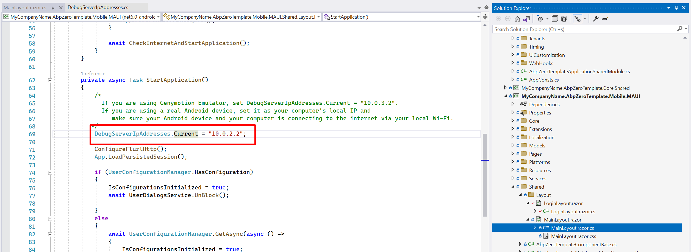
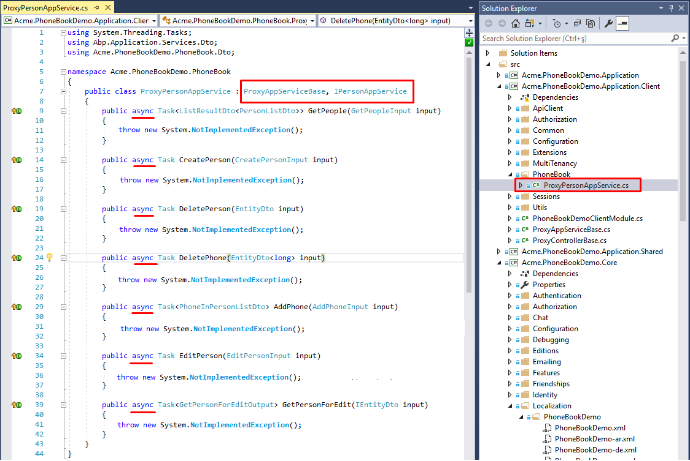
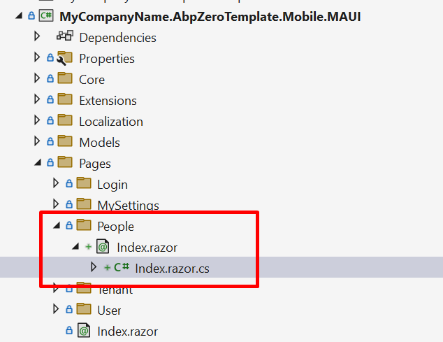
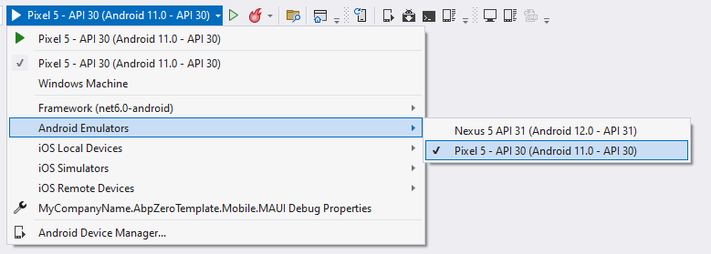
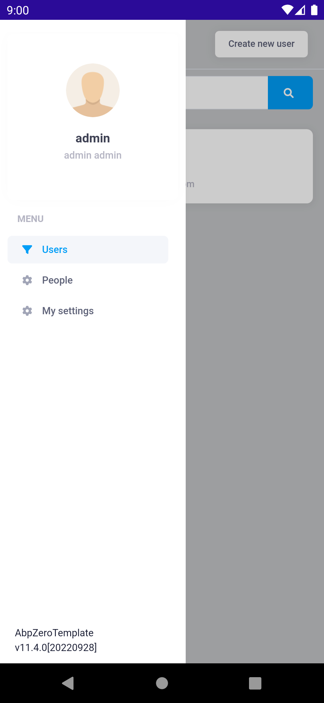
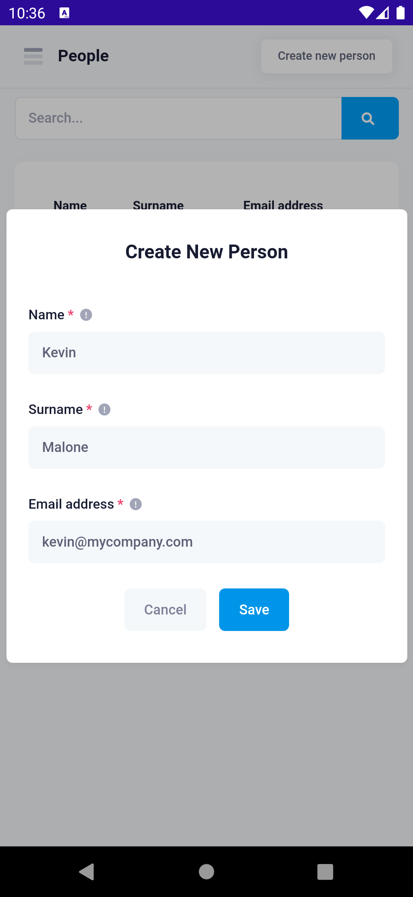
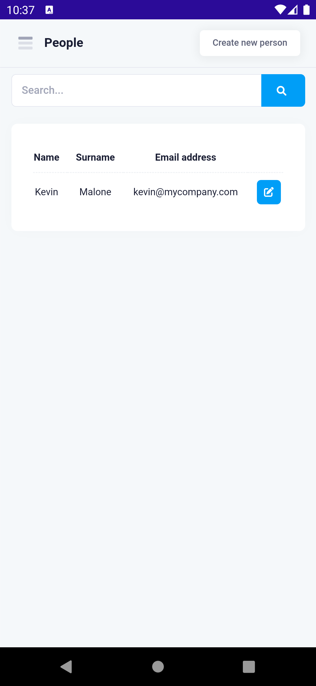
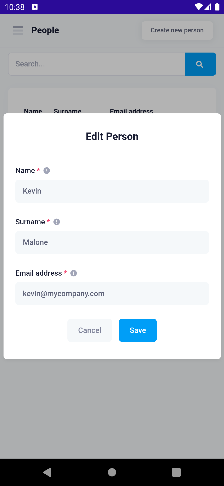
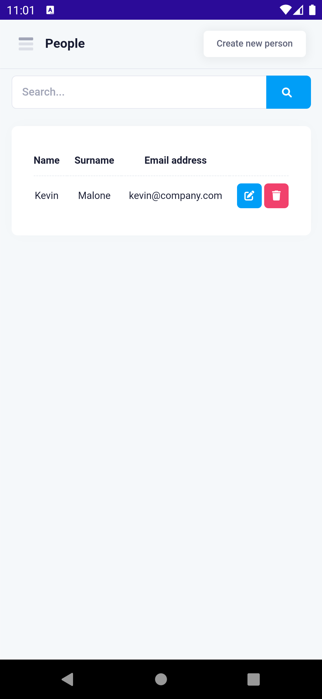

# Xamarin Step by Step Development

## Introduction

In this document, we will create a sample **Xamarin phonebook application** step by step integrated with ASP.NET Zero website. Be aware that only ASP.NET Core version is supported.

## Downloading Phonebook-Core Sample

In the **Developing Step By Step**  document we have already seen how to create a phonebook on server side and web client. In this document we will resume this project. We will build a phonebook application on ASP.NET Zero Xamarin project. Download the solution [Acme.PhoneBookDemo](https://github.com/aspnetzero/aspnet-zero-samples/tree/master/PhoneBook-Core) and open the **Acme.PhoneBookDemo.Mobile.sln** file.

## Configuring Host Address

If you are using an emulator, you can use the **emulator's loopback address** to reach your local computer. Eg: for Android emulator, it's **10.0.2.2**



## Creating Phonebook Application Service Proxy

To consume server API methods, we need to implement the **IPersonAppService** application service over HTTP transmission. Create a new folder called **PhoneBook** in
**Acme.PhoneBookDemo.Application.Client** project.

Then create a new class called **ProxyPersonAppService** in the **PhoneBook** folder. Derive ProxyPersonAppService from **ProxyAppServiceBase**, **IPersonAppService** interface. Visual Studio will
help us to add all unimplemented methods from IPersonAppService at once.

Add **async** keyword to all methods to be able to benefit from multi-tasking.



### Implementing App Service Methods

In the ProxyAppServiceBase class you'll see *ApiClient*, which is being
used to call host web API methods. We'll use *ApiClient* to transfer
data with host.

ApiClient has **post, put, get, delete** HTTP methods. To decide which needs to be called for the corresponding method you can read [ASP.NET Boilerplate Application Services as Controllers](https://aspnetboilerplate.com/Pages/Documents/AspNet-Core#application-services-as-controllers).

To summarize that document: ASP.NET Boilerplate framework uses
**ConventionalHttpVerbs** by default. This means there's a naming
convention while implementing app service methods.
When method name starts with:

-   **Get** =&gt; ApiClient.GetAsync&lt;T&gt;(...);
-   **Put or Update** =&gt; ApiClient.PutAsync&lt;T&gt;(...);
-   **Delete or Remove** =&gt; ApiClient.DeleteAsync&lt;T&gt;(...);
-   **Post, Create or Insert** =&gt; ApiClient.PostAync&lt;T&gt;();
-   **If none of the above** =&gt; Post is used as default.

Based on the above information, we will implement the methods. The first
method is **GetPeople**, it starts with **Get** prefix, so we have to
use *ApiClient.GetAsync(...)* method.

**GetEndPoint(...)** adds the method name as a segment for the target
host web API url.
You have to pass the name of the application service method to GetEndPoint():

```csharp
public async Task<ListResultDto<PersonListDto>> GetPeople(GetPeopleInput input)
{
    return await ApiClient.GetAsync<ListResultDto<PersonListDto>>(GetEndpoint(nameof(GetPeople)), input);
}
```

Do the same for other methods.
The final view of **ProxyPersonAppService** class should be
like this:

```csharp
public class ProxyPersonAppService : ProxyAppServiceBase, IPersonAppService
{
    public async Task<ListResultDto<PersonListDto>> GetPeople(GetPeopleInput input)
    {
        return await ApiClient.GetAsync<ListResultDto<PersonListDto>>(GetEndpoint(nameof(GetPeople)), input);
    }

    public async Task CreatePerson(CreatePersonInput input)
    {
        await ApiClient.PostAync(GetEndpoint(nameof(CreatePerson)), input);
    }

    public async Task DeletePerson(EntityDto input)
    {
        await ApiClient.DeleteAsync(GetEndpoint(nameof(DeletePerson)), input);
    }

    public async Task DeletePhone(EntityDto<long> input)
    {
        await ApiClient.DeleteAsync(GetEndpoint(nameof(DeletePhone)), input);
    }

    public async Task<PhoneInPersonListDto> AddPhone(AddPhoneInput input)
    {
        return await ApiClient.PostAync<PhoneInPersonListDto>(GetEndpoint(nameof(AddPhone)), input);
    }

    public async Task EditPerson(EditPersonInput input)
    {
        await ApiClient.PostAync(GetEndpoint(nameof(EditPerson)), input);
    }

    public async Task<GetPersonForEditOutput> GetPersonForEdit(IEntityDto input)
    {
        return await ApiClient.GetAsync<GetPersonForEditOutput>(GetEndpoint(nameof(GetPersonForEdit)), input);
    }
}
```

When we complete the communication phase with the host service, we can
start to create person and person detail view for mobile.

## Creating People Page

### Creating 

PeopleView is going to list all the persons. When we tap one of the
person, we'll navigate to person details. In **Acme.PhoneBookDemo.Mobile.MAUI** project, there's **Pages** folder. Add new folder named **People** in that folder. And create new razor page in it named **Index**.



Go to `NavigationUrlConsts` and add People

```diff
internal class NavigationUrlConsts
{
    public const string Index = "/";
    public const string Login = "Login";
    public const string SendTwoFactorCode = "SendTwoFactorCode";
    public const string Tenants = "Tenants";
    public const string User = "User";
    public const string Settings = "Settings";

+    public const string People = "People";
}
```

Then set your `Index` pages route using that.
_Index.razor_
```csharp
@using Acme.PhoneBookDemo.Services.Navigation
@attribute [Route("/" + NavigationUrlConsts.People)]

<h3>Index</h3>
```

And inherit `[YOURAPPNAME]MainLayoutPageComponentBase`.
_Index.razor_
```diff
@using Acme.PhoneBookDemo.Services.Navigation
+@inherits AbpZeroTemplateMainLayoutPageComponentBase
@attribute [Route("/" + NavigationUrlConsts.People)]

<h3>Index</h3>
```

_Index.razor.cs_

```csharp
using Acme.PhoneBookDemo.Mobile.MAUI.Shared;

public partial class Index: AbpZeroTemplateMainLayoutPageComponentBase
{
}
```

We have created an empty view. Lets fill it.

_Index.razor.cs_
```csharp
//...
using Acme.PhoneBookDemo.Core.Dependency;
using Acme.PhoneBookDemo.Core.Threading;

namespace Acme.PhoneBookDemo.Mobile.MAUI.Pages.People;

public partial class Index : AbpZeroTemplateMainLayoutPageComponentBase
{
    protected IPersonAppService personAppService { get; set; }

    private GetAllPersonsInput _filter = new GetAllPersonsInput();

    private GetPersonForViewDto[] people;

    public Index()
    {
        personAppService = DependencyResolver.Resolve<IPersonAppService>();
    }

    protected override async Task OnInitializedAsync()
    {
        await SetPage(L("People"));
        await UserDialogsService.Block();
        await GetList();
    }

    private async Task GetList()
    {
        await SetBusyAsync(async () =>
        {
            await WebRequestExecuter.Execute(
                async () => await personAppService.GetAll(_filter),
                (result) => {
                    people = result.Items.ToArray();
                    StateHasChanged();
                    return Task.CompletedTask;
                });
        });
    }
}
```

_Index.razor_
```html
@using Acme.PhoneBookDemo.Services.Navigation
@inherits AbpZeroTemplateMainLayoutPageComponentBase
@attribute [Route("/" + NavigationUrlConsts.People)]

<div class="row align-items-center mt-1 mb-2 m-0">
    <div class="col-xl-12">
        <div class="mb-5 align-items-center">
            <div class="input-group">
                <input type="text" class="form-control" @bind="_filter.Filter" placeholder="@L("SearchWithThreeDot")">
                <button @onclick="GetList" class="btn btn-primary" type="button">
                    <i class="fa fa-search" aria-label="Search"></i>
                </button>
            </div>
        </div>
    </div>
</div>
<div class="row m-0">
    <div class="col">
        <div class="card">
            <div class="card-body">
                @if (people != null)
                {
                    <div class="table-responsive">
                        <table class="table table-row-dashed align-middle gs-0 gy-3 my-0">
                            <thead>
                                <tr>
                                    <th class="text-center fw-bold">@L("Name")</th>
                                    <th class="text-center fw-bold">@L("Surname")</th>
                                    <th class="text-center fw-bold">@L("EmailAddress")</th>
                                    <th></th>
                                </tr>
                            </thead>
                            <tbody>
                                @foreach (var person in people)
                                {
                                    <tr>
                                        <td class="text-center">@person.Person.Name</td>
                                        <td class="text-center">@person.Person.Surname</td>
                                        <td class="text-center">@person.Person.EmailAdress</td>
                                    </tr>
                                }
                            </tbody>
                        </table>
                    </div>
                }
            </div>
        </div>
    </div>
</div>
```

### Adding People Page to Navigation Menu

To add a new menu item, open **MenuProvider** class in **Services/Navigation** folder.

Add the new *NavigationMenuItem* in the list like below:

```csharp
public class MenuProvider : ISingletonDependency, IMenuProvider
{
    private List<NavigationMenuItem> _menuItems = new List<NavigationMenuItem>
    {
        new NavigationMenuItem
        {
            Title = L.Localize("Tenants"),
            Icon = "fa-solid fa-list",
            NavigationUrl = NavigationUrlConsts.Tenants,
            RequiredPermissionName = PermissionKey.Tenants,
        },
        new NavigationMenuItem
        {
            Title = L.Localize("Users"),
            Icon = "fa-solid fa-filter",
            NavigationUrl= NavigationUrlConsts.User,
            RequiredPermissionName = PermissionKey.Users,
        },
        new NavigationMenuItem
        {
            Title = L.Localize("People"),
            Icon = "fa-solid fa-user",
            NavigationUrl  = NavigationUrlConsts.People,
            RequiredPermissionName = PermissionKey.Phonebook
        },
        new NavigationMenuItem
        {
            Title = L.Localize("MySettings"),
            Icon = "fa-solid fa-cog",
            NavigationUrl  = NavigationUrlConsts.Settings
        }
    };
}
```

Let's set the properties of the new *NavigationMenuItem*:

1. **Title:** It's already localized in the **Developing Step By Step** document. We just
   set localization key with this shortcut: **L.Localize("PhoneBook")**. And it localizes the menu text.
2.  **Icon:** Icon for menu

3.  **NavigationUrl:** Url to go to the page
4.  **RequiredPermissionName:** A permission key has to be assigned to be
    able to show/hide the new menu according to the user's permission.
    In the previous document, it's already declared in "[Define the
    permission](https://www.aspnetzero.com/Documents/Developing-Step-By-Step-Core#define-the-permission)"
    section as "**Pages.Tenant.PhoneBook**". We need to use the same
    string for permission key. So what you have to do is add the below
    line to **PermissionKey** class like below:  

    ```c#
    public const string Phonebook = "Pages.Tenant.PhoneBook";
    ```

Let's run the application to see the new menu item.

In this example, we'll use Android platform to test the sample. Hence, set the startup
project to **Acme.PhoneBookDemo.Mobile.MAUI** and .

If you've already started Android emulator, you can directly run the
project. But if you've not started the emulator yet, it's advised to start the emulator first from the Visual Studio Toolbar as shown
below. The reason of initializing emulator is: sometimes Visual Studio
cannot make initial connection to the emulator for the first run. So
it's better to run it and wait until it starts up successfully. When you
see the emulator home screen, you can run the project (F5).



You will see a loading animation screen while initializing. After that you'll see
the app login page. The PhoneBook is defined on tenant side. You have to
switch to a tenant to see the PhoneBook menu item. Tap **Switch Tenant**
button and enter **default** into the textbox in the opened modal. If the tenant **default** is available, you will see **"Current Tenant: default"**
label. If the tenant is not active or does not exist, then you'll get an
alert about that.


Enter your credentials and tap **Log In** button.
When you successfully login, you can see the below screen with new
**People** menu item.



Up to here we successfully added an empty People page. Let's populate
the view with data.

#### Creating Or Editing People Modal

Let's go to the **Pages/People** and add new razor page named **CreateOrEditPersonModal**. And fill it with following code parts

_CreateOrEditPersonModal.razor.cs_

```csharp
using Acme.PhoneBookDemo.Mobile.MAUI.Shared;

namespace Acme.PhoneBookDemo.Mobile.MAUI.Pages.People;

public partial class CreateOrEditPersonModal : ModalBase
{
    public override string ModalId => "create-or-edit-person";

    [Parameter] public EventCallback OnSave { get; set; }

    CreateOrEditPersonDto createOrEditPersonDto;

    protected IPersonAppService personAppService { get; set; }

    bool _isInitialized = false;

    public CreateOrEditPersonModal()
    {
        personAppService = DependencyResolver.Resolve<IPersonAppService>();
    }

    public async Task Open(int? personId = null)
    {
        await SetBusyAsync(async () =>
        {
            if (personId.HasValue)
            {
                await WebRequestExecuter.Execute(
                    async () => await personAppService.GetPersonForEdit(new EntityDto(personId.Value)),
                    async (person) =>
                    {
                        createOrEditPersonDto = person.Person;

                        _isInitialized = true;
                        await Show();//shows modal
                    }
                );
            }
            else
            {
                createOrEditPersonDto = new CreateOrEditPersonDto();
                _isInitialized = true;
                await Show();//shows modal
            }
        });
    }

    private async Task Save()
    {
        await SetBusyAsync(async () =>
        {
            await WebRequestExecuter.Execute(
                    async () => await personAppService.CreateOrEdit(createOrEditPersonDto),
                    async () =>
                    {
                        _isInitialized = false;
                        createOrEditPersonDto = null;

                        await UserDialogsService.AlertSuccess(L("SuccessfullySaved"));
                        await Hide();
                        await OnSave.InvokeAsync();
                    }
                );
        });

    }
}
```
ASP.NET Zero provides you a built-in base classes that help you while you developing MAUI apps. With using ModalBase class you can easly access to the modal in DOM and show and hide it. Since modal implementation is javascript based, ASP.NET Zero implements proxy classes that calls javascript apis for managing modals. See **Services/UI/ModalManagerService.cs**

_CreateOrEditPersonModal.razor_
```html
@inherits ModalBase

<!--begin::Modal - New Target-->
<div class="modal fade" id="@ModalId" tabindex="-1" aria-hidden="true">
    <!--begin::Modal dialog-->
    <div class="modal-dialog modal-dialog-centered">
        <!--begin::Modal content-->
        <div class="modal-content rounded">
            <!--begin::Modal body-->
            <div class="modal-body scroll-y pt-10 pb-10">
                @if (_isInitialized)
                {
                      <!--begin::Heading-->
                    <div class="mb-13 text-center">
                        @if (createOrEditPersonDto.Id.HasValue)
                        {
                            <!--begin::Title-->
                            <h1 class="mb-3">@L("EditPerson")</h1>
                            <!--end::Title-->
                        }else
                        {
                            <!--begin::Title-->
                            <h1 class="mb-3">@L("CreateNewPerson")</h1>
                            <!--end::Title-->
                        }
                    </div>
                    <!--end::Heading-->
                    <!--begin::Input group-->
                    <div class="d-flex flex-column mb-8 fv-row fv-plugins-icon-container ">
                        <!--begin::Label-->
                        <label class="d-flex align-items-center fs-6 fw-semibold mb-2">
                            <span class="required">
                                @L("Name")
                            </span>
                            <i class="fas fa-exclamation-circle ms-2 fs-7"></i>
                        </label>
                        <!--end::Label-->
                        <input type="text" class="form-control form-control-solid" @bind="createOrEditPersonDto.Name" />
                    </div>
                    <!--end::Input group-->
                    <!--begin::Input group-->
                    <div class="d-flex flex-column mb-8 fv-row fv-plugins-icon-container min-w-90">
                        <!--begin::Label-->
                        <label class="d-flex align-items-center fs-6 fw-semibold mb-2">
                            <span class="required">
                                @L("Surname")
                            </span>
                            <i class="fas fa-exclamation-circle ms-2 fs-7"></i>
                        </label>
                        <!--end::Label-->
                        <input type="text" class="form-control form-control-solid" @bind="createOrEditPersonDto.Surname" />
                    </div>
                    <!--end::Input group-->
                    <!--begin::Input group-->
                    <div class="d-flex flex-column mb-8 fv-row fv-plugins-icon-container min-w-90">
                        <!--begin::Label-->
                        <label class="d-flex align-items-center fs-6 fw-semibold mb-2">
                            <span class="required">
                                @L("EmailAddress")
                            </span>
                            <i class="fas fa-exclamation-circle ms-2 fs-7"></i>
                        </label>
                        <!--end::Label-->
                        <input type="text" class="form-control form-control-solid" @bind="createOrEditPersonDto.EmailAdress" />
                    </div>
                    <!--end::Input group-->
                    <!--begin::Actions-->
                    <div class="text-center mt-8">
                        <button type="reset" data-dismiss="modal" class="btn btn-light me-3" @onclick="Hide">@L("Cancel")</button>
                        <button type="button" class="btn btn-primary" @onclick="Save">
                            <span class="indicator-label">@L("Save")</span>
                        </button>
                    </div>
                    <!--end::Actions-->
                }
            </div>
            <!--end::Modal body-->
        </div>
        <!--end::Modal content-->
    </div>
    <!--end::Modal dialog-->
</div>
<!--end::Modal - New Target-->
```

Now we can use that modal to create or edit person. Let's go to the Index.razor of people and add that modal.

_Index.razor.cs_
```diff
public partial class Index : AbpZeroTemplateMainLayoutPageComponentBase
{
    protected IPersonAppService personAppService { get; set; }
+    protected IPermissionService PermissionService { get; set; }

    private GetAllPersonsInput _filter = new GetAllPersonsInput();

    private GetPersonForViewDto[] people;

    private CreateOrEditPersonModal createOrEditPersonModal { get; set; }

+    private bool _hasEditPermission;
+    private bool _hasCreatePermission;

    public Index()
    {
        personAppService = DependencyResolver.Resolve<IPersonAppService>();
+        PermissionService = DependencyResolver.Resolve<IPermissionService>();

+        _hasEditPermission = PermissionService.HasPermission(PermissionKey.PhoneBook.EditPerson);
+        _hasCreatePermission = PermissionService.HasPermission(PermissionKey.PhoneBook.CreatePerson);
    }

    protected override async Task OnInitializedAsync()
    {
+        if (_hasCreatePermission)
+        {
+            await SetPage(L("People"), L("CreateNewPerson"), OpenCreatePersonModal);
+        }
+        else
+        {
+            await SetPage(L("People"));
+        }

        await GetList();
    }

    private async Task GetList()
    {
        await SetBusyAsync(async () =>
        {
            await WebRequestExecuter.Execute(
                async () => await personAppService.GetAll(_filter),
                (result) => {
                    people = result.Items.ToArray();
                    StateHasChanged();
                    return Task.CompletedTask;
                });
        });
    }

+    private async Task OpenCreatePersonModal()
+    {
+        await createOrEditPersonModal.Open();
+    }
+
+    private async Task EditPerson(int personId)
+    {
+        await createOrEditPersonModal.Open(personId);
+    }
}
```
And add modal at the end of your `Index.razor`.

_Index.razor_
```diff
<CreateOrEditPersonModal OnSave="GetList" @ref="createOrEditPersonModal"></CreateOrEditPersonModal>
```
Now you can create person, list it and edit it.





#### Deleting Person

Adding delete person is much more easier. We can use [sweetalert](https://sweetalert2.github.io/)

- Add the delete permission key in **PermissionKey.cs**.

  ```csharp
  public const string PhoneBookDeletePerson = "Pages.Tenant.PhoneBook.DeletePerson";
  ```

- We'll place a delete button inside the person list. 

_Index.razor.cs_
```csharp
private bool _hasDeletePermission;

public Index()
{
    //...
    _hasDeletePermission = PermissionService.HasPermission(PermissionKey.PhoneBook_DeletePerson);
}

//...
private async Task DeletePerson(PersonDto person)
{
    var isConfirmed = await UserDialogsService.Confirm(L("PersonDeleteWarningMessage", "\"" + person.Name + "\""), L("AreYouSure"));
    if (isConfirmed)
    {
        await SetBusyAsync(async () =>
        {
            await WebRequestExecuter.Execute(
                async () => await personAppService.Delete(new EntityDto(person.Id)),
                async () =>
                {
                    await GetList();
                }
            );
        });
    }
}
```

_Index.razor_
```diff
@foreach (var person in people)
{
    <tr>
        <td class="text-center">@person.Person.Name</td>
        <td class="text-center">@person.Person.Surname</td>
        <td class="text-center">@person.Person.EmailAdress</td>
        <td>
+            @if (_hasDeletePermission)
+            {
+                <button class="float-end btn btn-sm btn-icon btn-primary w-30px h-30px" @onclick="(()=>DeletePerson(person.Person))">
+                    <i class="fa fa-trash"></i>
+                </button>
+            }
            @if (_hasEditPermission)
            {
                <button class="float-end btn btn-sm btn-icon btn-primary w-30px h-30px me-1" @onclick="(()=>EditPerson(person.Person.Id))">
                    <i class="fa fa-edit"></i>
                </button>
            }                                          
        </td>
    </tr>
}
```




## Conclusion

In this document, we built a complete example that covers most parts of the ASP.NET Zero MAUI development. We intentionally used different approaches for similar tasks to show you different styles of development. ASP.NET Zero provides an architecture, but does not restrict you. You can decide on your own style of development.

### Source Code

You should [purchase](https://aspnetzero.com/Pricing) ASP.NET Zero in order to get **source
code**. After purchasing, you can get the sample project from the private  
GitHub repository: <https://github.com/aspnetzero/aspnet-zero-samples/tree/master/PhoneBook-Core>
