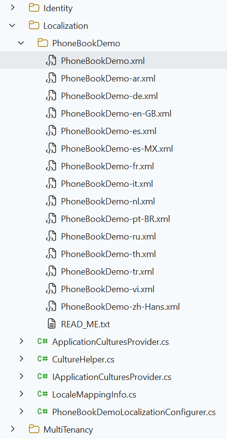

# Adding a New Menu Item

Let's begin from UI and create a new page named "**Phone book**".

## Defining a Menu Item

Open **src\\lib\\navigation\\appNavigation.tsx** in the client side which defines menu items in the application. Create new menu item as shown below (You can add it right after the dashboard menu item).

```typescript
export const buildRawMenu = (): AppMenuItem[] => [
  {
    id: "PhoneBook",
    title: L("PhoneBook"),
    icon: "book",
    route: "/app/admin/phonebook",
  },
];
```

**PhoneBook** is the menu name, **book** is just an arbitrary icon class (from [this set](http://keenthemes.com/metronic/preview/?page=components/icons/flaticon&demo=default)) and **/phonebook** is the React route.

If you run the application, you will see a new menu item on the left menu, but it won't work (it redirects to default route) If you click to the menu item, since we haven't defined the React route yet.

## Localize Menu Item Display Name

Localization strings are defined in **XML** files in **.Core** project in server side as shown below:



Open PhoneBookDemo.xml (the **default**, **English** localization dictionary) and add the following line:

```xml
<text name="PhoneBook">Phone Book</text>
<text name="PhoneBooksHeaderInfo">Phone Book Details</text>
```

If we don't define "PhoneBook"s value for other localization dictionaries, default value is shown in all languages. For example, we can define it also for Turkish in `PhoneBookDmo-tr.xml` file:

```xml
<text name="PhoneBook">Telefon Rehberi</text>
<text name="PhoneBooksHeaderInfo">Telefon Rehberi Detayları</text>
```

Note: Any change in server side (including change localization texts) requires recycle of the server application. We suggest to use Ctrl+F5 if you don't need to debugging for a faster startup. In that case, it's enough to make a re-build to recycle the application.

## React Route

React has a powerful URL routing system. ASP.NET Zero has defined routes in a few places (for modularity, see [main menu & layout](Features-React-Main-Menu-Layout.md)). We want to add phone book page to the admin component. So, open **src\\routes\\AppRouter.tsx** in the client side and add a new route just below to the dashboard:

```typescript
const AppRouter = () => {
  return (
    <Suspense fallback={<LoadingSpinner />}>
      <BrowserRouter>
        <Routes>
          <Route path="/app" element={<ProtectedRoute />}>
            <Route element={<AppLayout />}>
              {/* Other Routes */}
              <Route path="admin/phonebook" element={<PhoneBookPage />} />
            </Route>
          </Route>
        </Routes>
      </BrowserRouter>
    </Suspense>
  );
};
```

We get an error since we haven't defined PhonebookPage yet. Also, we ignored permission for now (will implement later).

## Next

- [Creating the PhoneBook Component](Developing-Step-By-Step-React-Creating-PhoneBook-Component)
