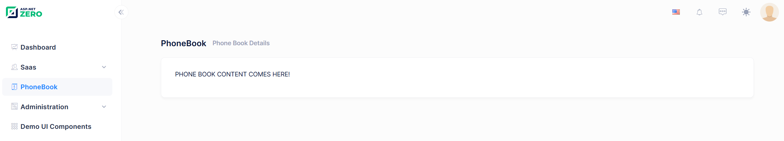

# Creating the PhoneBook Component

Create a **phonebook** folder inside **src/pages/admin** folder and add a new typescript file (**index.tsx**) in the phonebook folder as shown below:

```typescript
import L from "@/lib/L";
import React from "react";
import PageHeader from "../components/common/PageHeader";
import { useTheme } from "@/hooks/useTheme";

const PhoneBookPage: React.FC = () => {
  const { containerClass } = useTheme();

  return (
    <>
      <PageHeader
        title={L("PhoneBook")}
        description={L("PhoneBooksHeaderInfo")}
      />
      <div className={containerClass}>
        <div className="card card-custom">
          <div className="card-body">
            <p>PHONE BOOK CONTENT COMES HERE!</p>
          </div>
        </div>
      </div>
    </>
  );
};

export default PhoneBookPage;
```

**L** (upper case 'L') function comes from **lib/L.tsx** and used to easily localize texts.

Now, we can refresh the page to see the new added page:



Note: React automatically re-compiles and refreshes the page when any changes made to any file in the application.

## Next

- [Creating Person Entity](Developing-Step-By-Step-React-Creating-Person-Entity)
