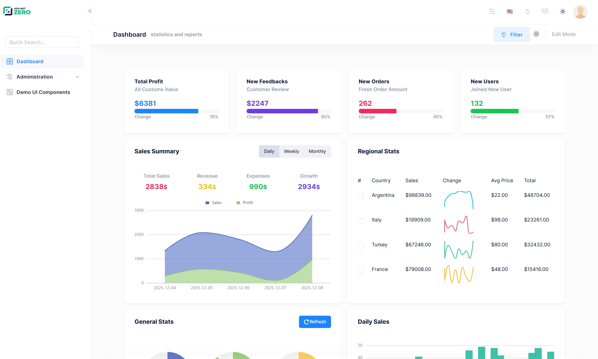

## Creating & Running The Project

We're creating and downloading the solution named "**Acme.PhoneBookDemo**" as described in [Getting Started](Getting-Started-React) document. Please follow the getting started document, run the application, login as default tenant
admin (select `Default` as tenancy name, use `admin` as username and `123qwe` as the password) and see the dashboard below:



Logout from the application for now. We will make our application **single-tenant** (we will convert it to multi-tenant later). So, we open **PhoneBookDemoConsts** class in the  **Acme.PhoneBookDemo.Core.Shared** project and disable multi-tenancy as shown below:

```c#
public class PhoneBookDemoConsts
{
    public const string LocalizationSourceName = "PhoneBookDemo";

    public const string ConnectionStringName = "Default";

    public const bool MultiTenancyEnabled = false;

    public const int PaymentCacheDurationInMinutes = 30;
}
```

**Note:** If you log in before changing **MultiTenancyEnabled** to false, you might get a login error. If you face this problem, you need to remove cookies.

## Next

- [Adding a New Menu Item](Developing-Step-By-Step-React-Adding-New-Menu-Item)