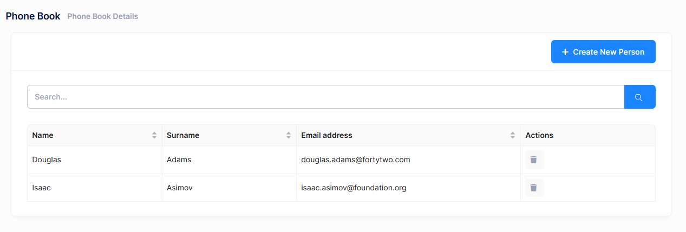
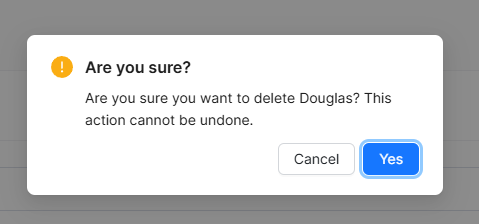

# Deleting a Person

Let's add a delete button in people list as shown below:



We're starting from UI in this case.

## View

We're changing **index.tsx** to add a delete button in the Actions column. First, we need to add the Ant Design `App` hook for modal confirmations and update the columns definition:

```typescript
import L from "@/lib/L";
import React, { useEffect, useState } from "react";
import { Table, App } from "antd";
import type { ColumnsType } from "antd/es/table";
import PageHeader from "../components/common/PageHeader";
import { useTheme } from "@/hooks/useTheme";
import { usePermissions } from "@/hooks/usePermissions";
import {
  PersonListDto,
  PersonServiceProxy,
  useServiceProxy,
} from "@/api/service-proxy-factory";
import CreatePersonModal from "./CreatePersonModal";

const PhoneBookPage: React.FC = () => {
  const { modal } = App.useApp(); // Add this line for modal.confirm
  const personService = useServiceProxy(PersonServiceProxy);

  // Other Code

  const deletePerson = (person: PersonListDto) => {
    modal.confirm({
      title: L("AreYouSure"),
      content: L("PersonDeleteWarningMessage", person.name),
      okText: L("Yes"),
      cancelText: L("Cancel"),
      onOk: async () => {
        await personService.deletePerson(person.id);
        abp.notify.success(L("SuccessfullyDeleted"));
        setPeople((prevPeople) => prevPeople.filter((p) => p.id !== person.id));
      },
    });
  };

  const columns: ColumnsType<PersonListDto> = [
    {
      title: L("Name"),
      dataIndex: "name",
      key: "name",
      sorter: true,
      width: 150,
    },
    {
      title: L("Surname"),
      dataIndex: "surname",
      key: "surname",
      sorter: true,
      width: 150,
    },
    {
      title: L("EmailAddress"),
      dataIndex: "emailAddress",
      key: "emailAddress",
      sorter: true,
      width: 250,
    },
    {
      title: L("Actions"),
      key: "actions",
      width: 150,
      render: (_text: string, record: PersonListDto) => (
        <>
          {isGranted("Pages.Administration.PhoneBook.DeletePerson") && (
            <button
              onClick={() => deletePerson(record)}
              title={L("Delete")!}
              className="btn btn-sm btn-icon btn-bg-light btn-active-color-danger"
            >
              <i className="fa fa-trash"></i>
            </button>
          )}
        </>
      ),
    },
  ];

  // Rest of The Component
};

export default PhoneBookPage;
```

We simply added an Actions column with a delete button that calls **deletePerson** method when clicked. The button is conditionally rendered based on the delete permission.

## Style

React components in this project use inline styles or CSS classes from Bootstrap and Metronic theme. No separate CSS file is needed for this feature.

If you need custom styles, you can create a **styles.css** file in the phonebook folder:

```css
/* Custom styles for phonebook */
.phonebook-actions {
  display: flex;
  gap: 8px;
}
```

And import it in your component:

```typescript
import "./styles.css";
```

## Application Service

Let's leave the client side and add a DeletePerson method to the server side. We are adding it to the service interface, **IPersonAppService**:

```csharp
Task DeletePerson(EntityDto input);
```

**EntityDto** is a shortcut of ABP if we only get an id value. Implementation (in **PersonAppService**) is very simple:

```csharp
[AbpAuthorize(AppPermissions.Pages_Administration_PhoneBook_DeletePerson)]
public async Task DeletePerson(EntityDto input)
{
    await _personRepository.DeleteAsync(input.Id);
}
```

### Define the Delete Permission

In this example, we are creating a child permission under an existing phoneBook permission. This allows for more granular control, such as managing delete operations separately.

A permission should have a unique name. We define permission names as constant strings in **AppPermissions** class. It's a simple constant string:

```csharp
public const string Pages_Administration_PhoneBook_DeletePerson = "Pages.Administration.PhoneBook.DeletePerson";
```

To define delete permission, use the `AppAuthorizationProvider` class as shown below:

```csharp
phoneBook.CreateChildPermission(AppPermissions.Pages_Administration_PhoneBook_DeletePerson, L("DeletePerson"));
```

## Service Proxy Generation

Since we changed server side services, we should re-generate the client side service proxies via NSwag. Make server side running and use **refresh.bat** (located in `nswag/` folder) as we did before.

```bash
cd nswag
refresh.bat
```

This will update the `src/api/generated/service-proxies.ts` file with the new `deletePerson` method.

## React Component Implementation

The key parts of the React implementation:

### Using Ant Design Modal for Confirmation

```typescript
const { modal } = App.useApp();
```

We use Ant Design's `App.useApp()` hook to access the modal context, which provides a cleaner way to show confirmation dialogs.

### Delete Function

```typescript
const deletePerson = (person: PersonListDto) => {
  modal.confirm({
    title: L("AreYouSure"),
    content: L("PersonDeleteWarningMessage", person.name),
    okText: L("Yes"),
    cancelText: L("Cancel"),
    onOk: async () => {
      try {
        await personService.deletePerson(person.id);
        abp.notify.success(L("SuccessfullyDeleted"));
        setPeople((prevPeople) => prevPeople.filter((p) => p.id !== person.id));
      } catch (error) {
        console.error("Error deleting person:", error);
      }
    },
  });
};
```

This function:
- Shows a confirmation modal with the person's name
- If confirmed, calls the backend `deletePerson` method
- On success, shows a notification and removes the person from the state
- Handles errors gracefully

### State Update

We use React's functional state update:

```typescript
setPeople((prevPeople) => prevPeople.filter((p) => p.id !== person.id));
```

This ensures the state update is based on the latest state value.

## Localization

Open **PhoneBookDemo.xml** (the **default**, **English** localization dictionary) in your server-side project and add the following line:

```xml
<text name="PersonDeleteWarningMessage">Are you sure you want to delete {0}? This action cannot be undone.</text>
```

The `{0}` placeholder will be replaced with the person's name when calling `L("PersonDeleteWarningMessage", person.name)`.

## Confirmation Dialog

When you click the delete button, it shows a confirmation message:



If you click OK, it calls the **deletePerson** method of **PersonServiceProxy** and shows a success notification. The person is also removed from the table immediately without requiring a page refresh.

## Next

- [Filtering People](Developing-Step-By-Step-React-Filtering-People)