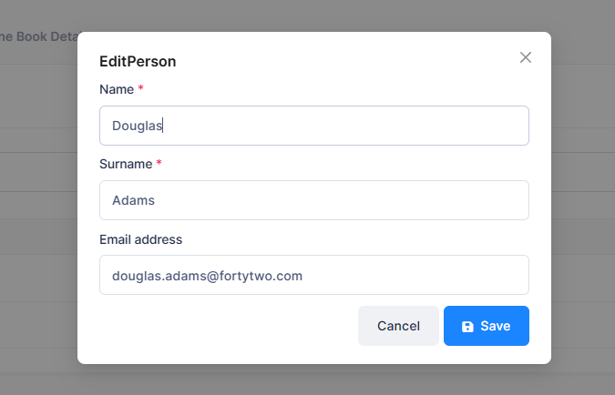

# Edit Mode For People

Now we want to edit name, surname and e-mail of people:

  

First of all, we create the necessary DTOs to transfer people's id, name,
surname and e-mail. We can optionally configure auto-mapper, but this is not necessary because all properties match automatically. Then we create the functions in PersonAppService for
editing people:  

```csharp
Task<GetPersonForEditOutput> GetPersonForEdit(EntityDto<int> input);
Task EditPerson(EditPersonInput input);
```

```csharp 
[AbpAuthorize(AppPermissions.Pages_Administration_PhoneBook_EditPerson)]
public async Task<GetPersonForEditOutput> GetPersonForEdit( EntityDto<int> input)
{
    var person = await _personRepository.GetAsync(input.Id);
    return ObjectMapper.Map<GetPersonForEditOutput>(person);
}

[AbpAuthorize(AppPermissions.Pages_Administration_PhoneBook_EditPerson)]
public async Task EditPerson(EditPersonInput input)
{
    var person = await _personRepository.FirstOrDefaultAsync(input.Id);
    ObjectMapper.Map(input, person);
}

public class GetPersonForEditOutput : EntityDto<int>
{
    public string Name { get; set; }
    public string Surname { get; set; }
    public string EmailAddress { get; set; }
}

public class EditPersonInput : EntityDto<int>
{
    public string Name { get; set; }
    public string Surname { get; set; }
    public string EmailAddress { get; set; }
}
```

The previous documents showed how to add `Pages_Administration_PhoneBook_EditPerson`. You can add it in the same way.

Then we add configuration for AutoMapper into `CustomDtoMapper.cs` like below:

```csharp
configuration.CreateMap<Person, GetPersonForEditOutput>();
configuration.CreateMap<EditPersonInput, Person>().ReverseMap();
```

## Edit Modal Implementation

### `EditPersonModal.tsx`

Create the edit person modal component:

```typescript
import React, { useEffect, useState } from "react";
import { Modal, Spin } from "antd";
import { useForm } from "react-hook-form";
import L from "@/lib/L";
import {
  EditPersonInput,
  GetPersonForEditOutput,
  PersonServiceProxy,
  useServiceProxy,
} from "@/api/service-proxy-factory";

interface EditPersonModalProps {
  personId: number | null;
  isVisible: boolean;
  onClose: () => void;
  onSave: () => void;
}

interface EditPersonFormData {
  name: string;
  surname: string;
  emailAddress: string;
}

const EditPersonModal: React.FC<EditPersonModalProps> = ({
  personId,
  isVisible,
  onClose,
  onSave,
}) => {
  const personService = useServiceProxy(PersonServiceProxy);
  const [loading, setLoading] = useState<boolean>(false);
  const [saving, setSaving] = useState<boolean>(false);

  const {
    register,
    handleSubmit,
    formState: { errors, isValid },
    reset,
    setValue,
    setFocus,
  } = useForm<EditPersonFormData>({
    mode: "onChange",
  });

  useEffect(() => {
    if (isVisible && personId) {
      loadPerson();
    }
  }, [isVisible, personId]);

  const loadPerson = async () => {
    if (!personId) return;

    setLoading(true);
    try {
      const result = await personService.getPersonForEdit(personId);
      setValue("name", result.name || "");
      setValue("surname", result.surname || "");
      setValue("emailAddress", result.emailAddress || "");
      setTimeout(() => setFocus("name"), 100);
    } catch (error) {
      console.error("Error loading person:", error);
    } finally {
      setLoading(false);
    }
  };

  const onSubmit = async (data: EditPersonFormData) => {
    if (!personId) return;

    setSaving(true);
    try {
      const input = new EditPersonInput({
        id: personId,
        name: data.name,
        surname: data.surname,
        emailAddress: data.emailAddress,
      });

      await personService.editPerson(input);
      abp.notify.success(L("SavedSuccessfully"));
      handleClose();
      onSave();
    } catch (error) {
      console.error("Error editing person:", error);
    } finally {
      setSaving(false);
    }
  };

  const handleClose = () => {
    reset();
    onClose();
  };

  return (
    <Modal
      title={L("EditPerson")}
      open={isVisible}
      onCancel={handleClose}
      footer={[
        <button
          key="cancel"
          type="button"
          className="btn btn-secondary"
          onClick={handleClose}
          disabled={saving}
        >
          {L("Cancel")}
        </button>,
        <button
          key="save"
          type="submit"
          className="btn btn-primary"
          onClick={handleSubmit(onSubmit)}
          disabled={!isValid || saving}
        >
          {saving ? (
            <>
              <Spin size="small" /> {L("SavingWithThreeDot")}
            </>
          ) : (
            <>
              <i className="fa fa-save"></i> {L("Save")}
            </>
          )}
        </button>,
      ]}
      destroyOnClose
    >
      {loading ? (
        <div className="text-center p-4">
          <Spin />
        </div>
      ) : (
        <form onSubmit={handleSubmit(onSubmit)}>
          <div className="mb-3">
            <label htmlFor="name" className="form-label">
              {L("Name")} <span className="text-danger">*</span>
            </label>
            <input
              id="name"
              type="text"
              className={`form-control ${errors.name ? "is-invalid" : ""}`}
              {...register("name", {
                required: L("ThisFieldIsRequired"),
                maxLength: {
                  value: 32,
                  message: L("FieldShouldNotExceedMaxLength", 32),
                },
              })}
            />
            {errors.name && (
              <div className="invalid-feedback d-block">
                {errors.name.message}
              </div>
            )}
          </div>

          <div className="mb-3">
            <label htmlFor="surname" className="form-label">
              {L("Surname")} <span className="text-danger">*</span>
            </label>
            <input
              id="surname"
              type="text"
              className={`form-control ${errors.surname ? "is-invalid" : ""}`}
              {...register("surname", {
                required: L("ThisFieldIsRequired"),
                maxLength: {
                  value: 32,
                  message: L("FieldShouldNotExceedMaxLength", 32),
                },
              })}
            />
            {errors.surname && (
              <div className="invalid-feedback d-block">
                {errors.surname.message}
              </div>
            )}
          </div>

          <div className="mb-3">
            <label htmlFor="emailAddress" className="form-label">
              {L("EmailAddress")}
            </label>
            <input
              id="emailAddress"
              type="email"
              className={`form-control ${
                errors.emailAddress ? "is-invalid" : ""
              }`}
              {...register("emailAddress", {
                maxLength: {
                  value: 255,
                  message: L("FieldShouldNotExceedMaxLength", 255),
                },
                pattern: {
                  value: /^\w+([\.-]?\w+)*@\w+([\.-]?\w+)*(\.\w{1,})+$/,
                  message: L("InvalidEmailAddress"),
                },
              })}
            />
            {errors.emailAddress && (
              <div className="invalid-feedback d-block">
                {errors.emailAddress.message}
              </div>
            )}
          </div>
        </form>
      )}
    </Modal>
  );
};

export default EditPersonModal;
```

### `index.tsx` Integration

Update the phonebook `index.tsx` file to include edit functionality:

#### Import EditPersonModal

```typescript
import EditPersonModal from "./EditPersonModal";
```

#### Add State for Edit Modal

```typescript
const [isEditModalVisible, setIsEditModalVisible] = useState<boolean>(false);
const [editingPersonId, setEditingPersonId] = useState<number | null>(null);
```

#### Add Edit Person Handlers

```typescript
const handleEditPerson = (personId: number) => {
  setEditingPersonId(personId);
  setIsEditModalVisible(true);
};

const handleEditModalClose = () => {
  setIsEditModalVisible(false);
  setEditingPersonId(null);
};

const handleEditModalSave = () => {
  getPeople();
};
```

#### Add Edit Button to Actions Column

```typescript
{
  title: L("Actions"),
  key: "actions",
  width: 150,
  render: (_text: string, record: PersonListDto) => (
    <>
      {isGranted("Pages.Administration.PhoneBook.EditPerson") && (
        <button
          onClick={() => handleEditPerson(record.id!)}
          title={L("Edit")!}
          className="btn btn-sm btn-icon btn-bg-light btn-active-color-warning me-2"
        >
          <i className="fa fa-edit"></i>
        </button>
      )}
      {isGranted("Pages.Administration.PhoneBook.DeletePerson") && (
        <button
          onClick={() => deletePerson(record)}
          title={L("Delete")!}
          className="btn btn-sm btn-icon btn-bg-light btn-active-color-danger me-2"
        >
          <i className="fa fa-trash"></i>
        </button>
      )}
      {/* ... phone button ... */}
    </>
  ),
}
```

#### Add EditPersonModal Component

```typescript
<EditPersonModal
  personId={editingPersonId}
  isVisible={isEditModalVisible}
  onClose={handleEditModalClose}
  onSave={handleEditModalSave}
/>
```

## Localization

Add these localization strings to your PhoneBookDemo.xml file:

```xml
<text name="EditPerson">Edit Person</text>
<text name="FieldShouldNotExceedMaxLength">Field should not exceed max length: {0}</text>
```

## Next

- [Multi Tenancy](Developing-Step-By-Step-React-Multi-Tenancy)