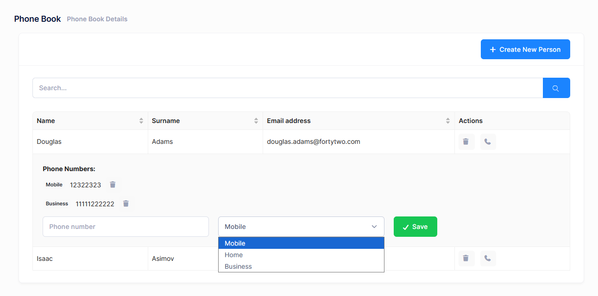

# Edit Mode For Phone Numbers

Final UI is shown below:



When we click the **phone icon** for a person, its row is expanded and all phone numbers are shown. Then we can delete any phone by clicking the delete icon. We can add a new phone from the inputs at the bottom of the expanded area.

## PhoneBook Component

The main changes are in the `index.tsx` file. We added expandable rows to the Ant Design Table component to show phone numbers for each person.

### State Management

```typescript
const [expandedRowKeys, setExpandedRowKeys] = useState<number[]>([]);
const [newPhoneNumber, setNewPhoneNumber] = useState<string>("");
const [newPhoneType, setNewPhoneType] = useState<PhoneType>(PhoneType.Mobile);
```

### Actions Column

The Actions column includes the phone button that toggles row expansion:

```typescript
{
  title: L("Actions"),
  key: "actions",
  width: 150,
  render: (_text: string, record: PersonListDto) => (
    <>
      {isGranted("Pages.Administration.PhoneBook.DeletePerson") && (
        <button
          onClick={() => deletePerson(record)}
          title={L("Delete")!}
          className="btn btn-sm btn-icon btn-bg-light btn-active-color-danger me-2"
        >
          <i className="fa fa-trash"></i>
        </button>
      )}
      <button
        onClick={() => {
          const keys = expandedRowKeys.includes(record.id!)
            ? expandedRowKeys.filter((k) => k !== record.id)
            : [...expandedRowKeys, record.id!];
          setExpandedRowKeys(keys);
          setNewPhoneNumber("");
          setNewPhoneType(PhoneType.Mobile);
        }}
        title={L("AddPhone")!}
        className="btn btn-sm btn-icon btn-bg-light btn-active-color-primary"
      >
        <i className="fa fa-phone"></i>
      </button>
    </>
  ),
}
```

### Expanded Row Render

The expanded row displays the phone list and add phone form:

```typescript
const expandedRowRender = (record: PersonListDto) => {
  return (
    <div className="p-4">
      <div className="mb-3">
        <strong>{L("PhoneNumbers")}:</strong>
        <ul className="list-unstyled mt-2 mb-3">
          {record.phones && record.phones.length > 0 ? (
            record.phones.map((phone: PhoneInPersonListDto) => (
              <li key={phone.id} className="d-flex align-items-center gap-3 mt-2">
                <span className="badge bg-light text-dark">
                  {getPhoneTypeLabel(phone.type!)}
                </span>
                <span>{phone.number}</span>
                <button
                  className="btn btn-sm btn-icon btn-bg-light btn-active-color-danger"
                  title={L("Delete")!}
                  onClick={() => deletePhone(phone.id!, record.id!)}
                >
                  <i className="fa fa-trash"></i>
                </button>
              </li>
            ))
          ) : (
            <li>{L("NoPhoneNumbersFound")}</li>
          )}
        </ul>
      </div>

      <div className="row">
        <div className="col-md-4">
          <input
            value={newPhoneNumber}
            onChange={(e) => setNewPhoneNumber(e.target.value)}
            placeholder={L("PhoneNumber")!}
            className="form-control"
          />
        </div>
        <div className="col-md-4">
          <select
            value={newPhoneType}
            onChange={(e) => setNewPhoneType(Number(e.target.value))}
            className="form-select"
          >
            <option value={PhoneType.Mobile}>{L("PhoneType_Mobile")}</option>
            <option value={PhoneType.Home}>{L("PhoneType_Home")}</option>
            <option value={PhoneType.Business}>{L("PhoneType_Business")}</option>
          </select>
        </div>
        <div className="col-md-4">
          <button
            className="btn btn-success"
            onClick={() => addPhone(record.id!)}
          >
            <i className="fa fa-check"></i> {L("Save")}
          </button>
        </div>
      </div>
    </div>
  );
};
```

### Table Configuration

The Table component is configured with the expandable prop:

```typescript
<Table
  rowKey={(record) => record.id!}
  size="small"
  bordered
  columns={columns}
  loading={loading}
  dataSource={people}
  pagination={false}
  scroll={{ x: true }}
  expandable={{
    expandedRowKeys: expandedRowKeys,
    expandedRowRender: expandedRowRender,
    showExpandColumn: false,
    onExpand: (expanded, record) => {
      const keys = expanded
        ? [...expandedRowKeys, record.id!]
        : expandedRowKeys.filter((k) => k !== record.id);
      setExpandedRowKeys(keys);
    },
  }}
/>
```

### Phone Management Functions

Functions to add and delete phone numbers:

```typescript
const addPhone = async (personId: number) => {
  if (!newPhoneNumber.trim()) {
    abp.notify.warn(L("PhoneNumberRequired"));
    return;
  }

  const input = new AddPhoneInput({
      personId: personId,
      number: newPhoneNumber,
      type: newPhoneType,
    });
    await personService.addPhone(input);
    abp.notify.success(L("PhoneSuccessfullyAdded"));
    setNewPhoneNumber("");
    setNewPhoneType(PhoneType.Mobile);
    setExpandedRowKeys([]);
    getPeople();
};

const deletePhone = (phoneId: number, personId: number) => {
  modal.confirm({
    title: L("AreYouSure"),
    content: L("PhoneDeleteWarningMessage"),
    okText: L("Yes"),
    cancelText: L("Cancel"),
    onOk: async () => {
        await personService.deletePhone(phoneId);
            abp.notify.success(L("SuccessfullyDeleted"));
            setPeople((prevPeople) =>
            prevPeople.map((p) => {
                if (p.id === personId && p.phones) {
                p.phones = p.phones.filter((phone) => phone.id !== phoneId);
                }
                return p;
            })
        );
    },
  });
};

const getPhoneTypeLabel = (type: PhoneType): string => {
  switch (type) {
    case PhoneType.Mobile:
      return L("PhoneType_Mobile");
    case PhoneType.Home:
      return L("PhoneType_Home");
    case PhoneType.Business:
      return L("PhoneType_Business");
    default:
      return "";
  }
};
```


## Localization

Add these localization strings to your PhoneBookDemo.xml file:

```xml
<text name="AddPhone">Add Phone</text>
<text name="PhoneNumbers">Phone Numbers</text>
<text name="NoPhoneNumbersFound">This person has no phone numbers.</text>
<text name="PhoneDeleteWarningMessage">Are you sure you want to delete this phone number?</text>
<text name="PhoneSuccessfullyAdded">Phone number successfully added</text>
<text name="PhoneNumberRequired">Phone number is required</text>
<text name="PhoneType_Mobile">Mobile</text>
<text name="PhoneType_Home">Home</text>
<text name="PhoneType_Business">Business</text>
```


## Next

- [Edit Mode For People](Developing-Step-By-Step-React-Edit-Mode-People)
