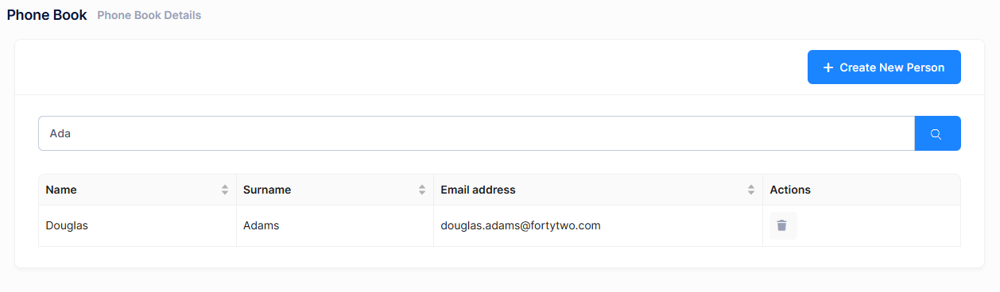

# Filtering People

Now, we will implement **search** functionality of **GetPeople** method. UI is shown below:



First, add filter state to manage the search input:

```typescript
const [filter, setFilter] = useState<string>("");
```

Then, update getPeople method to use the filter parameter:

```typescript
const getPeople = async (): Promise<void> => {
  setLoading(true);
  try {
    const result = await personService.getPeople(filter);
    setPeople(result.items || []);
  } finally {
    setLoading(false);
  }
};
```

Finally, add search form with input and submit handler:

```typescript
const handleSearch = (e: React.FormEvent) => {
  e.preventDefault();
  getPeople();
};

<form className="form" autoComplete="off" onSubmit={handleSearch}>
  <div className="row align-items-center mb-4">
    <div className="col-xl-12">
      <div className="mb-5 m-form__group align-items-center">
        <div className="input-group">
          <input
            value={filter}
            name="filter"
            autoFocus
            className="form-control m-input"
            placeholder={L("SearchWithThreeDot")!}
            type="text"
            onChange={(e) => setFilter(e.target.value)}
          />
          <button className="btn btn-primary" type="submit">
            <i className="flaticon-search-1" aria-label={L("Search")!}></i>
          </button>
        </div>
      </div>
    </div>
  </div>
</form>
```

Since we have already defined and used the filter property and the server-side implementation is ready, this code immediately works!

## Next

- [Adding Phone Numbers](Developing-Step-By-Step-React-Adding-Phone-Numbers)
