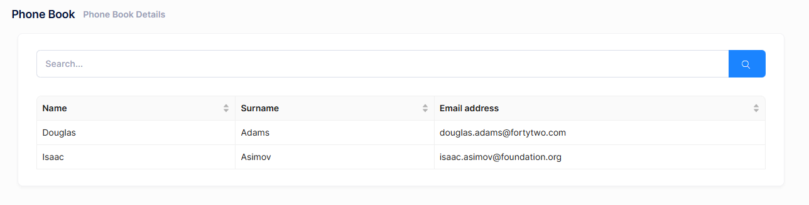

# Using GetPeople Method From React Component

Now, we can switch to the client side and use GetPeople method to show a
list of people on the UI.

## Service Proxy Generation

First, run (prefer Ctrl+F5 to be faster) the server side application
(.Web.Host project). Then run **nswag/refresh.bat** file on the client
side to re-generate service proxy classes (they are used to call server
side service methods).


## PhoneBookPage Typescript File

Change **index.tsx** as like below:

```typescript
import L from "@/lib/L";
import React, { useEffect, useState } from "react";
import { Table } from "antd";
import type { ColumnsType } from "antd/es/table";
import PageHeader from "../components/common/PageHeader";
import { useTheme } from "@/hooks/useTheme";
import {
  PersonListDto,
  PersonServiceProxy,
  useServiceProxy,
} from "@/api/service-proxy-factory";

const PhoneBookPage: React.FC = () => {
  const { containerClass } = useTheme();
  const personService = useServiceProxy(PersonServiceProxy);

  const [people, setPeople] = useState<PersonListDto[]>([]);
  const [loading, setLoading] = useState<boolean>(false);
  const [filter, setFilter] = useState<string>("");

  useEffect(() => {
    getPeople();
  }, []);

  const getPeople = async (): Promise<void> => {
    setLoading(true);
    try {
      const result = await personService.getPeople(filter);
      setPeople(result.items || []);
    } finally {
      setLoading(false);
    }
  };

  const handleSearch = (e: React.FormEvent) => {
    e.preventDefault();
    getPeople();
  };

  const columns: ColumnsType<PersonListDto> = [
    {
      title: L("Name"),
      dataIndex: "name",
      key: "name",
      sorter: true,
      width: 150,
    },
    {
      title: L("Surname"),
      dataIndex: "surname",
      key: "surname",
      sorter: true,
      width: 150,
    },
    {
      title: L("EmailAddress"),
      dataIndex: "emailAddress",
      key: "emailAddress",
      sorter: true,
      width: 250,
    },
  ];

  return (
    <>
      <PageHeader
        title={L("PhoneBook")}
        description={L("PhoneBooksHeaderInfo")}
      />
      <div className={containerClass}>
        <div className="container-fluid">
          <div className="card card-custom gutter-b">
            <div className="card-body">
              <form className="form" autoComplete="off" onSubmit={handleSearch}>
                <div className="row align-items-center mb-4">
                  <div className="col-xl-12">
                    <div className="mb-5 m-form__group align-items-center">
                      <div className="input-group">
                        <input
                          value={filter}
                          name="filter"
                          autoFocus
                          className="form-control m-input"
                          placeholder={L("SearchWithThreeDot")!}
                          type="text"
                          onChange={(e) => setFilter(e.target.value)}
                        />
                        <button className="btn btn-primary" type="submit">
                          <i
                            className="flaticon-search-1"
                            aria-label={L("Search")!}
                          ></i>
                        </button>
                      </div>
                    </div>
                  </div>
                </div>
              </form>

              <Table
                rowKey={(record) => record.id!}
                size="small"
                bordered
                columns={columns}
                loading={loading}
                dataSource={people}
                pagination={false}
                scroll={{ x: true }}
              />
            </div>
          </div>
        </div>
      </div>
    </>
  );
};

export default PhoneBookPage;
```

We inject **PersonServiceProxy**, call its **getPeople** method and
**subscribe** to get the result. We do this in **ngOnInit** function
(defined in React's **OnInit** interface). Assigned returned items to
the **people** class member.




We successfully retrieved list of people from database to the page.

## About Showing Tabular Data

We normally use a javascript based rich table/grid library to show tabular data, instead of manually rendering data like that. For example, we used [Ant Design Table library](https://ant.design/components/table/) to show users on the Users page of ASP.NET Zero. Always use such components since they make things much easier and provide a much better user experience.

## Next

- [Creating a New Person](Developing-Step-By-Step-React-Creating-New-Person)
