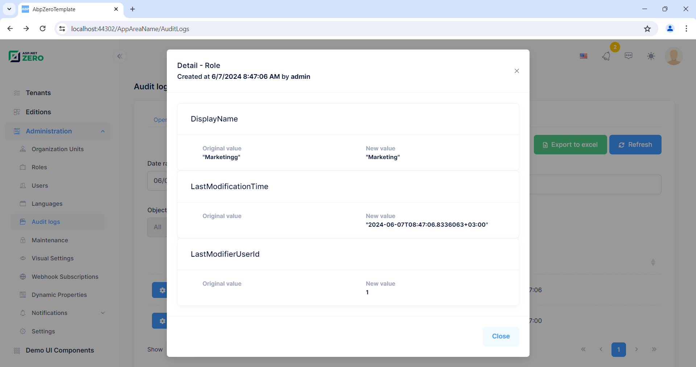

# Development Guide


## AppModule

This is the actual application module which is entered by username and
password. You will mostly work on this application to add your business
requirements. A screenshot from the application:


Folder structure of the source code is like that:


It consists of 3 sub modules as described before. **app.component** is
the root component for all views.

### Main Menu and Layout

Menu and Layout files located under shared folder:


Main menu is defined and rendered in **side-bar.component**. You can add
new menu items here. You generally relate a menu item to an Angular
route. Angular routes are defined in several modules:

-   app/admin/**admin-routing.module** defines routes for admin module.
-   app/main/**main-routing.module** defines routes for main module.
-   app/**app-routing.module** defines general routes and the default
    route.

### Edition Management

*If you're not developing a multi-tenant application, you can skip this
section.*

Most **SaaS** (multi-tenant) applications have **editions** (packages)
those have different **features**. Thus, they can provide different
**price and feature options** to their tenants (customers). **Editions page** (available in host login) is used to manage application's
editions:


Editions are used to group feature values and assign to tenants. We can
create a new edition by clicking "**Create new edition**" button:


An edition can be free or paid. If it's a paid edition then you should
enter monthly and annual prices. You can allow tenants to use trial
version of this edition for a specified days. Then you can determine an
expire strategy: How many days to allow a tenant to use the application
after subscription expires. And finally, you can deactivate tenant or
assign to a free edition if they don't extend their subscription.

Features tab is used to determining features available for the edition:


See [feature
management](https://aspnetboilerplate.com/Pages/Documents/Feature-Management)
and [edition
management](https://aspnetboilerplate.com/Pages/Documents/Zero/Edition-Management)
documents for more information.

### Tenant Management

*If you're not developing a multi-tenant application, you can skip this
section.*

If this is a multi-tenant application and you logged in as a host user,
then tenants page is shown:


A tenant is represented by **Tenant** class. Tenant class [can be
extended](Extending-Existing-Entities.md) by adding new properties.
There is an only one tenant, named **Default** as initial. **Tenancy
Name** (code name, which can be used as subdomain) is the **unique**
name of a tenant. A tenant can be **active** or **passive**. If it's
passive, no user of this tenant can login to the application.

When we click the "**Create New Tenant**" button, a dialog is shown:


**Tenancy name** should be unique and can not contain spaces or other
special chars since it may be used as subdomain name (like
tenancyname.mydomain.com). **Name** can be anything. **Admin email** is
used as email address of the admin user of new tenant. Admin user is
automatically created with the tenant. We can set a random password for
admin and send activation email. When user first logins, they should
change the password. We can uncheck this to enter a known password.

When we create a new tenant, we should select/create a database to store
new tenant's data. We can select '**Use host database**' to store tenant
data in host database (can be used for single database approach) or we
can specify a connection string to create/use a **dedicated database**
for new tenant. ASP.NET Zero supports **hybrid** approach. That means you
can use host database for some tenants and create dedicated databases
for some other tenants. Even you can **group** some tenants in a
separated database.

Once you assign an edition to the tenant, you can select an expiration
date (see edition management section to know what happens after
subscription expiration).

#### Tenant Edition and Features

An **edition** can be **assigned** to a tenant (while creating or
editing). Tenant will inherit all features of the assigned edition, but
we can also override features and values for a tenant. Click
**actions/change features** for a tenant to **customize** it's features:


#### Tenant User Impersonation

As a host user, we may want to perform operations in behalf of a tenant.
In this case, we can click the "**Login as this tenant**" button in the
actions. When we click it, we see **a modal to select a user** of the
tenant. We can select any user and perform operations allowed that user.
See **User Impersonation** section in this document for more
information.

#### Using Tenancy Name As Subdomain

A multi-tenant application generally uses subdomain to identify current
tenant. **tenant1**.mydomain.com, **tenant2**.mydomain.com and so on.
ASP.NET Zero automatically identify and get tenant name from subdomain.
See application configuration section.

### Host Dashboard

Host dashboard is used to show some statistics about tenants, editions
and income:


This is a fully implemented dashboard except two sample statistics
(sample statistics 1 & 2) those are placeholders for your own
statistics.

### Organization Units

Organization units (OU) are used to hierarchically group user and
entities. Then you can get user or entities based on their OUs. When we
click Administration/Organization units, we enter the related page:


Here, we can manage OUs (create, edit, delele, move) and members
(add/remove).

In the left OU tree, we can **right click** to an OU (or left click to
**arrow** at the right) to open **context menu** for OU operations. We
can also add new members with the upper right button of members area.


This is actually a **generic lookup modal** and can be used to select
any type of entity (see app/shared/common/lookup/**common-lookup-modal.component**).

See [organization unit management
document](https://aspnetboilerplate.com/Pages/Documents/Zero/Organization-Units)
for more information.

### Role Management

When we click Administration/Roles menu, we enter to the role management
page:


Roles are used to **group permissions**. When a user has a role, then
they will have all permissions of that role.

A role is represented by the **Role** class. Role class [can be
extended](Extending-Existing-Entities.md) by adding new properties.

Roles can be dynamic or static:

-   **Static role**: A static role has a known **name** (like 'admin')
    and can not change this name (we can change **display name**). It's
    exists on the system startup and can not be deleted. Thus, we can
    write codes based on a static role name.
-   **Dynamic role**: We can create a dynamic role after deployment.
    Then we can grant permissions for that role, we can assign the role
    to some users and we can delete it. We can not know names of dynamic
    roles in development time.

One or more roles can be set as **default**. Default roles are assigned
to new added/registered users as default. This is not a development time
property and can be set or changed after deployment.

In startup project, we have static **admin** role for host (for
multi-tenant apps). Also, we have static **admin** and **user** roles
for tenants. **Admin** roles have all permissions granted by default.
**User** role is the **default** role for new users and has no
permission by default. These can be changed easily in the [server
side](Development-Guide-Core.md).

#### Role Permissions

Since roles are used to group permissions, we can set permissions of a
role while creating or editing as shown below:


(not all permissions shown in the figure above)

Every tenant has it's **own roles** and any change in roles for a tenant
does not effect other tenants. Also, host has also it's own isolated
roles.

### User Management

When we click Administration/Users menu, we enter to the user management
page:


**Users** are people who can **login** to the application and perform
some operations based on their **permissions**.

Current **user list** can be downloaded as an Excel file. new users can be imported from an excel file. Also, invalid user information is sent back with the reason for invalidity via notification system after import process ends.

**User** class represents a user. User class [can be
extended](Extending-Existing-Entities.md) by adding new properties.

**UserManager** is used to perform domain logic, **UserAppService** is
used to perform application logic for users.

A user can have zero or more **roles**. If a user has more than one
role, he inherits union of permissions of all these roles. Also, we can
set **user-specific permission**. A user specific permission setting
overrides role settings for this permission. A screenshot of user
permission dialog:


(not all permissions shown in the figure above)

A dialog is used to create/edit a user:


We can change user's **password**, make her **active/passive** and so
on... A user can have a **profile picture**. It can be changed by the
user (See User Menu section). **Admin** user can not be deleted as a
business rule. If you don't want to use admin, just make it inactive.

#### User Impersonation

As admin (or any allowed user), we may want to login as a user and
perform operations in behalf of that user, without knowing his password.
When we click "**Login as this user**" icon in the actions of a user, we
are automatically redirected and logged in as this user. This is called
as "**user impersonation**". When we impersonate a user, a "**back to my
account**" option is added to the user profile menu:


In an impersonated account, we can only perform operations allowed to
that user. That means, everything **exactly** works as same as this user
logged in himself. The only difference is shown in audit logs which
indicates that operations are performed by somebody else. Notice that;
Also a **red 'back' icon** shown near to the user name to indicate that
you are in an impersonated account.

### Language Management

Language management page is used to manage (add/edit/delete)
**application languages** and change **localized texts**:


We can create new language, edit/delete an existing language and **set a
language as default**. Note that; tenants can not edit/delete default
languages, but host users can do.

When we click to **Change text** for any language, we are redirected to
a new view to edit language texts:


We can select any language as a **base** (reference) and change
**target** language's texts. Base language is just to help the
translation progress. Since there maybe different [localization
sources](https://aspnetboilerplate.com/Pages/Documents/Localization#DocLocalizationSources),
we select the source to translate. When we click the edit icon, we can
see the edit modal for the selected text:


**Host** users (if allowed) can edit languages and localized texts.
These languages will be default for all tenants for a multi-tenant
application. **Tenants** inherit languages and localized texts and can
**override** localized texts or can add new languages.

See [language
management](https://aspnetboilerplate.com/Pages/Documents/Zero/Language-Management)
and
[localization](https://aspnetboilerplate.com/Pages/Documents/Localization)
documents for more information.

### Audit Logs

In audit logs page, we can see all user interactions with the
application:


All application service methods and MVC controller actions are
automatically logged and can be viewed here. See [audit logs
documentation](https://aspnetboilerplate.com/Pages/Documents/Audit-Logging)
to learn how to configure it. When we click the magnifier icon, we can
see all details an audit log:


Audit log report is provided by **AuditLogAppService** class.

### Entity History

In change logs under audit logs menu, we can see all change logs (entity history) in the
application:


When we click the magnifier icon, we can see all details a change log. We can see which properties are changed.



You should add entity type that you want to track to `*.Core\EntityHistory\EntityHistoryHelper.TrackedTypes`. And make sure you uncomment following line in `*.EntityFrameworkCore\EntityFrameworkCore\YourProjectNameEntityFrameworkCoreModule.cs`

    //Configuration.EntityHistory.Selectors.Add("AbpZeroTemplateEntities", EntityHistoryHelper.TrackedTypes);

### Subscription

Tenants can manage (show, extend or upgrade) their edition/plan
subscriptions using this page:


All payment records for extending/upgrading current licenses are kept in
the system. These records can be seen on "Payment History" tab on
subscription page.


Tenants can also create & print invoices for these payments by clicking
the "Show Invoice" button. System will automatically generate an invoice
number and show the generated invoice. In order to use this function,
both Host & Tenant must set invoice informations on host setting/tenant
setting page.


After all, invoices for payments related to subscription can be
generated. You can see a sample invoice below:


AspNet Zeros subscription system allows using two payment gateways, one is [PayPal](https://www.paypal.com) and the other one is [Stripe](https://stripe.com/). You can configure both payment gateways in the appsettings.json file in *.Web.Host project.

##### PayPal

In order to configure PayPal settings, open appsettings.json file in *.Web.Host project and fill the values;

* **IsActive:** This setting can be used to enable/disable PayPal. If set to false, end users will not see PayPal option during the payment process.
* **Environment:** Determines PayPal environment. "sandbox" is used for testing environment and "live" is used for production environment.
* **BaseUrl:** Url for making API calls to PayPal. You can find correct urls in your PayPal developer dashboard. 
* **ClientId**: ClientId for the PayPal app.
* **ClientSecret:** ClientSecret for the PayPal app.
* **DemoUsername:** Username for a demo account to show users in Demo mode for testing purposes.
* **DemoPassword:** Password for a demo account to show users in Demo mode for testing purposes.

Note: Current implementation of PayPal doesn't support recurring payments. So, If a tenant wants to pay via PayPal, AspNet Zero will not charge Tenant's account automatically. In that case, Tenant needs to pay the subscription price on every subscription cycle.

##### Stripe

In order to configure Stripe, open appsettings.json file in *.Web.Host project and fill the values;

* **IsActive:** This setting can be used to enable/disable Stripe. If set to false, end users will not see Stripe option during the payment process.
* **BaseUrl:** Url for making API calls to Stripe. You can find correct urls in your Stripe dashboard. 
* **SecretKey:** Your Stripe SecretKey.
* **PublishableKey:** Your Stripe PublishableKey.
* **WebhookSecret:** Your Stripe WebhookSecret which is used to validate WebHook requests.

Stripe supports recurring payments. If a tenant wants to pay via Stripe and accepts automatically billing the  account used for the initial payment, then Stripe charges the amount from Tenants account on each subscription cycle and notifies AspNet Zero. Then, AspNet Zero extends the subscription for the paid period (either monthly or annual).

###### Testing Stripe WebHooks on localhost

In order to get Stripe's WebHook request on your local environment, you need to use an external tool. [https://webhookrelay.com](https://webhookrelay.com) is one of the best tools on the web at the moment. [How to receive Stripe webhooks on localhost](https://webhookrelay.com/blog/2017/12/26/receiving-stripe-webhooks-localhost/) can be used to test Stripe's WebHooks on the localhost. Basically, you need to create an account on [https://webhookrelay.com](https://webhookrelay.com), then need to download relay.exe to your development machine. 

Then, you need to run relay.exe like this;

```./relay.exe forward --bucket stripe http://localhost:22742/Stripe/WebHooks```

This will give you an url something like "https://my.webhookrelay.com/v1/webhooks/aa180d45-87d5-4e9c-8bfa-e535a91df3fc". You need to enter this url as an WebHook endpoint on Stripe's WebHook dashboard ([https://dashboard.stripe.com/account/webhooks](https://dashboard.stripe.com/account/webhooks)).

Don't forget to enter your production app's url as a WebHook endpoint when you publish your app to production.

* Notes
  * Tenants can disable or enable Stripe to charge their accounts automatically on the Subscription page. 
  * When upgrading to an higher edition, stripe calculates the cost for upgrade and charges it from Tenants account. However, AspNet Zero can't show this amount during the edition upgrade process. But, this amount can be seen at the Payment History tab on Subscription page after a successful payment process.
  * When a tenant subscribes to an edition using Stripe and if admin user changes the edition of the Tenant on Tenant page to a higher edition, Tenant's account will be charged on stripe automatically.

### Visual Settings

ASP.NET Zero's look of UI can be modified in visual settings page. This
page is used to modify look of UI both for system and personal user
accounts. If a user doesn't have permission to see this page, then user
will see an item named "Visual Settings" in his personal menu.


Users who have permission to see this page will see the same item in the
application menu.

In this page, users can change visual settings for Layout, Header, Menu
and Footer of the application.


### Host Settings

Host settings page is used to configure some system settings:


**Timezone** is an important setting in this page. ASP.NET Zero can work
in multiple zones. Each user can see dates and times in their own time
zone. Timezone setting in this page allows you to set default time zone
for the application including all tenants and users. Tenants and users
can change time zone in their own settings. Timezone setting is
available only if you are using UTC clock. [See
documentation](https://aspnetboilerplate.com/Pages/Documents/Timing) to
switch to UTC.

**Security** tab in host settings page contains password complexity
settings. Host can define system wide password complexity settings in
this tab. Each tenant can override this setting in tenant settings page.


**Email(SMTP)** tab allows you to configure smtp settings for your app. AspNet Zero uses MailKit to send emails. By default, smtp certificate validation is disabled in **YourProjectNameMailKitSmtpBuilder.cs** class. If you are able to validate mail server's certificate, you need to modify **ServerCertificateValidationCallback** in **YourProjectNameMailKitSmtpBuilder.cs**.

If you want each Tenant to configure their own SMTP settings, you can go to **YourProjectNameConsts.cs** which is in ***.Core.Shared** project and set **AllowTenantsToChangeEmailSettings** to true. In that way, each tenant can configure and use their own SMTP settings.

### Tenant Settings

In a multi-tenant application, tenant settings are shown as below:


If we disable multi-tenancy, some host settings are also shown in this
page (since there is no host setting page). Tenants can also define
password complexity settings for their users or they can use password
complexity settings defined by host user.

#### Enabling LDAP (Active Directory) Authentication

LDAP (Active Directory) Authentication is disabled by default. To make
it work, we should **disable multi-tenancy** since LDAP auth is not used
in a multi-tenant system normally. See [server
side](Development-Guide-Core.md) to enable LDAP. Once we enable, we
can see **LDAP settings** section in the settings page:


We can check "**Enable LDAP Authentication**" to enable it. If the
server works in domain and application runs with a domain user or local
system, then generally even **no need** to set Domain name, user and
password. You can logout and then login with your **domain user name and
password**. If not, you should set these credentials.

### Maintenance

Maintenance page is available to **host side** for multi tenant
applications (for single tenant applications it's shown in tenant side)
and shown as below:


In the **Caches** tab, we can clear some or all caches. Clearing caches
may be needed if you manually change database and want to refresh
application cache. **Website Logs** tab is used to see and download
logs:


### Tenant Dashboard

ASP.NET Zero startup project also includes a **sample** dashboard. It's
just for demo purposes, you can make it as a start point for your actual
dashboard. It's implemented with app/main/**dashboard.component** in
**main.module**.


Client gets all data from server, server generates random data.

### Notifications

Notification icon is located next to the language selection button. The
number in the red circle shows unread notification count.


User can see 3 recent notifications by clicking this icon.


User can marks all notifications as read by clicking the "Set all as
read" link or can mark a single notification by clicking the "set as
read" link next to each notification.

Notifications are sent real-time using SignalR. In addition, a **desktop
push notification** is shown when a notification is received.

#### Notification Settings

"Settings" link opens notification settings dialog.


In this dialog there is a global setting for user to enable/disable
receiving notifications. If this setting is enabled, then user can
enable/disable each notification individually.

You can also define your custom notifications in the [server
side](Development-Guide-Core.md). See [notifications
documentation](https://aspnetboilerplate.com/Pages/Documents/Notification-System)
for detailed information.

#### Notification List

All notifications of the user are listed in this page.


### Chat

Chat icon is located next to user's profile image on top right corner of
the page. The number in the red circle shows total unread chat message
count.


When user clicks this icon, chat panel appears on the right of page.
This panel contains friends of user and list of blocked users.


User can add new friends by writing the username into username textbox
above friend list. If "Chat with other tenants" feature is enabled for
tenant, users of other tenants can be added as a friend by writing
\[tenancy name\]\\\[user name\] (ex: Default\\admin). If "Chat with host
users" feature is enabled, host users can be added as friend by writing
.\\\[user name\] in the same textbox.

While online friends/users have a green circle on their profile image,
offline friends/users have a gray circle.

User can pin or unpin the chat panel by clicking the pin icon on top
right corner of the chat panel. Application tries to remember last state
of chat panel and restores it when user login to application.

When a friend/user is selected, conversation panel is opened.


Chat system also allows sending images, files and link of current page
to friends


User can block or unblock friend/user in this area. There is a wrench
icon right of the selected user's username. This icon opens an action
menu and this menu contains block user or unblock user actions according
to user's block status.

#### Chat Features


There are three chat features in the system. These are "Chat", "Chat
with host", "Chat with other tenants". These features can be
enabled/disabled per edition/tenant. By using these features host can
enable/disable chat with other tenant's users or host users.

### User Menu

A user can click his name at top right corner to open user menu:


#### Linked Accounts

Linked accounts are used to link multiple accounts to each other. In
this way, a user can easily navigate through his accounts using this
feature.

User can link new accounts or delete already linked accounts by clicking
the "Manage accounts" link.


In order to link a new account, user must enter login credentials of
related account.


#### Profile Settings

My settings is used to change user profile settings:


As shown here, **admin** user name can not be changed. It's considered a
special user name since it's used in database migration seed. Other
users can change their usernames.

#### Login Attempts

All login attempts (success of failed) are logged in the application. A
user can see last login attempts for his/her account.


#### Change Picture

A user can change own profile picture. Currently, jpg/jpeg, gif and png
files are supported, you can extend it.

#### Change Password

**ProfileAppService** is used to change password.

#### Download Collected Data

A user can download his/her collected data using this menu item.


#### Logout

**AccountController** is used to logout the user and redirect to Login
page.

### Setup Page

ASP.NET Zero application can be set-up using install page. This page is
developed to create initial database, apply migrations and configure the
application according to user's input on this page. Setup page can be
accessed via **http://yourwebsite.com/app/admin/install**.


## Infrastructure

### NPM Packages

ASP.NET Zero solution supports both [yarn](https://yarnpkg.com/) and
[npm](https://www.npmjs.com/) to obtain front end library dependencies
(like Angular and Bootstrap). We suggest to use yarn because npm has
some problems, yarn solves those problems and it is compatible with npm
as well. You can easily add, update or remove packages on yarn's command
line interface.

### Angular CLI & WebPack

ASP.NET Zero uses [angular-cli](https://cli.angular.io/) for the
development and deployment. It's properly configured for angular-cli and
already working. To run the application, open command line and type
"**npm start**" command (or "npm run hmr" to enable hot module
replacement feature). Once it's compiled and ready, you can go to
<http://localhost:4200> to open the application in your browser. See
[angular-cli](https://cli.angular.io/) official web site for more.

### NSwag

Since all communication to server made via AJAX requests, we are using a
client side javascript layer to call server API. It's automatically
generated by [nswag](https://github.com/NSwag/NSwag) tool using
[swagger](http://swagger.io/). ASP.NET Zero solution is properly
configured for nswag. When you change your server side services, all you
need to do is to run **nswag/refresh.bat** file (or run the command
inside it for a non-Windows OS) while server side (.Host project) is
running.

Generated code is located in
shared/service-proxies/**service-proxies**.ts file. You should not make
manual change in this file since it will be overwritten on the next code
generation.

**Refreshing Service Proxies**

While Nswag automatically generate proxy files, it does not refresh
**service-proxies.module**.ts. If you add a new service, you should
**manually** add it to this file as like others.

### AppComponentBase

If you inherit your components from **AppComponentBase** class, you can
get many commonly used services as pre-injected (like localization,
permission checker, feature checker, ui notify/message, settings and so
on...). For example; you can just use **l(...)** function In views and
**this.l(...)** function in component classes for localization. See
pre-built components for example usages.

### Localization

ASP.NET Zero **User Interface** is completely localized. ASP.NET Zero
uses **dynamic, database based, per-tenant** localization.

XML files are used as base translation for desired languages (defined in
the [server side](Development-Guide-Core.md)):


PhoneBook will be your ProjectName. You can add more XML files by
copying one XML file and translate to desired language. See [valid
culture codes](http://www.csharp-examples.net/culture-names/).

When you are adding a new localizable text, add it to the XML file of
the default language then use in your application (Also, add translated
values to corresponding XML files). No need to add it to database
migration code since value in the XML file will be used as default. See
[server side](Development-Guide-Core.md) documentation for more.

See
[localization](https://aspnetboilerplate.com/Pages/Documents/Localization)
and [language
management](https://aspnetboilerplate.com/Pages/Documents/Zero/Language-Management)
documentations for more information on localization.

### Exception Handling

ASP.NET Zero uses ABP's [exception
handling](https://aspnetboilerplate.com/Pages/Documents/AspNet-Core#exception-filter)
system. Thus, you don't need to handle & care about exceptions in most
time. All server side exceptions are gracefully handled and an
appropriate message is shown to the user.

### Authorization

You can inject and use PermissionCheckerService to check user
permissions. It's pre injected for AppComponentBase (permission field)
and also you can use shortcut isGranted function. Permissions are
defined in [server side](Development-Guide-Core.md). See authorization
[documentation](https://aspnetboilerplate.com/Pages/Documents/Authorization)
for more.

### Features

You can inject and use FeatureCheckerService to check tenant features.
It's pre injected for AppComponentBase (feature field). Features are
defined in [server side](Development-Guide-Core.md). See feature
management
[documentation](https://aspnetboilerplate.com/Pages/Documents/Feature-Management)
for more.

### Setting

You can inject and use SettingService to check settings. It's pre
injected for AppComponentBase (setting field). Settings are defined in
[server side](Development-Guide-Core.md). See setting management
[documentation](https://aspnetboilerplate.com/Pages/Documents/Setting-Management)
for more.

### SignalR Integration

SignalR is properly configured and integrated to the startup project.
Real time notification and chat systems use it. You can also direcly use
SignalR in your applications.

Notice that; As the time being, SignalR [has not been
released](https://github.com/aspnet/Home/wiki/Roadmap#12) for ASP.NET
Core yet. We integrated **OWIN** to ASP.NET Core pipeline in order to
use SignalR in the application.

See [SignalR
integration](https://aspnetboilerplate.com/Pages/Documents/SignalR-Integration)
document for more information.

## Token Based Authentication

ASP.NET Zero Angular UI uses the [server
side](Development-Guide-Core.md) via token based authentication. Any
application can authenticate and use any functionality in the
application as API. For instance, you can create a mobile application
consumes the same API. In this section, we'll demonstrate usage of the
API from [Postman](https://www.getpostman.com/docs/introduction) (a
Google Chrome extension).

### Authentication

We suggest you to disable two factor authentication for the user which
will be used for remote authentication. Otherwise, two factor
authentication flow should be implemented by the client. You can check
account module source code to understand the flow. We assume that you
have disabled two factor authentication for the **admin** user of
**default** tenant since we will use it in this sample.

Following headers should be configured for all requests (Abp.TenantId is
Id of the default tenant. This is not required for single tenant
applications or if you want to work with host users):


Then we can send username and password as a **POST** request to http://localhost:22742/api/TokenAuth/Authenticate


In the returning response, **accessToken** will be used to authorize for the API.

### Using API

After authenticate and get the access token, we can use it to call any
**authorized** actions. All **services** are available to be used
remotely. For example, we can use the **User service** to get a **list
of users**:


We sent a GET request to
http://localhost:22742**/api/services/app/User/GetUsers** and added
Authorization to the header as "**Bearer &lt;accessToken&gt;**".
Returning JSON contains the list of users.

## Swagger UI

[Swagger UI](http://swagger.io/swagger-ui/) is **integrated** to ASP.NET
Zero **by default**. You can browse **swagger ui** from
http://localhost:22742**/swagger/ui/** URL. Notice that this is [server
side](Development-Guide-Core.md) URL of the application. In this page
(which is the default page of server side API application) you can see
all available API:


## Deployment

**About Deployment**

If you have merged Angular UI project into ASP.NET Core project then you
only need to publish your .Host project. After publish .Host project, you should copy files that are in .Host/wwwroot/dist folder to publish_folder/wwwroot. 
For example: Move files in `.Host/wwwroot/dist` to `C:\inetpub\wwwroot\my-website\wwwroot`

**Email Settings**

If you don't configure email settings, some functions may not work (Like
new tenant registration).

We are using [angular-cli](https://cli.angular.io/) for development &
deployment. Angular CLI has it's own build command that can be used to
build your application:

    ng build --prod

This command uses **dist** folder as output. Just remember to change
**assets/appconfig.json** file with your own configuration.

### Publish to The Azure

Read [this document](Step-by-step-publish-to-azure-angular.md) to publish to the Azure.

### AOT

Angular CLI uses
**[AOT](https://angular.io/docs/ts/latest/cookbook/aot-compiler.html)
(Ahead of Time)** Compilation by default. You can add --no-aot parameter
to ng build command to disable it. But we recommend AOT since it has
significiant performance gain.

### IIS Deploy

Read [this document](Step-by-step-angular-publish-to-iis.md) to publish to the IIS.

## ASP.NET Zero Power Tools

**ASP.NET Zero Power Tools** creates all related layers (including UI) by defining an entity.

See [documentation](https://aspnetzero.com/Documents/Development-Guide-Rad-Tool) to learn how to use it.

## Penetration Test

Asp.Net Zero (v5) has been scanned for vulnerabilities with the latest version of [OWASP ZAP (v2.7.0)](https://www.owasp.org/index.php/OWASP_Zed_Attack_Proxy_Project). The OWASP Zed Attack Proxy (ZAP) is one of the world's most popular security tools and is actively maintained by hundreds of international volunteers, see [Security-Report](Security-Report-Angular.md) for details.

## Used Library & Frameworks

Many open source frameworks and libraries are used to build ASP.NET Zero
project. Here, a list of all libraries:

-   [Angular](https://angular.io/)
-   [Angular-cli](https://cli.angular.io/)
-   [Typescript](http://typescriptlang.org/)
-   [SignalR](http://asp.net/signalr)
-   [Metronic Theme](http://keenthemes.com/metronic/)
-   [Twitter Bootstrap](http://getbootstrap.com/)
-   [Ngx Bootstrap](https://github.com/valor-software/ngx-bootstrap)
-   [primeng](https://github.com/primefaces/primeng)
-   [LocalForage](https://github.com/localForage/localForage)
-   [Moment.js](http://momentjs.com/)
-   [Moment.js Timezone](http://momentjs.com/timezone/)
-   [Lodash](https://lodash.com/)
-   [Font-Awesome](http://fontawesome.io/)
-   [Famfamfam flags](http://www.famfamfam.com/lab/icons/flags/)
-   [Simple Line Icons](http://thesabbir.github.io/simple-line-icons/)
-   [SweetAlert](https://github.com/sweetalert2/sweetalert2)
-   [ngx-charts](https://github.com/swimlane/ngx-charts)
-   [angular-oauth2-oidc](https://github.com/manfredsteyer/angular-oauth2-oidc)
-   [angular2-counto](https://github.com/izupet/angular2-counto)
-   [angular2-text-mask](https://github.com/text-mask/text-mask/tree/master/angular2)
-   [animate.css](https://github.com/daneden/animate.css/)
-   [js-cookie](https://github.com/js-cookie/js-cookie)
-   [ng-recaptcha](https://github.com/DethAriel/ng-recaptcha)
-   [ng2-file-upload](https://github.com/valor-software/ng2-file-upload)
-   [ngx-image-cropper](https://github.com/Mawi137/ngx-image-cropper)
-   [ngx-perfect-scrollbar](https://github.com/zefoy/ngx-perfect-scrollbar)
-   [push.js](https://github.com/Nickersoft/push.js)
-   [rtl-detect](https://github.com/shadiabuhilal/rtl-detect)
-   [spin.js](https://github.com/fgnass/spin.js)
-   [text-mask-addons](https://github.com/text-mask/text-mask/tree/master/addons)
