# MAUI Development Guide

## Introduction

MAUI is a cross-platform UI toolkit that allows developers to
efficiently create native cross platform user interface layouts.  
This document is intended to show how to setup a MAUI development
environment and introduce existing features and user interfaces on
ASP.NET Zero MAUI platform. For an overview of the MAUI
installation and setup practices see [MAUI Offical Documentation](https://learn.microsoft.com/en-us/dotnet/maui/get-started/installation) 
For an overview of the ASP.NET Zero getting started see [ASP.NET Zero
Getting Started.](Getting-Started-Core) The ASP.NET Zero MAUI is only
available for ASP.NET Core included Angular UI and Mvc UI.

ASP.NET Zero uses Blazor version of MAUI with [Metronic](https://keenthemes.com/metronic) theme. Since it is a Blazor application, you can basically develop your application using html and css.

### Prerequisites

Following tools are needed in order to develop ASP.NET Zero MAUI:

-   [Visual Studio 2022 17.3 ](https://www.visualstudio.com)+

### IOS

To build, sign, and deploy .NET MAUI apps for iOS, you'll also need:

- A Mac that is compatible with the latest version of Xcode. For more information, see Apple's minimum requirements documentation
- The latest version of Xcode.
- An Apple ID and paid Apple Developer Program enrollment. An Apple ID is required to deploy apps to devices, and to submit apps to the Apple Store.

### Solution Structure (Layers)

After [downloading](https://aspnetzero.com/Download) your project, you will see 3 types of solutions;

-   **.Mobile** MAUI and related projects included.
-   **.Web** Web and related projects included.
-   **.All** All the projects included.

For MAUI development, you can open **.Mobile.sln**.

Xamarin Architecture

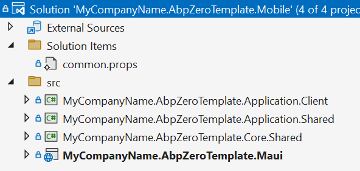

Mobile Solution

There are 4 projects in the mobile solution:

-   **Core.Shared** project contains basic primitive types like consts,
    enums that used in all layers of the solution.
-   **Application.Shared** project contains data transfer objects (DTOs)
    and interfaces of application services shared with application layer
    of the backend.
-   **Application.Client** project contains Web Api client (bridge
    between mobile app and host) and proxy classes of Application
    Services.
-   **Mobile.MAUI** project contains mobile application.

MAUI app contains all platform specific files in the **Platforms** folder in project folder.
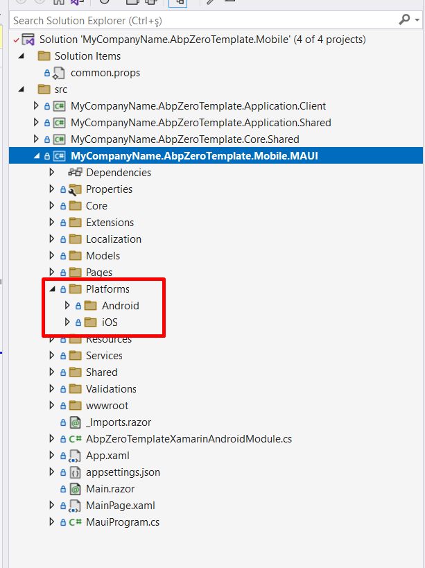

## Debugging

### Host

To start debugging MAUI app you need to configure host settings. You
can use **Web.Host** to feed the MAUI app.
Open Windows Command Prompt. Go to the folder where your **Web.Host csproj** file is located.  
Then run the command below to start hosting your Web API:

```bash
dotnet run --launch-profile Mobile
```

> This will start the Web.Host project from the address "https://0.0.0.0:44301" which enables to access it from external networks.

Alternatively, there's `start-host-mobile.bat` file in your **Web.Host** directory which does the same for Windows users.

**Warning**

If you want to start **Web.Host** from Visual Studio, set **Web.Host** as startup project and choose the `Mobile` profile.

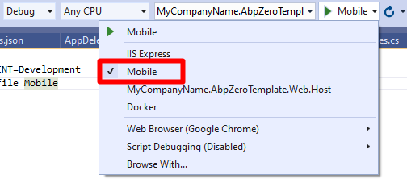


## Create a development certificate

Installing the .NET Core SDK installs the ASP.NET Core HTTPS development  certificate to the local user certificate store. However, while the  certificate has been installed, it's not trusted. To trust the  certificate, perform the following one-time step to run the dotnet `dev-certs` tool:

```bash
dotnet dev-certs https --trust
```

This will allow to trust the self-signed ASP.NET Core HTTPS development certificate in your computer.

For more information, see [Connect to Local Web Services from iOS Simulators and Android Emulators]( https://docs.microsoft.com/en-us/xamarin/cross-platform/deploy-test/connect-to-local-web-services#create-a-development-certificate)

We have successfully started host. Now we can configure MAUI app to connect this host.

### Prepare for production

When you release your MAUI app for production you need to change **DefaultHostUrl** in **ApiUrlConfig** class! 

```
ApiUrlConfig.DefaultHostUrl = "https://mywebapi.com/"
```

**Important**
Be aware that connecting over Wi-Fi needs both the device and the computer to be on the same Wi-Fi network! To avoid confusions to you can completely turn off your mobile data connection.

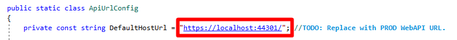

### Debugging Android

There are a few installation steps and configuration details required to install `MAUI`. It's highly recommended you to read the [MAUI Android](https://learn.microsoft.com/en-us/dotnet/maui/android/emulator/hardware-acceleration) for necessary setups.

* If you are using the default Android Emulator, you don't need to change anything. The default loopback address for the Android emulator is `10.0.2.2` and it's written in the `StartApplication()` method of  `MainLayout.razor.cs`

  ````csharp
  DebugServerIpAddresses.Current = "10.0.2.2";
  ````

* If you are using [Genymotion Emulator](https://www.genymotion.com/), change it as below:

  ```csharp
  DebugServerIpAddresses.Current = "10.0.3.2"
  ```

* If you are using a real Android device, change it as your computer's local IP and make sure your Android device and your computer is connecting from the same network (your local Wi-Fi). To connect your real mobile device, make sure your computer's firewall is off (or create an exception in your firewall to allow the port `44301`)

  ````bash
  DebugServerIpAddresses.Current = "XXX.XXX.XXX.XXX"
  ````

After successful setup, set **Mobile.MAUI** as startup project. Choose an Android emulator from list and press start button.

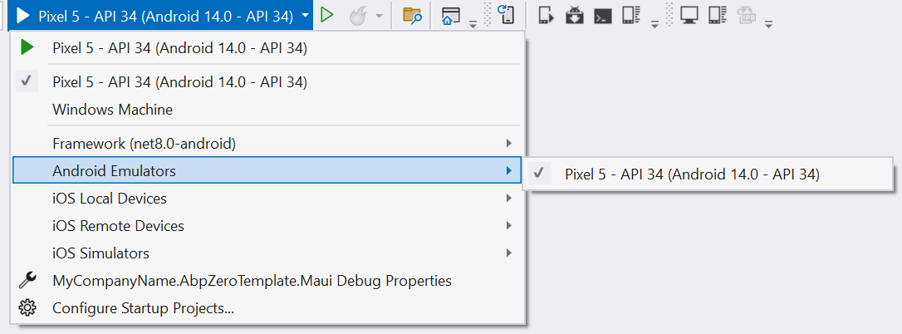  


### Debugging iOS

There are a few requirements that must be adhered to when developing for iOS in Visual Studio. A Mac, an IPAD or an IPhone is required to compile IPA files. Applications cannot be deployed to a device without Apple's certificates and code-signing tools. Also, the iOS simulator can be used only on a Mac.

You need to set DebugServerIpAddresses as your local IP. Eg: `192.168.1.120`

````bash
DebugServerIpAddresses.Current = "XXX.XXX.XXX.XXX";
````
## Mobile.MAUI

### Folder struction

MAUI project has a very basic structure. ASP.NET Zero adds or modifies these files in the default project;

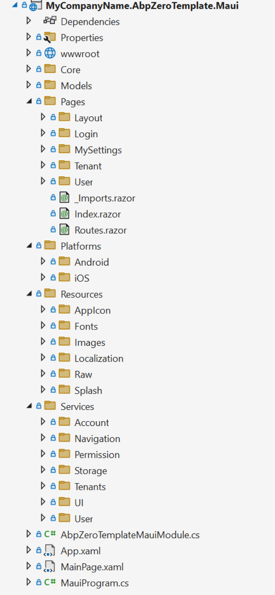

Android Project Structure

-   **Pages** This is where all pages located. You can add your pages in that folder. Pages added here will be used in Android and IOS.
-   **Platforms** This is where all platrform specific implemetations can be made. Every code written here is only published to the relevant platform.You can locate any platform specific codes in that folders. For example, If your service has platform based implementation, you can use that folder and implement it to DI container according to their platform.
-   **Resources** This is where application resources located.
-   **Services** This is where mobile based services implemented.
-   **Shared** This is where all blazor based shared items located. Layouts, base components, partial components are located in this folder.
-   **wwwroot** Since ASP.NET Zero uses Blazor version of MAUI, all web based items(index.html, css, js etc...) are located in this folder.


#### Dependency Injection

ASP.NET Zero MAUI uses ASP.NET Boilerplate Framework's dependency
injection system. Therefore it uses [Castle
Windsor](http://www.castleproject.org/projects/windsor/) as an Inversion of Control container. To resolve dependencies; you can use constructor or property injection, beside there's a shortcut class called *DependencyResolver,* which can be used to resolve dependencies as well.
ASP.NET Boilerplate provides *ITransientDependency* and
*ISingletonDependency* interfaces as a shortcut to register classes. See [ASP.NET Boilerplate Dependency Injection](https://aspnetboilerplate.com/Pages/Documents/Dependency-Injection/)

#### Communicating with Host Api

***AbpApiClient*** class is used to communicate with host. In this
class, *[FlurlClient](https://github.com/tmenier/Flurl)*  is used as http client. The host address *DefaultHostUrl* is stored in
*ApiUrlConfig* class. Before publishing application you need to change
this address with your production host server address. In development
time, it's important to change *LocalhostIp* as your computer's LAN IP
in *DebugServerIpAdresses.cs.*

***WebRequestExecuter*** class handles http web requests in a safe
manner. When the request fails, it handles different types of
exceptions. So if it's a timeout exception, it asks user to retry the
same request. Or if it's a user friendly exception thrown by ABP it
shows an alert and so on... You have to write a success and a fail
callback to handle the result. In fail callback, the exception can be
retrieved and in success callback result of the request can be
retrieved.

***SetBusyAsync*** method is in the base class of components in
*AbpZeroTemplateComponentBase* class. Whenever a long lasting operation is required
it should be wrapped with SetBusyAsync method in view model so that user
can see a busy indicator.

#### Exception Handling

All exceptions are globally handled in *ExceptionHandler* class,
when you use *WebRequestExecuter*.

#### Pages

##### InitialView

InitialView is a transition page that checks whether user has any
granted menu permission or not. If user has no permissions then an info
message will be shown on the screen. But if user has at least one
granted menu permission, it is automatically being navigated to the
first authorized menu item.

##### Login

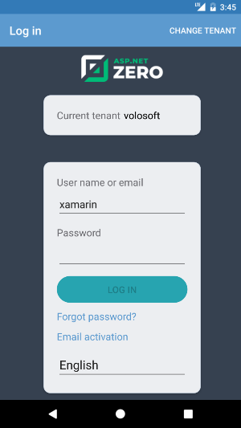

When user enters credentials *AccessTokenManager* authenticates user,
stores access token in memory. For authentication needed Api calls, this
token is being added to the request as bearer token. There's a timer in
*AccessTokenManager* class that renews token before it expires. If an
error occurs while communicating with host, client tries to reconnect using refresh token
within an exponentiation increasing time. After successful login user
credentials are stored in device. User information is being set in
*ApplicationContext* so if current logon account information is needed
it can be retrieved with injecting *IApplicationContext*.

##### Menu

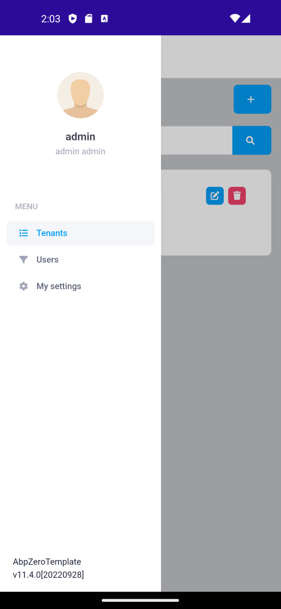

Menu items are stored in *MenuProvider* class. A menu item is shown if
only user has granted required permission.

##### Tenants View


In this page you can see all tenants in your application. You can create new tenant, edit tenant or delete tenant. (If you have necessary permissions, otherwise you will not be able to see related buttons or page)
There is a search bar on the top
that filters tenants.
You can _Create_ new tenant, _Edit_ or _Delete_ existing tenants using related button in the row. (If you dont have permission buttons will not be shown)

Create Tenant             |  Edit Tenant |  Delete Tenant
:-------------------------:|:-------------------------:|:-------------------------:
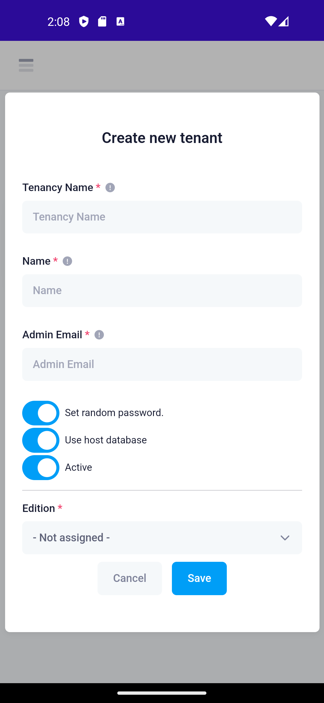  |  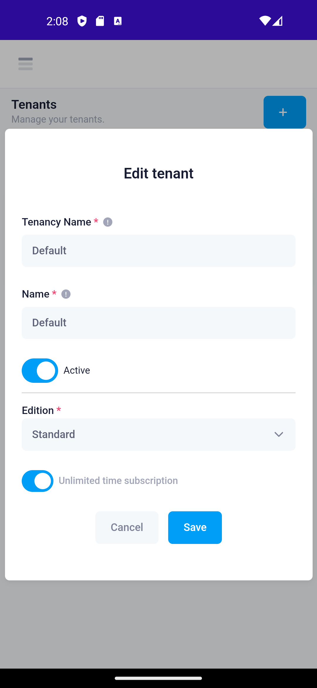 | 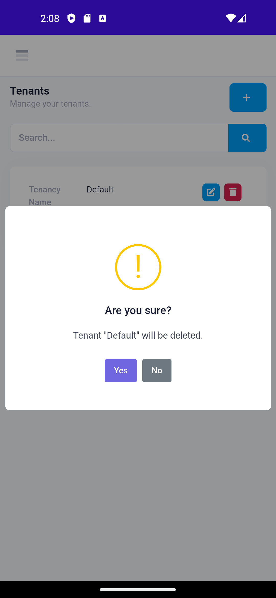

##### User View

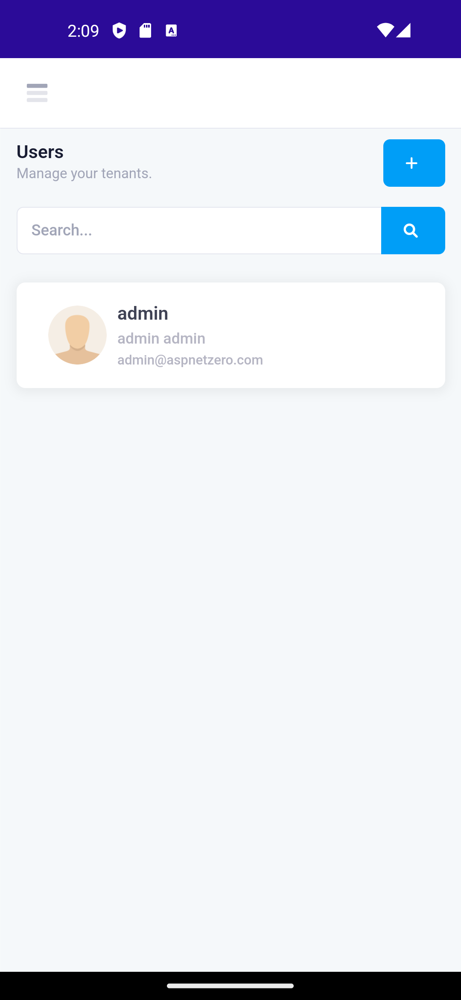

This page lists users of the tenant or tenant owner. It is only shown if
the user has permission to this page. Same as tenants view, there's a
search bar and a new user creation toolbar item. hen a user is being tapped, it's navigated to edit user modal with the selected user.

You can create new user or manage existing one.

Create Tenant             |  Edit Tenant |  Delete Tenant
:-------------------------:|:-------------------------:|:-------------------------:
  |  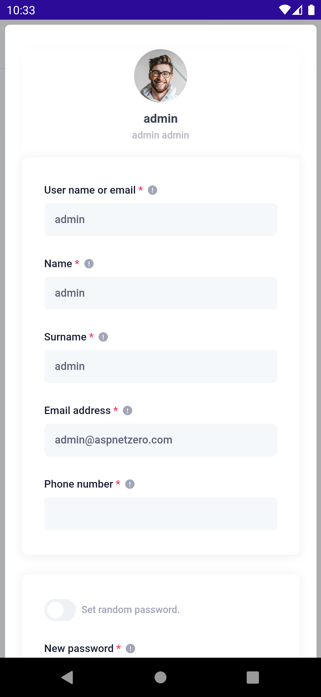 | 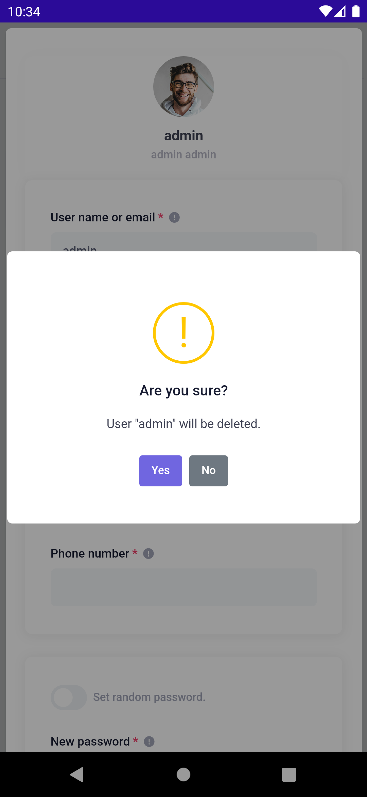

## Distribution

### Configuration

-   Before publishing the application change the **DefaultHostUrl** in
    **ApiUrlConfig** class. how to distribute MAUI application.
-   Change all application icon files with your own app icon.
-   Change all AppLogo.png files with your own app logo.
-   Version your application for future updates.

### Publishing

If you want to publish your application to the related application store
you can read the MAUI official guides;

-   [Publish a .NET MAUI app for Android](https://learn.microsoft.com/en-us/dotnet/maui/android/deployment/overview)
-   [Publish a .NET MAUI app for iOS](https://learn.microsoft.com/en-us/dotnet/maui/ios/deployment/overview)