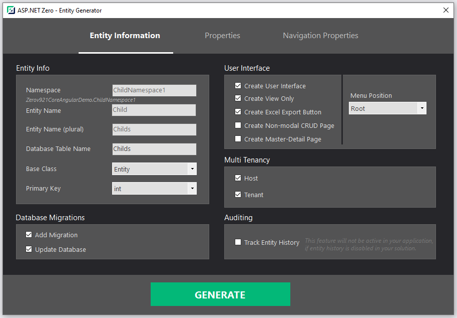
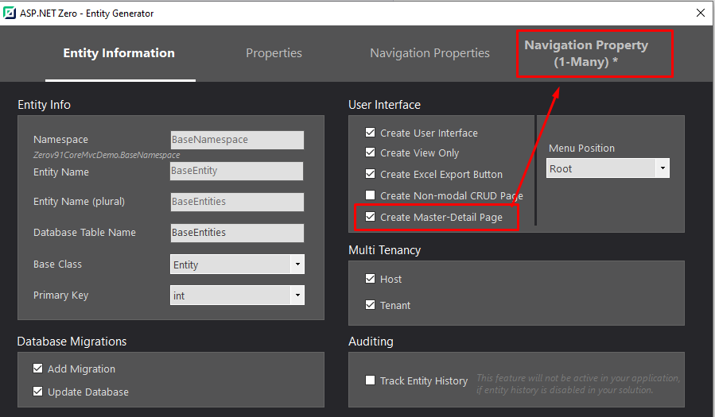
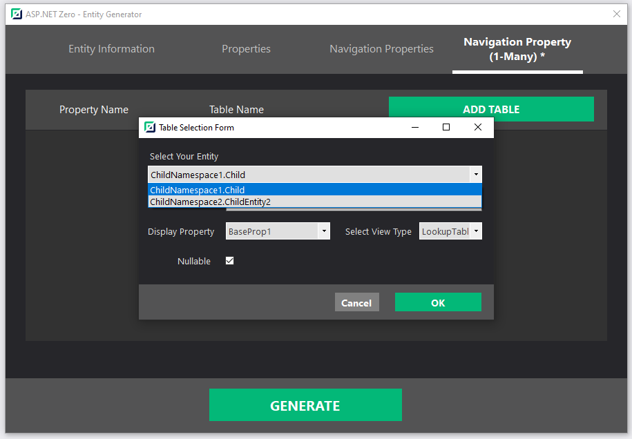
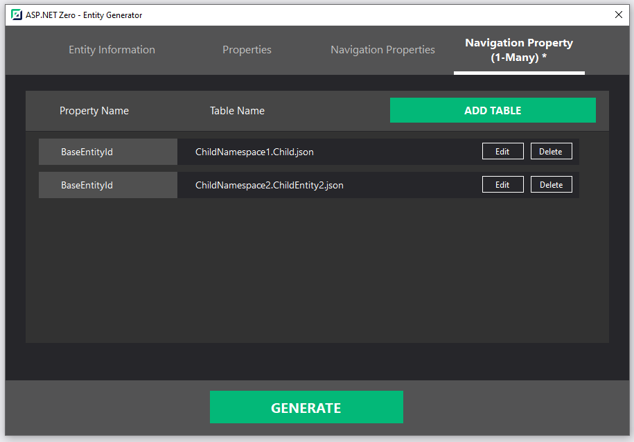
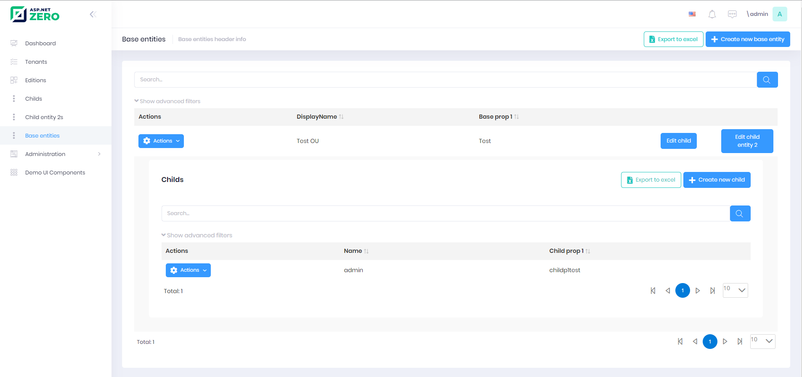
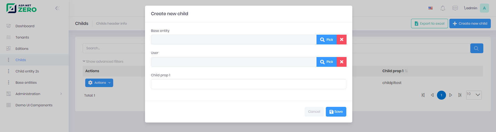
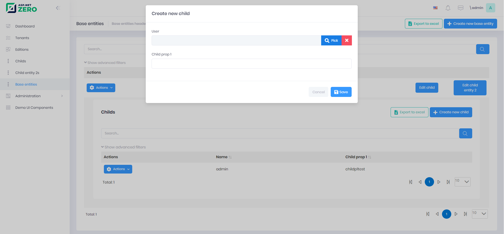

# Power Tools Master Detail Tables

You can create master detail tables using Power Tools.

To create master-detail tables you can follow these steps.

1. **Creating a child entity**
   You should create necessary child entities using Power Tools 
   You can follow [that](Development-Guide-Rad-Tool.md) documentation and create an entity. 
   For example:
   
2. **Creating a base entity**
   * Open new entity generator. Fill your base entities' information.
   * Select **Create Master-Detail Page** then you will be able to see **Navigation Property (1-Many)** tab
     
   * Then go to that tab, Click **Add Table** and select the child table that you previously created.
     
   * Then you can generate the base entity
     

After that you can use new master detail page.

Note: You can create list views for child entities too. Power Tools will change base entity page and child page. It will add base entity to child entity as a navigation property.

(If you manage child entity in base entity page everything about the base entity will be automatically managed.)

