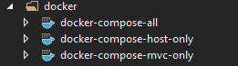
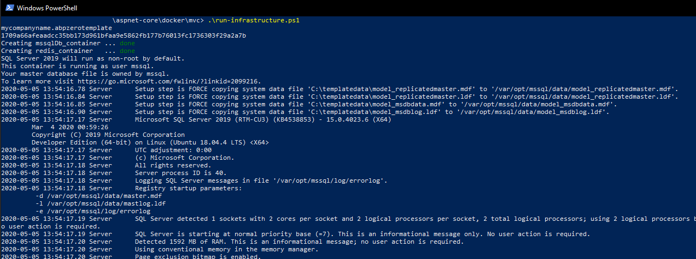
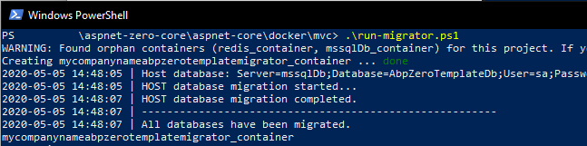
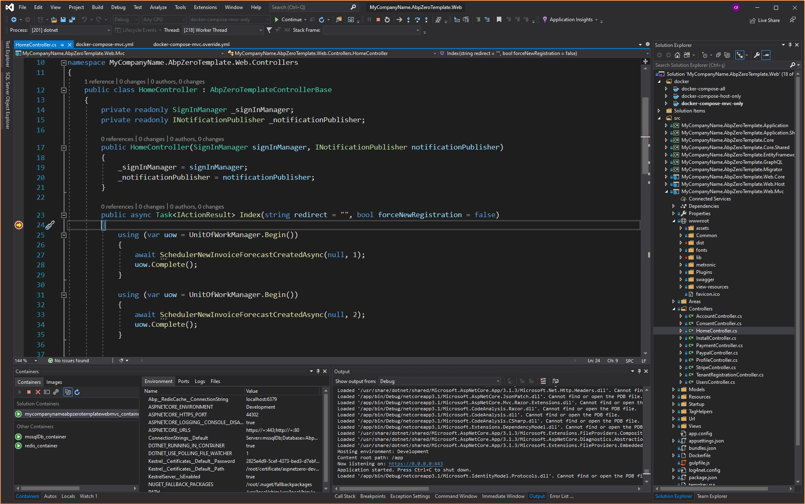
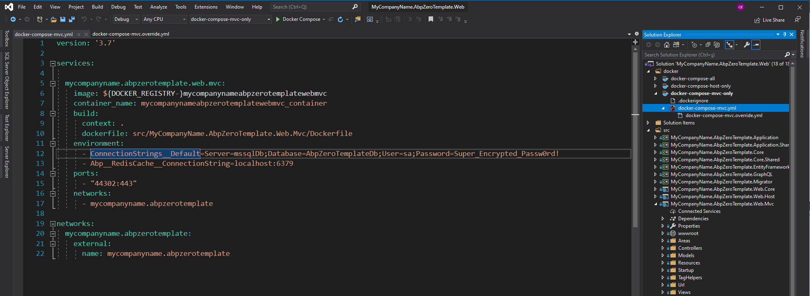
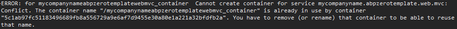

# Development with Docker Containers for MVC

ASP.NET Zero `aspnet-core` folder contains various docker projects for your application to debug using docker containers. You can add these projects to your **.Web** or **.All** solutions by **Add Existing Project** to your preferred solution.



To get started with using docker for development, there are some prerequisites.

### 1. Setting up the infrastructure

Infrastructure contains **mssql-server-linux** as a replacement for your LocalDb and **redis** server for your applications.

In your `aspnet-core\docker\infrastructure\` folder, you will find **run-infrastructure.ps1** file which uses **docker-compose.infrastructure.yml** file to setup your infrastructure. Running the shell script should have a similar output like below.



After running the script, powershell will be hanging (non interactive) for you to see if there is any error occurred while creating the containers. You can use **Ctrl + X** to exit tailing the database logging to make the powershell interactive again.

### 2. Setting up the self-signed certificate

Your applications need certificate to enable https. Normally Visual Studio creates this certificate for you when you run your application for the first time however sometimes it doesn't when docker is involved. To overcome the issue, we create our own self-signed certificate for development.

In your `aspnet-core\docker\certificate\` folder, you will find **create-certificate.ps1** file to create the certificate. After running the shell script, you should have a similar output like below.


### 3. Running the migrator

In your `aspnet-core\docker\migrator\` folder, you will find **run-migrator** file to apply migrations for your application. Running the shell script should have a similar output like below.




## Running applications on containers

In your applications **.Web** solution under **docker folder**, set as startup project you want to debug. Visual studio will instantly begin building the container. **Building containers may take some time** for the first time since it will be downloading required base images.

Below you can see **docker-compose-mvc** debugging:



There are three docker solutions you can set as startup project to run;

1. **docker-compose-host:** Runs Web.Host project.
2. **docker-compose-mvc:** Runs only Web.Mvc project.
3. **docker-compose-public:** Runs Web.Mvc and Web.Public projects together.

Each docker-compose files have override.yml files to set the other environments like certification information, docker volumes or AspnetCore environment.


Configuration is separated between **docker development** and default **IIS development**. 

If you want to change the default connection string when running on containers; you need to change the environment variable **ConnectionStrings__Default** in corresponding **docker-compose.yml** shown below:



This environment variable overrides the connection string which has been set in appsettings.json. This way you can use both development environments without mixing up the configurations.

In some cases, you may get **container conflict errors** when switching between docker projects; like debugging **docker-compose-mvc** first then start debugging **docker-compose-public** after stopping the first one.



This occurs because the mvc container is still alive even if you stop debugging. To avoid container conflicts, you need to **Clean** the solution (right click to docker project and clean option) to remove the container completely before running the **docker-compose-public** which uses common containers like mvc container.

Note: You can also run your projects using following commands

_mvc_
```shell
docker compose -f docker-compose-mvc.yml -f docker-compose-mvc.override.yml up
```

_host_
```shell
docker compose -f docker-compose-host.yml -f docker-compose-host.override.yml up
```

_public_
```shell
docker compose -f docker-compose-public.yml -f docker-compose-public.override.yml up
```