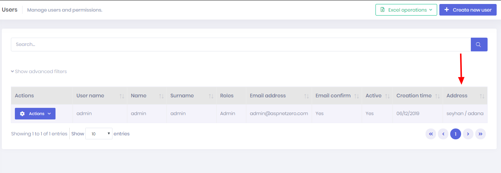

# Extending Existing Entities

## Introduction

This tutorial is a step by step guide to learn **how to add new properties to existing entities**, from database layer to UI layer.

In ASP.NET Zero, **Tenant**, **User** and **Role** entities are **abstract** in the framework, others are not. There are some differences between them. So, we separated it into two sections.

*Note: We assume that you have created your project as described in the Getting Started document*

* [Getting Started Angular](Getting-Started-Angular)

* [Getting Started MVC](Getting-Started-Core) 

## Extending Abstract Entities

As a sample, we will work on **User** entity. We want to add an **Address** property to the User.

### Add New Property To User

Open Authorization\\Users\\**User.cs** (in .Core project) and add the new property:

```csharp
public class User : AbpUser<User>
{
    //...existing code

    public virtual string Address { get; set; }
}
```

Here, we hid the existing code in the User class to show it simpler. You can add Address property after existing properties.

### Add Migration

Since we added new property, our database schema is changed. Whenever we change our entities, we should add a new database migration. Open Package Manager Console, select ".EntityFrameworkCore" project as default project in combobox and write new migration code:

    Add-Migration "Added_Address_To_User"

This will create a new Entity Framework migration class:

```csharp
    public partial class Added_Address_To_User : Migration
    {
        protected override void Up(MigrationBuilder migrationBuilder)
        {
            migrationBuilder.AddColumn<string>(
                name: "Address",
                table: "AbpUsers",
                nullable: true);
        }

        protected override void Down(MigrationBuilder migrationBuilder)
        {
            migrationBuilder.DropColumn(
                name: "Address",
                table: "AbpUsers");
        }
    }
```

Since it's automatically created, we don't have to know what it does for most cases. Now, we can update our database with this command:

    Update-Database

When we check **AbpUsers** table in the database, we can see the new **Address** field:


For testing purposes, we can enter some data for existing users by hand.

### Show Address On The UI

Note: The UI part of this document is written for ASP.NET Core MVC & jQuery version of ASP.NET Zero. 

**GetUsers** method in Authorization\\Users\\**UserAppService.cs** (in .Application project) is used for getting list of users by clients. It returns a list of **UserListDto** (we always use [DTOs](https://aspnetboilerplate.com/Pages/Documents/Data-Transfer-Objects) for client communication). So, we should add the Address property to UserListDto too:

```csharp
public class UserListDto : EntityDto<long>, IPassivable, IHasCreationTime
{
    //...existing code

    public string Address { get; set; }
}
```

Since UserListDto **auto maps** from User entity, no need to change **UserAppService.GetUsers** method. Now, we can go to UI side to add Address property to the **users table**. Open 
.Web\\wwwroot\\view-resources\Areas\\{AppAreaName}\Views\\Users\\**Index.js** and add Address column right after CreationTime column:

```javascript
                },
                {
                    targets: 9,
                    data: "creationTime",
                    render: function (creationTime) {
                        return moment(creationTime).format('L');
                    }
                },
                {
                    targets: 10,
                    data: 'address'
                }
            ]
        });
```

And in .Web\\Areas\\{AppAreaName}\Views\\Users\\**Index.cshtml**, add Address column:


```html
                            <th>@L("Active")</th>
                            <th>@L("CreationTime")</th>
                            <th>@L("Address")</th>
                        </tr>
                    </thead>
                </table>
```

That's all. Now let's navigate to root directory of ***.Web.Mvc** project and run **npm run create-bundles** command. Then we can start the application and open the **users page**:



### Add Address On User Create/Edit

We may want to set Address while **creating/editing** a User.

Clients use UserAppService.**GetUserForEdit** method to show user information on edit form. It returns **GetUserForEditOutput** object which contains a **UserEditDto** object that includes user properties.
So, we should add Address to UserEditDto to allow clients to change Address property on create/update:

```csharp
public class UserEditDto : IPassivable
{
    //...existing code

    public string Address { get; set; }
}
```

Since **UserAppService** use **auto mapping**, no need to manually map Address to the User entity. So, server side code is just that. We can go to UI side to add an Address field to the form:

```html
                        <div class="form-group">
                            <label for="Address">@L("Address")</label>
                            <input id="Address" type="text" name="Address" class="form-control" value="@Model.User.Address">
                        </div>
```

This code is written to ***.Web\\Areas\\{AppAreaName}\Views\\Users\\createOrEditModal.cshtml**. After adding, new Address field is shown on the create/edit form as shown below:


## Extending Non-Abstract Entities

As a sample, we will work on **Edition** entity.

### Derive From Edition Entity

Since Edition is **not abstract** in the framework, we can not direcly add new properties to the Edition class. Instead, we should use OOP patterns like **inheritance** or **composition**. Since inheritance will be simpler, we can create a new class deriving from Edition entity. There is already an entity derived from edition: **SubscribableEdition**. Let we look how it is implemented, and show the steps of how **AnnualPrice** field is added (SubscribableEdition class is under Editions folder under the .Core project):

```csharp
public class SubscribableEdition : Edition
{
   //...other fields

   public decimal? AnnualPrice { get; set; }
        
   //...other fields
```


Notice that a DbSet property for SubscribableEdition entity is added to DbContext class defined in .EntityFrameworkCore project.

```csharp
public class ProjectNameDbContext : AbpZeroDbContext<Tenant, Role, User>
{
    public virtual DbSet<SubscribableEdition> SubscribableEditions { get; set; }

    //...other entities

    public ProjectNameDbContext()
        : base("Default")
    {

    }

    //...other codes
}
```

Also, you can see that a new migration is added after SubscribableEdition is created.

### Show AnnualPrice On The UI

Editions\\**EditionAppService.cs** (in .Application project) is used to get list of editions by clients. It returns a list of **EditionListDto** (we always use [DTOs](https://aspnetboilerplate.com/Pages/Documents/Data-Transfer-Objects) for client communication). So, AnnualPrice property is added to EditionListDto too:

```csharp
public class EditionListDto : EntityDto
{
    //...other fields

    public decimal? AnnualPrice { get; set; }
    
    //...other fields
}
```

**Auto mapping from MyEdition** is already added. No need to change **EditionAppService.GetEditions** method by the help of auto mapping. Now, you can go to UI side to see how AnnualPrice property is added to the **editions** table in .Web\\view-resources\\Areas\\{AppAreaName}\\Views\\Editions\\**Index.js**:

```javascript
},
{
   targets: 3,
   data: "price",
   render: function (displayName, type, row, meta) {
     if (row.monthlyPrice || row.annualPrice) {
       return '$ ' + row.monthlyPrice + ' ' + app.localize('Monthly') + ' / $ ' + row.annualPrice + ' ' + app.localize('Annual');
   }

   return app.localize('Free');
},
```

You can see that AnnualPrice is not directly shown. However, it could be simply added like below

```
{
    targets: 2,
    data: "annualPrice "
},
```

That's all. You can check **EditionCreateDto** and .Web\\Areas\\{AppAreaName}\Views\\Editions\\**_CreateModal.cshtml** to see how the AnnualPrice fields is set during edition creation.
