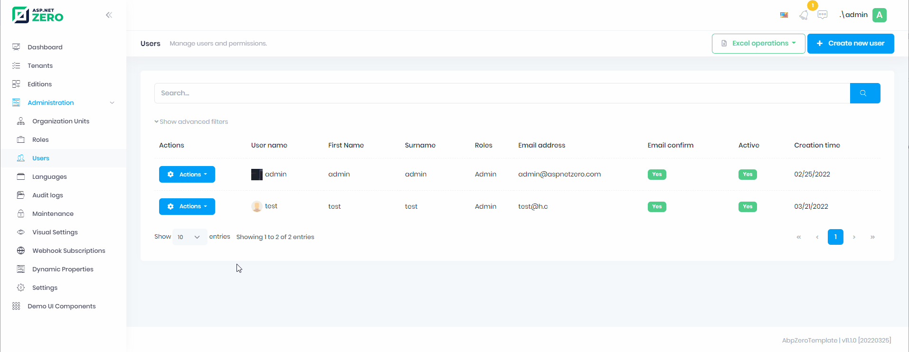

# Dynamic Property System

**Dynamic Property System** is a system that allows you to add and manage new properties on entity objects at runtime without any code changes. With this system, you can define dynamic propeties on entity objects and perform operations on these objects easily. For example, it can be used for cities, counties, gender, status codes etc.

Check AspNet Boilerplate side of [Dynamic Property System](https://aspnetboilerplate.com/Pages/Documents/Dynamic-Property-System)

### Defining

* Firs of all you need to define input types and entities you want to use with dynamic properties as described [here](https://aspnetboilerplate.com/Pages/Documents/Dynamic-Parameter-System#dynamic-property-definition)

* Then go to http://localhost:4200/app/admin/dynamic-property

* Add Dynamic Properties that you need

* Assign Dynamic Properties to your entity


* Then you will be able to use dynamic property for the items of your entity.

You can use `DynamicEntityPropertyManagerComponent` to manager dynamic properties of an entity

_*.html_
```html
<!--...-->
<li
    *ngIf="
        dynamicEntityPropertyManager.canShow(
            'MyCompanyName.AbpZeroTemplate.Authorization.Users.User'
        )
    "
    role="menuitem"
>
    <a
        href="javascript:;"
        class="dropdown-item"
        (click)="showDynamicProperties(record)"
    >
        {{ 'DynamicProperties' | localize }}
    </a>
</li>
<!--...-->
<dynamic-entity-property-manager #dynamicEntityPropertyManager></dynamic-entity-property-manager>
```

_*.ts_
```typescript
import { DynamicEntityPropertyManagerComponent } from '@app/shared/common/dynamic-entity-property-manager/dynamic-entity-property-manager.component';
@Component({
    templateUrl: './users.component.html',
    encapsulation: ViewEncapsulation.None,
    styleUrls: ['./users.component.less'],
    animations: [appModuleAnimation()],
})
export class UsersComponent extends AppComponentBase implements AfterViewInit {
    @ViewChild('dynamicEntityPropertyManager', { static: true }) dynamicEntityPropertyManager: DynamicEntityPropertyManagerComponent;

    showDynamicProperties(user: UserListDto): void {
        this.dynamicEntityPropertyManager
            .getModal()
            .show('MyCompanyName.AbpZeroTemplate.Authorization.Users.User', user.id.toString());
    }
    //...
}

```



_____

<table>
    <thead>
    	<tr>
            <th>Property</th>
            <th>Summary</th>
        </tr>
    </thead>
    <tbody>
    	<tr>
            <td>ParameterName*</td>
            <td>Unique name of the dynamic parameter</td>
        </tr>
         <tr>
            <td>Input Type*</td>
            <td>Input type name of the dynamic parameter</td>
        </tr>  
         <tr>
            <td>Permission</td>
            <td>Required permission to manage anything about that parameter <br><span style="font-style: italic;">(<code>DynamicParameterValue</code>, <code>EntityDynamicParameter</code>, <code>EntityDynamicParameterValue</code>)</span></td>
        </tr>   
    </tbody>
</table>