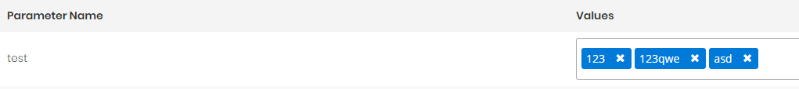

# Create Custom Input Types

In this document we will create a custom input type step by step. Our input type is multi-select combobox input type.

1. Go to `*.Core` and create a folder named `CustomInputTypes`.

2. Create a class named `MultiSelectComboboxInputType` in that folder.

   ```csharp
   /// <summary>
   /// Multi Select Combobox value UI type.
   /// </summary>
   [Serializable]
   [InputType("MULTISELECTCOMBOBOX")]
   public class MultiSelectComboboxInputType : InputTypeBase
   { 
   }
   ```

3. Go to `AppDynamicEntityParameterDefinitionProvider` and add new input type.

   ```csharp
    public class AppDynamicEntityParameterDefinitionProvider : DynamicEntityParameterDefinitionProvider
   {
       public override void SetDynamicEntityParameters(IDynamicEntityParameterDefinitionContext context)
       {
          	...
           context.Manager.AddAllowedInputType<MultiSelectComboboxInputType>();
   		...
       }
   }
   ```

4. Go to `angular\src\app\shared\common\input-types` folder

5. Create new component  named `MultiSelectComboboxInputTypeComponent` as seen below.

   ```bash
   ng g component multi-select-combobox-input-type
   ```

   *multi-select-combobox-input-type.component.html*

   ```typescript
   import { Component, OnInit } from '@angular/core';
   import { FormsModule } from '@angular/forms';
   import { NzSelectModule } from 'ng-zorro-antd/select';
   import { InputTypeComponentBase } from '../input-type-component-base';
   
   @Component({
     selector: 'app-multi-select-combobox-input-type',
     templateUrl: './multi-select-combobox-input-type.component.html',
     imports: [NzSelectModule, FormsModule]
   })
   export class MultiSelectComboboxInputTypeComponent extends InputTypeComponentBase implements OnInit {
     filteredValues!: string[];

     ngOnInit() {
       this.filteredValues = this.allValues;
     }
   
     getSelectedValues(): string[] {
       if (!this.selectedValues) {
         return [];
       }
       return this.selectedValues;
     }
   
     filter(event: any) {
       this.filteredValues = this.allValues
         .filter(item =>
           item.toLowerCase().includes(event.query.toLowerCase())
         );
     }
   }
   ```

   *multi-select-combobox-input-type.component.html*

   ```html
   <nz-select
       class="width-percent-100"
       nzMode="multiple"
       nzShowSearch
       nzServerSearch
       [(ngModel)]="selectedValues"
       (nzOnSearch)="filter({ query: $event })">
       @for (item of filteredValues; track item) {
           <nz-option [nzValue]="item" [nzLabel]="$any(item)" />
       }
   </nz-select>
   ```

   You must extend `InputTypeComponentBase`. Since you extend `InputTypeComponentBase` your component will have **selectedValues** (initial stored selected values) and **allValues** (all values that your component can have, if your component needs initial values).

   `InputTypeComponentBase` resolves these with Angular's `inject()` function in its own constructor, so your component does not need a constructor at all. Inject any additional service you need as a field, for example `private _myService = inject(MyServiceProxy);`.

   

6. Then go to `angular\src\app\shared\common\input-types\input-type-configuration.service.ts` and add your input type.

   ```typescript
   export class InputTypeConfigurationService {
     ...
     private initialize(): void {  
     ...
   
       let multiselectComboBoxInputType = new InputTypeConfigurationDefinition(
         'MULTISELECTCOMBOBOX',
         MultiSelectComboboxInputTypeComponent,
         true//is that input type need values to work. For example dropdown need initial values to select.
       );
   
       this.InputTypeConfigurationDefinitions.push(multiselectComboBoxInputType);
     }
     ...
   }
   
   
   ```

That is the only place the component has to be registered. Components are standalone,
so there is no module to declare it in: the dynamic parameter UI creates the component
from the definition above, and the component's own `imports` array brings in everything
its template uses.

All done. Your custom input type is ready to use in dynamic parameter. Create new dynamic parameter which uses that input type, add it to an entity. Then you can go to manage page and use it. 


