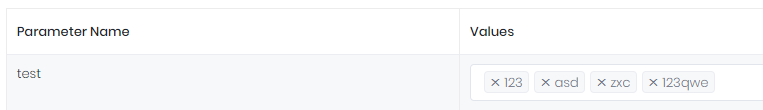

# Create Custom Input Types

In this document we will create a custom input type step by step. Our input type is multi-select combobox input type.

1. Go to `*.Core` and create a folder named `CustomInputTypes`.

2. Create a class named `MultiSelectComboboxInputType` in that folder.

   ```csharp
   /// <summary>
   /// Multi Select Combobox value UI type.
   /// </summary>
   [Serializable]
   [InputType("MULTISELECTCOMBOBOX")]
   public class MultiSelectComboboxInputType : InputTypeBase
   { 
   }
   ```

3. Go to `AppDynamicEntityParameterDefinitionProvider` and add new input type.

   ```csharp
    public class AppDynamicEntityParameterDefinitionProvider : DynamicEntityParameterDefinitionProvider
   {
       public override void SetDynamicEntityParameters(IDynamicEntityParameterDefinitionContext context)
       {
          	...
           context.Manager.AddAllowedInputType<MultiSelectComboboxInputType>();
   		...
       }
   }
   ```

4. Go to `*.Web.Mvc\wwwroot\view-resources\Areas\AppAreaName\Views\Common\IInputTypes\` folder

5. Create new JavaScript file named `MultiSelectComboboxInputType.js` and fill required functions.

   ```javascript
   var MultiSelectComboBoxInputType = (function () {
       return function () {
           var _options;
           function init(inputTypeInfo, options) {
               _options = options;
           }
           var $combobox;
           function getView(selectedValues, allItems) {
               $combobox = $('<select class="form-control w-100" multiple/>');
   
               if (allItems && allItems.length > 0) {
                   for (var i = 0; i < allItems.length; i++) {
                       var $option = $('<option></option>')
                           .attr('value', allItems[i])
                           .text(allItems[i]);
   
                       if (selectedValues && selectedValues.length > 0 && selectedValues.indexOf(allItems[i]) !== -1) {
                           $option.attr("selected", "selected");
                       }
   
                       $option.appendTo($combobox);
                   }
               }
   
               $combobox
                   .on('change', function () {
                       if (_options && typeof (_options.onChange) === "function") {
                           _options.onChange($combobox.val());
                       }
                   });
               return $combobox[0];
           }
   
           function getSelectedValues() {
               return $combobox.val();
           }
   
           function afterViewInitialized() {
               $combobox.select2({ width: '100%' });
           }
   
           return {
               name: "MULTISELECTCOMBOBOX",
               init: init,
               getSelectedValues: getSelectedValues,
               getView: getView,
               hasValues: true, // is that input type need values to work. For example dropdown need values to select.
               afterViewInitialized: afterViewInitialized
           };
       };
   })();
   
   (function () {
       var MultiSelectComboBoxInputTypeProvider = new function () {
           this.name = "MULTISELECTCOMBOBOX";
           this.get = function () {
               return new MultiSelectComboBoxInputType();
           }
       }();
   
       abp.inputTypeProviders.addInputTypeProvider(MultiSelectComboBoxInputTypeProvider);
   })();
   ```

   You input type should contain these:

   <table>
       <tbody>
           <tr>
               <th>name</th>
               <td>Unique name of input type <br/>(must be same with the name you use in .cs file)</td>
           </tr>
            <tr>
               <th>init</th>
               <td>initialize function that you will get <br/><a href="https://github.com/aspnetboilerplate/aspnetboilerplate/blob/dev/src/Abp/UI/Inputs/IInputType.cs">inputTypeInfo</a> and options</td>
           </tr>
             <tr>
               <th>getView</th>
               <td>the function that returns a new view for given informations. Manager uses it to create new view for inputs</td>
           </tr>
            <tr>
               <th>getSelectedValues</th>
               <td>the functions that returns selected values array.<br/> (it must be string array. If your input type has only one selected value return it in array for example:<code>["selectedvalue"]</code>)</td>
           </tr>
           <tr>
               <th>hasValues</th>
               <td>if your input type needs values <br/> For example single line input type does not need any predefined value but combobox needs.</td>
           </tr>
       <tr>
           <th>afterViewInitialized</th>
           <td>The function that manager will trigger after view initialized.</td>
       </tr>
   </tbody>
   </table>

6. Create `MultiSelectComboBoxInputTypeProvider` that create new input type object for each request. Then add that provider to `abp.inputTypeProviders`

   ```javascript
   (function () {
       var MultiSelectComboBoxInputTypeProvider = new function () {
           this.name = "MULTISELECTCOMBOBOX";
           this.get = function () {//must return new object of your input type
               return new MultiSelectComboBoxInputType();
           }
       }();
       abp.inputTypeProviders.addInputTypeProvider(MultiSelectComboBoxInputTypeProvider);//add your input type provider to abp.inputTypeProviders
   })();
   ```

All done. Your custom input type is ready to use in dynamic parameter. Create new dynamic parameter which uses that input type, add it to an entity. Then you can go to manage page and use it. 


