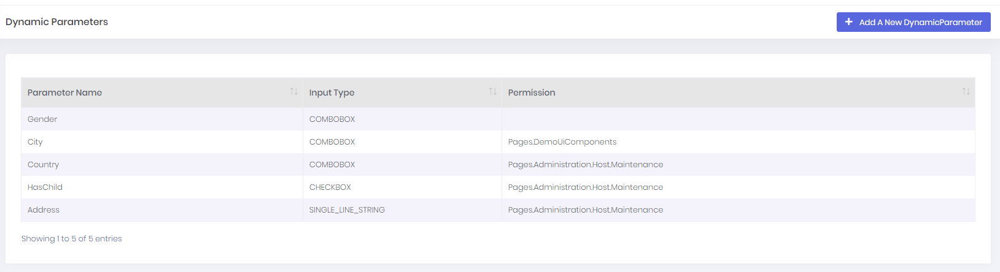
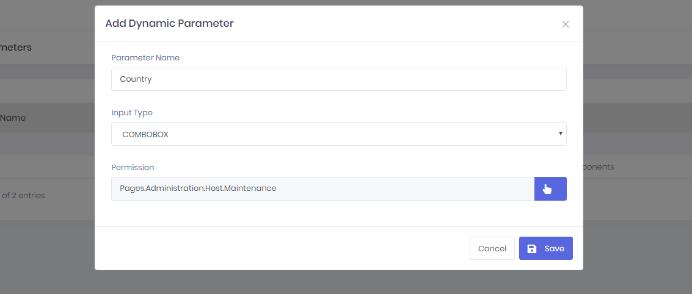
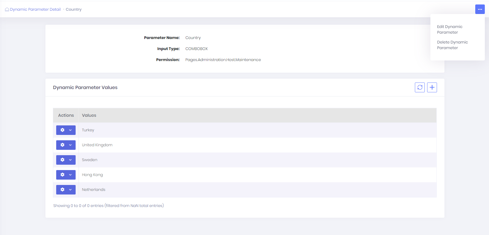
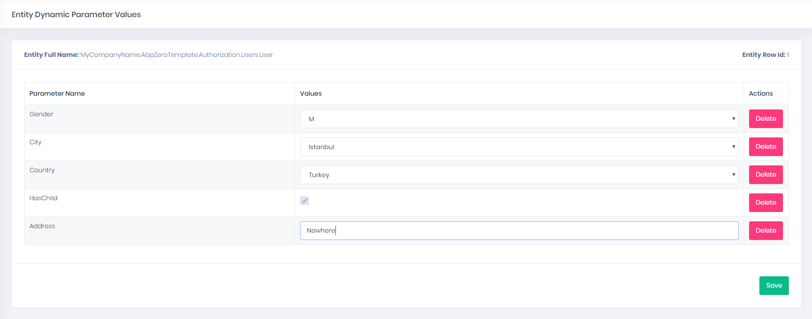

# Dynamic Parameter System

**Dynamic Parameter System** is a system that allows you to add and manage new parameters on entity objects at runtime without any code changes. With this system, you can define dynamic parameters on entity objects and perform operations on these objects easily. For example, it can be used for cities, counties, gender, status codes etc.

In **Dynamic Parameters** page, you can see all of your dynamic parameters:

You can use **Add A New Dynamic Parameter** button to create a new dynamic parameter. 

<table>
    <thead>
    	<tr>
            <th>Property</th>
            <th>Summary</th>
        </tr>
    </thead>
    <tbody>
    	<tr>
            <td>ParameterName*</td>
            <td>Unique name of the dynamic parameter</td>
        </tr>
         <tr>
            <td>Input Type*</td>
            <td>Input type name of the dynamic parameter</td>
        </tr>  
         <tr>
            <td>Permission</td>
            <td>Required permission to manage anything about that parameter  (<code>DynamicParameterValue</code>, <code>EntityDynamicParameter</code>, <code>EntityDynamicParameterValue</code>)</td>
        </tr>   
    </tbody>
</table>

In **Dynamic Parameter Detail Page**, you can manage a dynamic parameter and it's values(If your dynamic parameter's input types need values to select, for example: `ComboboxInputType`)

In **Entity Dynamic Parameters** page, you can manage dynamic parameter of entities. 

To manage dynamic parameter values of an entity row you should go to "https://localhost:44302/AppAreaName/EntityDynamicParameterValue/ManageAll/**{YourEntityName}**/**{EntityRowId}**". It will open value manager for entities dynamic parameter types.

For example, yo should go to https://localhost:44302/AppAreaName/EntityDynamicParameterValue/ManageAll/MyCompanyName.AbpZeroTemplate.Authorization.Users.User/1 to manage the first row of User entity table.

