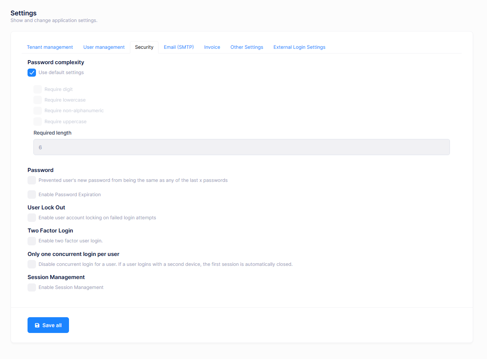
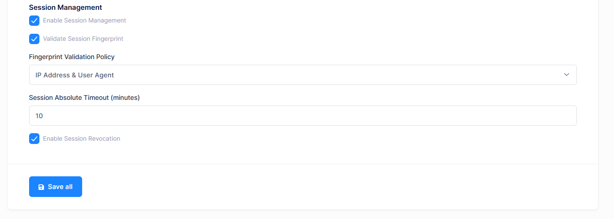
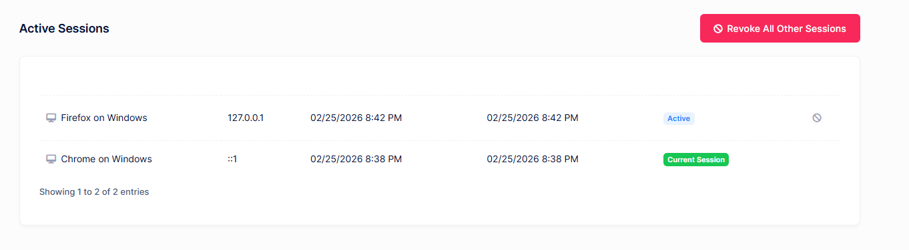

# Active Sessions

Active Sessions is a security feature that allows administrators to monitor and manage user login sessions across the application. With this feature, you can see where and when users are logged in, detect suspicious activity, and terminate sessions when needed. Session management works for both host and tenant users.

> Note: Session management is **disabled by default**. It must be enabled from the settings page before it can be used.

## Enabling Session Management

To enable session management, go to **Administration > Settings** and open the **Security** tab. You will find the **Session Management** section at the bottom of this tab.

Set the **Session Management** toggle to **enabled**. Once enabled, the application will start tracking user sessions on every login. The **Active Sessions** menu item will also appear under the **Administration** menu.

When session management is disabled, no sessions are recorded, the Active Sessions menu item is hidden, and the related API endpoints return a disabled message.

## Session Management Settings

The following settings are available under the Session Management section on the settings page. These settings can be configured separately for host and each tenant.

### Session Management Enabled

This is the master switch for the entire feature. When turned off, sessions are not tracked, the Active Sessions page is not accessible, and all session-related API calls are rejected.

### Session Fingerprint Validation

When enabled, the system generates a fingerprint for each session based on the client's IP address and User-Agent string. On subsequent requests, the system compares the current fingerprint with the stored one. If they do not match, the session is considered invalid and the user is logged out.

This provides an additional layer of security by detecting if a session token is used from a different device or network than the one that originally authenticated.

### Fingerprint Validation Policy

This setting controls what data is included when computing the session fingerprint. There are three options:

| Policy | Description |
|---|---|
| **IP and User Agent** | The fingerprint is computed using both the client's IP address and User-Agent header. This is the default and most restrictive option. A session becomes invalid if either the IP or browser changes. |
| **IP Only** | The fingerprint is computed using only the client's IP address. The session remains valid if the user switches browsers on the same network, but becomes invalid if the IP changes. |
| **User Agent Only** | The fingerprint is computed using only the User-Agent header. The session remains valid if the user's IP changes (e.g., switching networks), but becomes invalid if a different browser or device is used. |

> Note: Choose the policy based on your security requirements. **IP and User Agent** provides the strongest protection but may cause issues for users whose IP addresses change frequently (e.g., mobile users). **User Agent Only** is more lenient for users on dynamic networks.

### Session Absolute Timeout (Minutes)

Defines the maximum lifetime of a session in minutes. After this period, the session is automatically invalidated regardless of user activity. The value must be between **10** and **43200** (30 days). Setting this to **0** disables the absolute timeout, meaning sessions remain valid as long as there is activity.

### Session Revocation Enabled

Controls whether users and administrators can manually terminate (revoke) sessions from the Active Sessions page. When disabled, the revoke buttons are hidden and the revoke API endpoints are rejected. Disabling this does not affect automatic session invalidation through fingerprint validation or timeout.

## Active Sessions Page

To view active sessions, go to **Administration > Active Sessions** from the main menu. This page lists all active sessions for the current user.

Each session entry displays the following information:

- **IP Address**: The IP address from which the session was initiated.
- **Device Info**: The browser and operating system information parsed from the User-Agent header (e.g., "Chrome on Windows").
- **Sign-in Time**: The date and time when the user logged in.
- **Last Activity Time**: The date and time of the last recorded activity for this session. This is updated approximately every 5 minutes.
- **Current**: A badge indicating that this is the session you are currently using.

### Revoking a Session

If session revocation is enabled, each session row (except the current one) displays a **Revoke** button. Clicking this button immediately terminates that session. The user associated with that session will be logged out on their next request.

### Revoking All Other Sessions

A **Revoke All Other Sessions** button is available at the top of the page. This terminates all active sessions for the current user except the one being used to perform the action. This is useful when you suspect that your account credentials have been compromised.

## Permissions

Active Sessions uses a single permission:

| Permission | Name | Description |
|---|---|---|
| Pages.Administration.ActiveSessions | Active Sessions | Grants access to the Active Sessions page under the Administration menu. This permission is available for both host and tenant users. |

This permission can be assigned to roles through **Administration > Role Management**. By default, the **Admin** role has this permission.

## Session Lifecycle

Understanding how sessions are managed throughout their lifecycle:

### Session Creation

When a user logs in (via JWT token authentication or cookie-based authentication), the system creates a new session record in the database. A unique session token is generated and included as a claim in the user's JWT token or authentication cookie. The session stores the user's IP address, User-Agent, a computed fingerprint, and the sign-in timestamp.

### Session Validation

On every authenticated request, the system validates the session associated with the request:

1. Checks if the session exists and is active.
2. If fingerprint validation is enabled, compares the current request's fingerprint with the stored fingerprint.
3. If an absolute timeout is configured, checks whether the session has exceeded the timeout period.
4. If validation passes, the session's last activity time is updated (throttled to once every 5 minutes to minimize database writes).

If any validation check fails, the session is invalidated and the request is treated as unauthenticated.

### Session Termination

Sessions are terminated in the following cases:

- The user explicitly logs out.
- An administrator revokes the session from the Active Sessions page.
- The user clicks **Revoke All Other Sessions**.
- Fingerprint validation fails on a subsequent request.
- The session exceeds the absolute timeout period.

### Automatic Cleanup

A background worker runs every **24 hours** to clean up old session data:

- Inactive sessions older than **30 days** are permanently deleted from the database.
- Active sessions with no activity for more than **30 days** are automatically invalidated.

This ensures that the session table does not grow indefinitely and stale sessions are properly cleaned up.

## Next

- [Visual Settings](Features-Angular-Visual-Settings)
