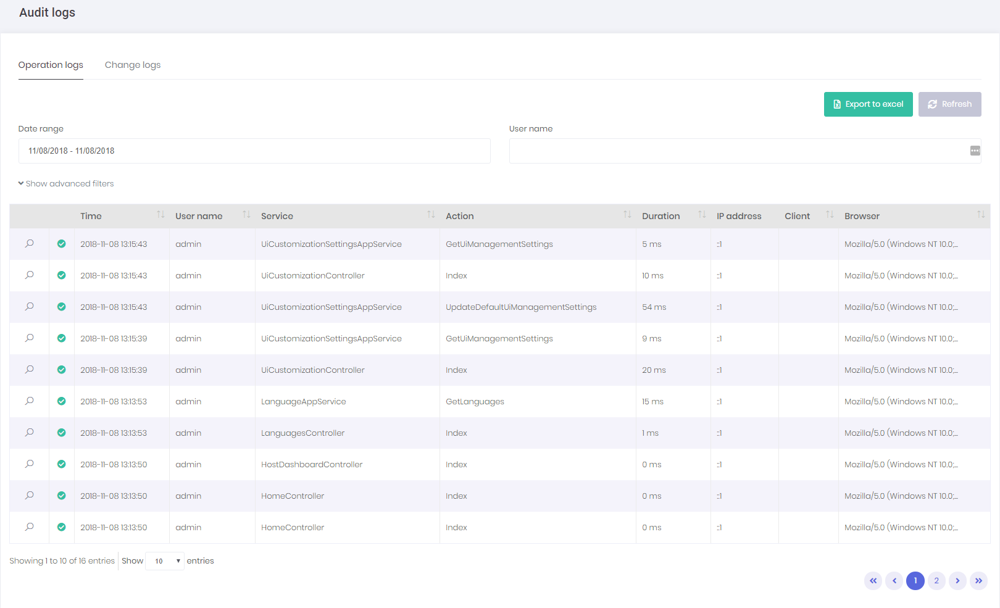
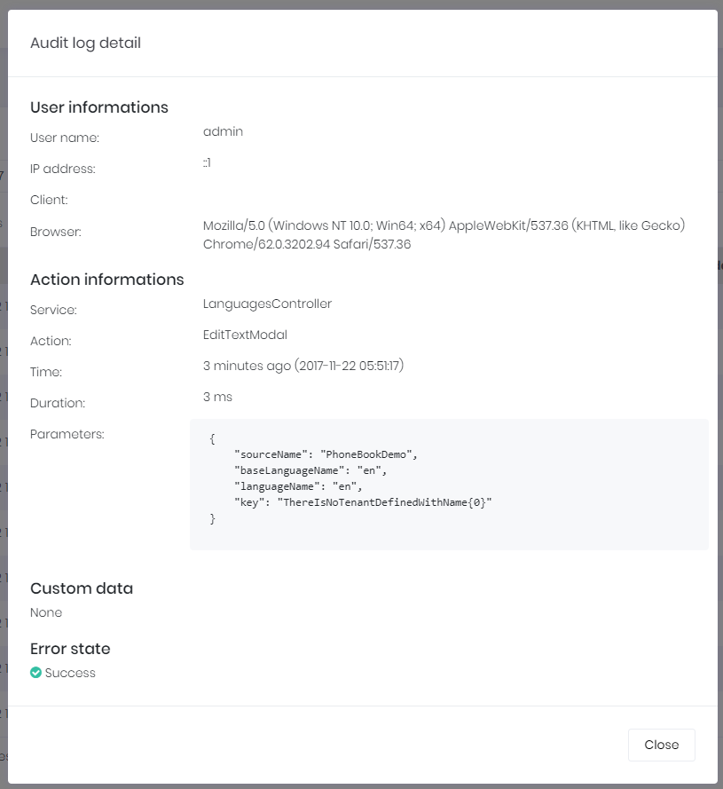

# Audit Logs

### Operation Logs

In audit logs page, we can see all user interactions with the application under the operation logs tab:



All application service methods and MVC controller actions are automatically logged and can be viewed here. See [audit logs documentation](https://aspnetboilerplate.com/Pages/Documents/Audit-Logging) to learn how to configure it. When we click the magnifier icon, we can see all details an audit log:



Audit log report is provided by **AuditLogAppService** class.

### Periodic Log Deletion 

ASP.NET Zero has built-in periodic log deletion system. To enable it, go to `*.Application/Auditing/ExpiredAuditLogDeleterWorker.cs`  and set `IsEnabled` to true;

```csharp
 public class ExpiredAuditLogDeleterWorker : PeriodicBackgroundWorkerBase, ISingletonDependency
    {
   		...
		public const bool IsEnabled = false;//default is false
		...
```

It has two more parameter.

**CheckPeriodAsMilliseconds:** Time to wait between two controls.

**MaxDeletionCount:** The maximum number of records that can be deleted at once.

> Note: To perform smaller operations with more frequent intervals you can decrease `MaxDeletionCount` and `CheckPeriodAsMilliseconds`. 

## Next

- [Entity History](Features-Angular-Entity-History)
