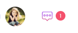
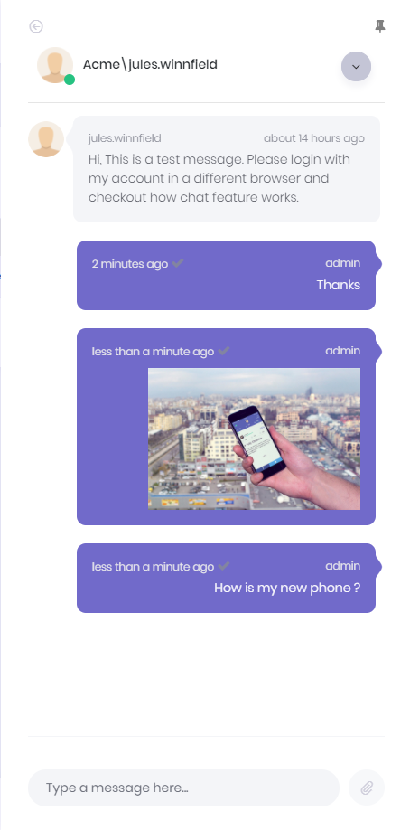

# Chat

Chat icon is located next to user's profile image on top right corner of the page. The number in the red circle shows total unread chat message count.

When user clicks this icon, chat panel appears on the right of page. This panel contains friends of user and list of blocked users.

User can add new friends by writing the username into username TextBox above friend list. If "**Chat with other tenants**" feature is enabled for tenant, users of other tenants can be added as a friend by writing
\[tenancy name\]\\\[user name\] (ex: Default\\admin). If "Chat with host users" feature is enabled, host users can be added as friend by writing  **.\\\[user name\]** in the same TextBox. Note that, a user can search users of the tenant who he/she belongs to but can't search users of Host. So, when adding a user of Host as a friend, the exact username must be written.

While online friends/users have a green circle on their profile image, offline friends/users have a gray circle.

User can pin or unpin the chat panel by clicking the pin icon on top right corner of the chat panel. Application tries to remember last state of chat panel and restores it when user login to application.

When a friend/user is selected, conversation panel is opened.

Chat system also allows sending images, files and link of current page to friends

User can block or unblock a friend in this area. There is a down arrow icon right of the selected user's username. This icon opens an action menu and this menu contains block user or unblock user actions according to user's block status.

## Chat Features

There are three chat features in the system. These are "Chat", "Chat with host", "Chat with other tenants". These features can be enabled/disabled per edition/tenant. By using these features host can enable/disable chat with other tenant's users or host users.

## Next

- [User Menu](Features-Angular-User-Menu)

