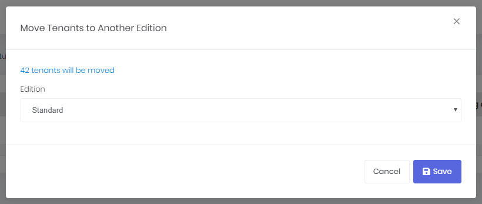

# Edition Management

*If you're not developing a multi-tenant application, you can skip this section.*

Most **SaaS** (multi-tenant) applications have **editions** (packages) those have different **features**. Thus, they can provide different **price and feature options** to their tenants (customers). **Editions page** (available in host login) is used to manage application's editions:

Editions are used to group feature values and assign to tenants. We can create a new edition by clicking "**Create new edition**" button:

An edition can be free or paid. If it's a paid edition then you should enter monthly and annual prices. You can allow tenants to use trial version of this edition for a specified days. Then you can determine an expire strategy: How many days to allow a tenant to use the application after subscription expires. And finally, you can deactivate tenant or assign to a free edition if they don't extend their subscription.

Features tab is used to determining features available for the edition:

After creating an edition, only name and features of the edition can be changed. If you have made a mistake while creating the edition or if you want users to stop subscribing this edition, just delete the edition and create another one. Since Edition is a [soft-delete](<https://aspnetboilerplate.com/Pages/Documents/Data-Filters#isoftdelete>) entity, it will not be deleted from database but will be marked as deleted.

In order to delete and edition, all tenants of that edition must be moved to another edition. You can easily do that in Editions page by clicking the "Actions" button for an Edition and then select "Move tenants to another edition" item. After that, you will see a modal page like below:

You can click the link on this page to see which tenants will be moved to the newly selected edition.

See [feature management](https://aspnetboilerplate.com/Pages/Documents/Feature-Management) and [edition management](https://aspnetboilerplate.com/Pages/Documents/Zero/Edition-Management) documents for more information.

## Next

- [Tenant Management](Features-Angular-Tenant-Management)