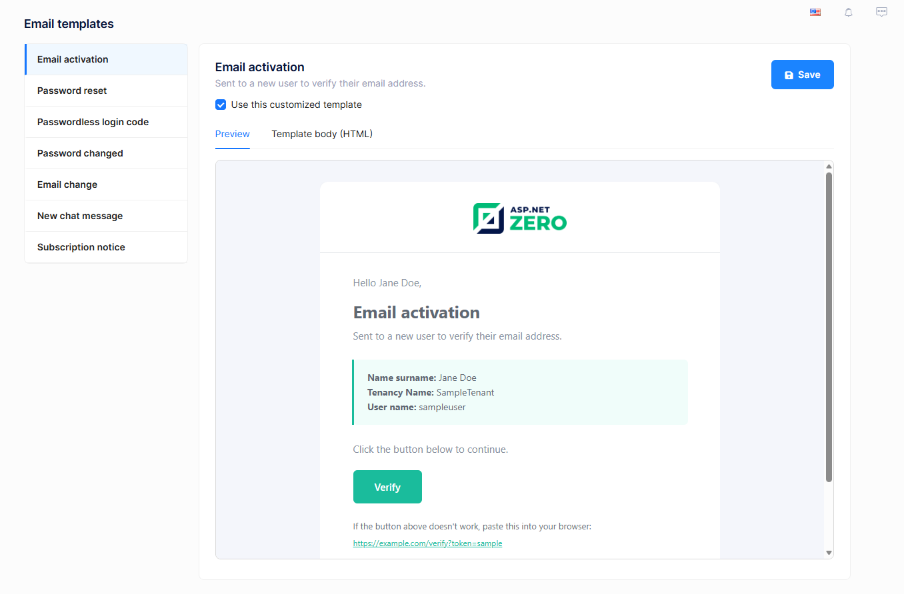

# Email Templates

Email templates page is available on the **host side** and allows host administrators to customize the HTML body of the emails that ASP.NET Zero sends to users. It is shown under the **Administration** menu:

## Overview

ASP.NET Zero ships with a set of factory default email templates as embedded HTML resources. Until you customize a template, the embedded resource is used. When you save changes to a template, the customized body is stored in the `AppEmailTemplates` database table and used in place of the embedded resource. Resetting a template removes the row from the database and restores the factory default.

The following templates can be customized:

| Template | Sent when |
| --- | --- |
| Email activation | A new user needs to verify their email address. |
| Password reset | A user requests a password reset. |
| Passwordless login code | A user requests a one-time login code. |
| Password changed | A user's password has been changed. |
| Email change | A user's new email address needs verification. |
| New chat message | A user receives a chat message while offline. |
| Subscription notice | Subscription expiration, payment, or edition change events. |

## Editing a template

Select a template from the list on the left to load it in the editor pane on the right. The editor pane has two tabs:

- **Preview** — Renders the current template body with sample tokens so you can see how the email will look in an inbox.
- **Template body (HTML)** — An editor where you can edit the raw HTML body.

After editing, click **Save** to persist your changes. The next email sent for this template will use your customized version. Use the **Use this customized template** checkbox to enable or disable your customization without losing it; when unchecked, ASP.NET Zero falls back to the factory default for that template.

## Placeholders

Templates use placeholders in the form `{TOKEN}` that are replaced at send time. The most common base placeholders that are available to every template are:

| Placeholder | Replaced with |
| --- | --- |
| `{PRODUCT_NAME}` | The product name. |
| `{THIS_YEAR}` | The current year, useful for footer copyrights. |
| `{EMAIL_LOGO_URL}` | The tenant logo URL (light theme). |
| `{EMAIL_LOGO_URL_DARK}` | The tenant logo URL (dark theme). |

Each template also uses additional placeholders specific to its context (for example `{CTA_URL}`, `{NAME_VALUE}`, `{CODE_VALUE}`). Use the **Preview** tab to confirm that the placeholders you keep are rendered as expected before saving.

> Removing a placeholder removes that piece of dynamic information from the email. Keep the placeholders you need; you can safely change the surrounding HTML, copy, and styling around them.

## Resetting a template

If a template has been customized, a **Reset to default** button is shown next to **Save**. Clicking it removes your customization and restores the factory default embedded resource. This action cannot be undone, so a confirmation is shown first.

## Caching

Rendered templates are cached per tenant for performance. Saving or resetting a template automatically invalidates the cache for that template so the next send uses the latest version.

## Permissions

Access to this page is controlled by three permissions under **Administration**:

- `Pages.Administration.EmailTemplates` — View the page and the list of templates.
- `Pages.Administration.EmailTemplates.Edit` — Save changes to a template.
- `Pages.Administration.EmailTemplates.Reset` — Reset a customized template to the factory default.

You can grant or revoke these permissions per role from the [Role Management](Features-Angular-Role-Management.md) page.

## Next

- [Tenant Dashboard](Features-Angular-Tenant-Dashboard.md)
