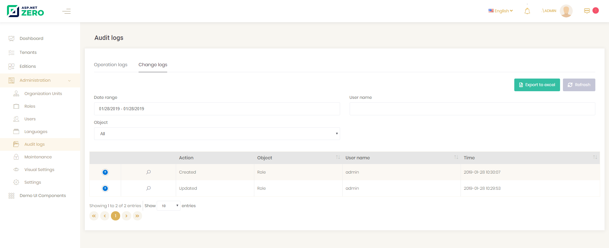

# Entity History

In change logs under audit logs menu, we can see all change logs (entity history) in the application:



When we click the magnifier icon, we can see all details a change log. We can see which properties are changed.


You should add entity type that you want to track to ***.Core\EntityHistory\EntityHistoryHelper.TrackedTypes**.  And make sure you uncomment following line in ***.EntityFrameworkCore\EntityFrameworkCore\YourProjectNameEntityFrameworkCoreModule.cs**

```csharp
//Configuration.EntityHistory.Selectors.Add("AbpZeroTemplateEntities", EntityHistoryHelper.TrackedTypes);
```

## Next

- [Subscription](Features-Angular-Subscription)