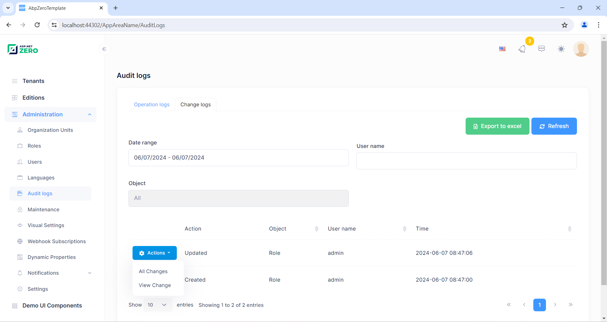
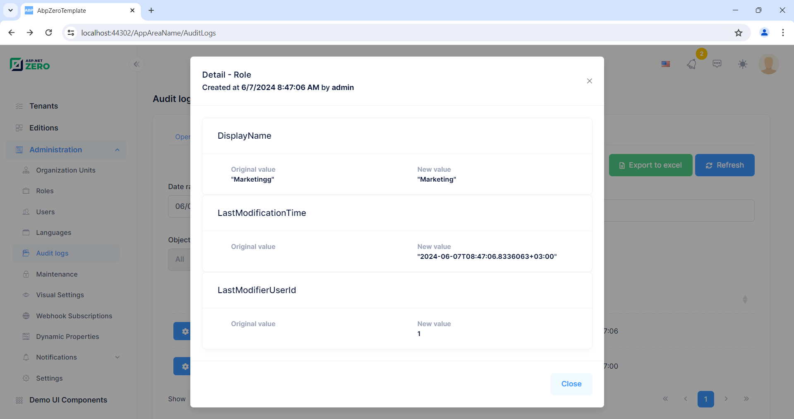
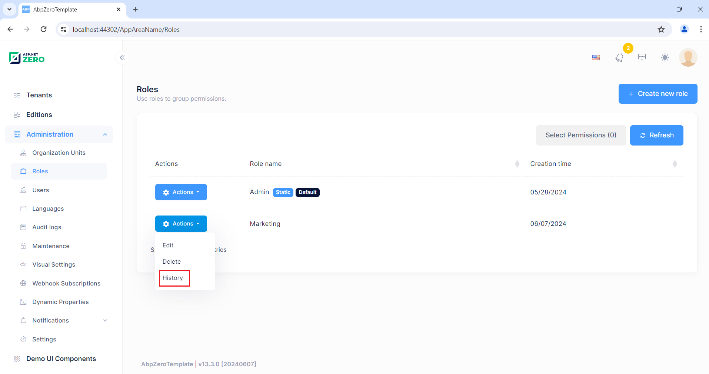
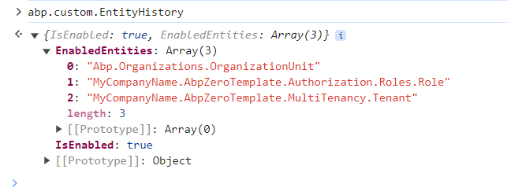

# Entity History

In change logs under audit logs menu, we can see all change logs (entity history) in the application:



When we click the magnifier icon, we can see all the details about a change log:



You should add entity type that you want to track to ***.Core\EntityHistory\EntityHistoryHelper.TrackedTypes**.  Make sure you uncomment following lines in ***.EntityFrameworkCore\EntityFrameworkCore\{YourProjectName}EntityFrameworkCoreModule.cs** and set **Configuration.EntityHistory.IsEnabled** to **true**.

```csharp
// Set this setting to true for enabling entity history.
Configuration.EntityHistory.IsEnabled = false;

// Uncomment below line to write change logs for the entities below:
// Configuration.EntityHistory.Selectors.Add("AbpZeroTemplateEntities", EntityHistoryHelper.TrackedTypes);
// Configuration.CustomConfigProviders.Add(new EntityHistoryConfigProvider(Configuration));
```

The first commented line here adds entity types defined in `EntityHistoryHelper.TrackedTypes` to entity history config, so changes on those entities will be recorded. The second commented line adds a custom config provider to `CustomConfigProviders` list. ASP.NET Zero executes `GetConfig` method of each `CustomConfigProvider` and returns the result of `GetConfig` to Angular client app. 

So, in this particular case, `EntityHistoryConfigProvider` returns if entity history feature is enabled or not and if enabled, it returns list of entities enabled for entity history. Angular client app uses those information to show entity history related buttons on each entity page.

For example, when entity history is enabled for an Entity, Angular client shows history dropdown menu item for each entity record on the related page. Here is a sample screenshot for role list:



In this way, history of an entity can be retrieved both on change logs tab in audit logs page or on the list page of the entity itself.

The entity history config can be accessed on the Angular app like below:

````javascript
abp.custom.EntityHistory
````

The abp.custom.EntityHistory object contains properties below:

* **isEnabled**: Boolean field represents if entity history is enabled or not.
* **enabledEntities**: Array of string contains full name of entity types entity history is enabled for.

Here is a sample screenshot which show the value of **abp.custom.EntityHistory**:



## Next

- [Subscription](Features-Angular-Subscription)