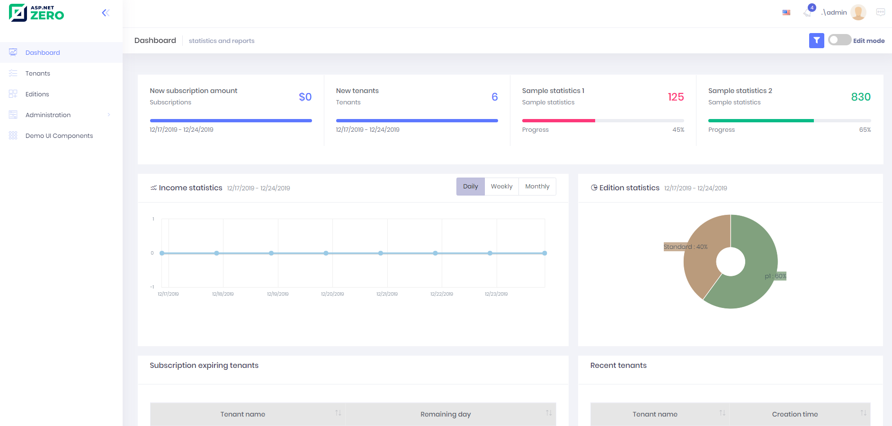

# Host Dashboard

Host dashboard is used to show some statistics about tenants, editions
and income:

This is a fully implemented dashboard except two sample statistics (sample statistics 1 & 2) those are placeholders for your own statistics.

## Next

- [Organization Units](Features-Angular-Organization-Units)

  