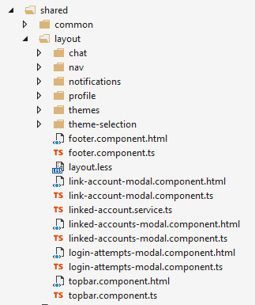

# Main Menu and Layout

Menu and Layout files are located under the shared folder.



ASP.NET Zero has 12 theme options and some of them are using left menu and some others are using top menu. Because of that, ASP.NET Zero contains two type of menu components, **side-bar-menu.component** and **top-bar-menu.component**. But, both components are getting the menu definition from **app-navigation.service.ts** class. So, if you need to add new menu items, you can modify this class and add your menu items.

You can add your new menu items here. You generally relate a menu item to an Angular route. Angular routes are defined in several modules:

- app/admin/**admin-routing.module** defines routes for admin module.
- app/main/**main-routing.module** defines routes for main module.
- app/**app-routing.module** defines general routes and the default route.

A menu item contains below properties:

* **name:** Name of the menu item. This value is used to show menu item on the UI using localization. So, it must be also entered into localization file of your app, otherwise you will see a not-localize value in the UI.
* **permissionName:** If the menu item requires a permission, you can set it using this property.
* **icon:** Icon to show on UI for the menu item.
* **route:** The Angular route to redirect when clicked to menu item. A sample value is: `/app/admin/tenants`.
* **items:** Children items of the menu item.
* **external:** Shows if the menu item opens an external url or not. If you set this property to true, you can use external urls for **route** parameter.
* **parameters:** Parameters to send when opening a new route. This parameter is valid only when **external** parameter is false.
* **requiresAuthentication:** If you want to show a menu item to authorized users but don't want to set a specific **permissionName** for that menu item, you can set this property to true.
* **featureDependency:** A function to check feature dependency of a menu item. A sample is:

```javascript
new AppMenuItem('Users', 'Pages.Administration.Users', 'flaticon-users', '/app/admin/users', undefined, undefined, undefined, () => {
	return this._featureCheckerService.isEnabled('App.ChatFeature');
})
```


## Next

- [Edition Management](Features-Angular-Edition-Management)