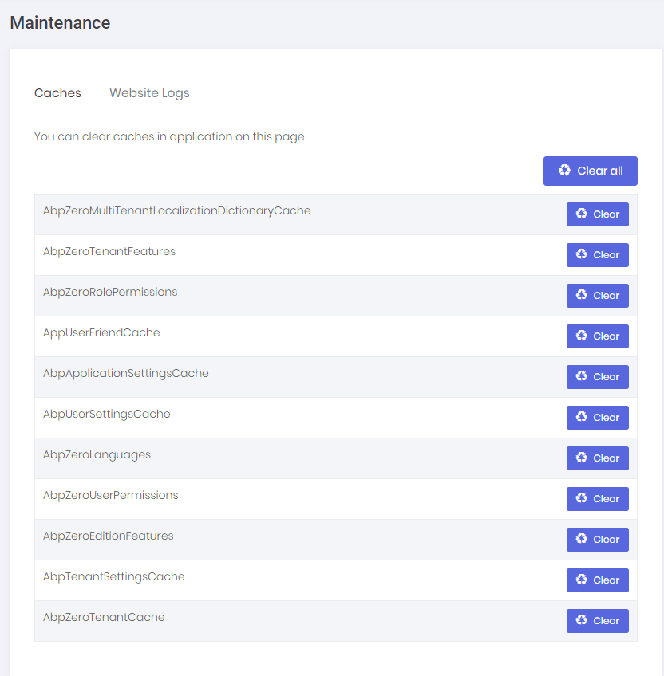

# Maintenance

Maintenance page is available to **host side** for multi tenant applications (for single tenant applications it's shown in tenant side) and shown as below:

In the **Caches** tab, we can clear some or all caches. Clearing caches may be needed if you manually change database and want to refresh application cache. **Website Logs** tab is used to see and download logs:

## Next

- [Tenant Dashboard](Features-Angular-Tenant-Dashboard)