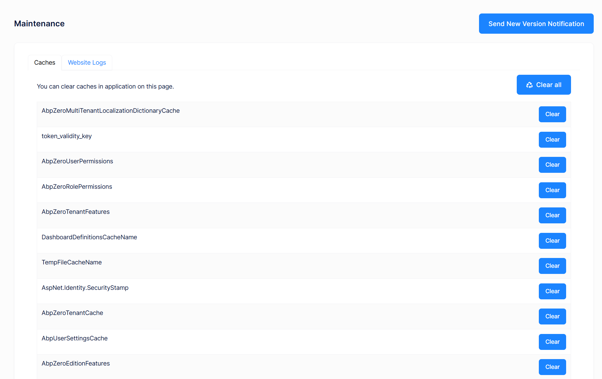
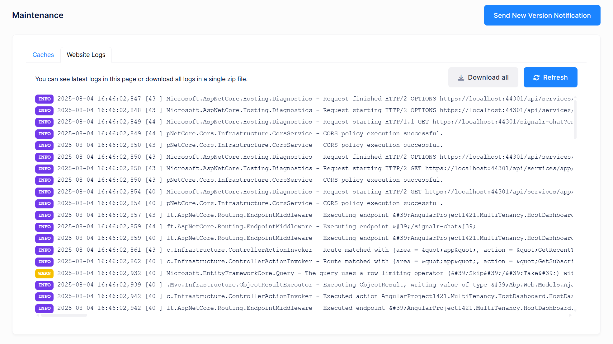
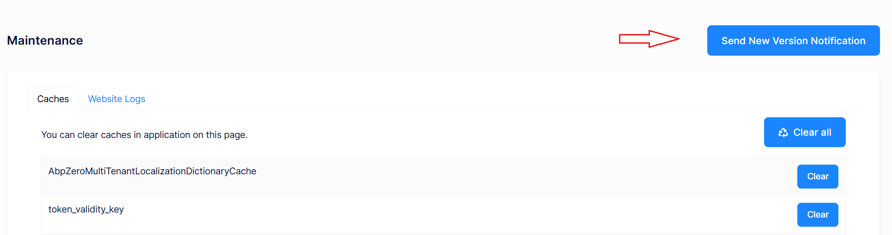

# Maintenance

Maintenance page is available to **host side** for multi tenant applications (for single tenant applications it's shown in tenant side) and shown as below:

In the **Caches** tab, we can clear some or all caches. Clearing caches may be needed if you manually change database and want to refresh application cache. **Website Logs** tab is used to see and download logs:

## New Version Notification

When a **new version** of the application is available you can **send a new version notification** to the users.  The notification will be shown a **popup** to the users. After clicking the **ok** button their browser will be **refreshed** and the **browser cache** will be **cleared**.

## Next

- [Tenant Dashboard](Features-Angular-Tenant-Dashboard)