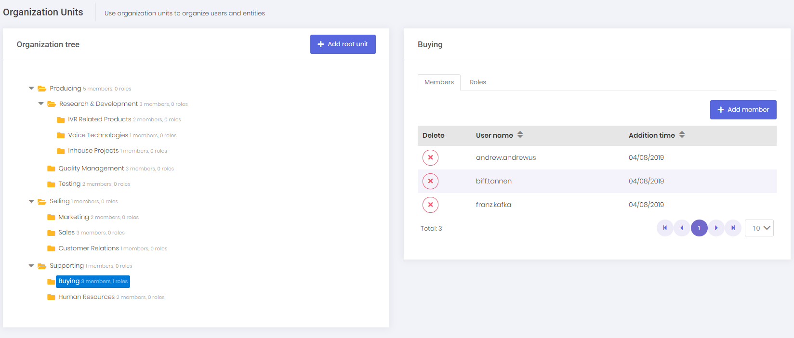
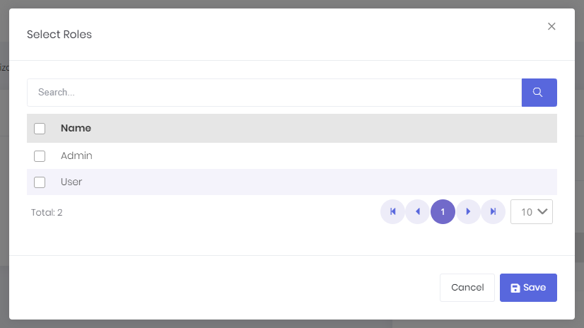

# Organization Units

Organization units (OU) are used to hierarchically group user and entities. Then you can get user or entities based on their OUs. When we click Administration/Organization units, we enter the related page:

Here, we can manage OUs (create, edit, delete, move), members of organization units (add/remove) and roles of organization units. When a role is added to an organization unit, all members of that organization unit are granted with the permissions of the role. 
In that way, you can easily assign a role to all users of an organization unit.

In the left OU tree, we can **right click** to an OU to open **context menu** for OU operations. 

We can also add new members with the upper right button of members tab.

This is actually a **generic lookup modal** and can be used to select any type of entity (see app/shared/common/lookup/**common-lookup-modal.component**).

We can also add new roles with the upper right button of roles tab. **common-lookup-modal** is used to build the role selection modal here as well.

Further information see [ASP.NET Boilerplate Organization Unit Management Document](https://aspnetboilerplate.com/Pages/Documents/Zero/Organization-Units).

## Next

- [Role Management](Features-Angular-Role-Management)