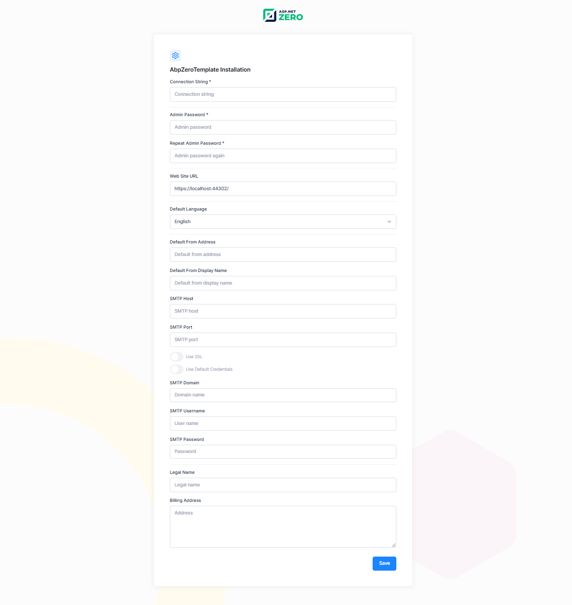

# Setup Page

ASP.NET Zero application can be set-up using install page. This page is developed to create initial database, apply migrations and configure the application according to user's input on this page. Setup page can be accessed on **http://yourwebsite.com/app/admin/install**.

Just note that, this page is only visible when the database is not created. If the database is created, you will be redirected to login page.

## Next

- [Migrator Console App](Migrator-Console-Application)

