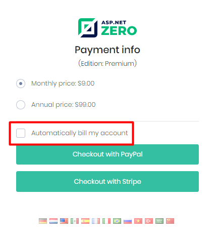
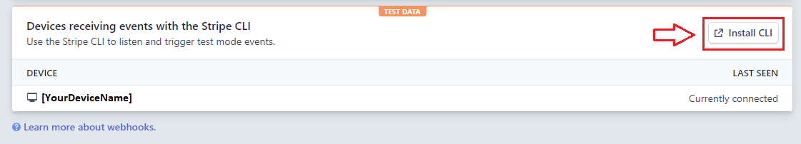
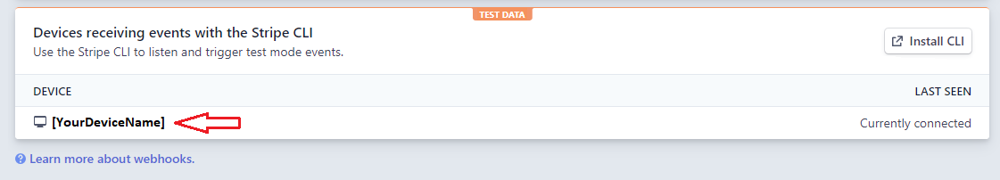

# Stripe Integration

In order to configure Stripe, open `appsettings.json` file in ***.Web.Host** project and fill the fields below:

- **IsActive:** This setting can be used to enable/disable Stripe. If set to false, end users will not see Stripe option during the payment process.
- **BaseUrl:** URL for making API calls to Stripe. You can find correct URLs in your Stripe dashboard. 
- **SecretKey:** Your Stripe SecretKey.
- **PublishableKey:** Your Stripe PublishableKey.
- **WebhookSecret:** Your Stripe WebHookSecret which is used to validate WebHook requests.
- **PaymentMethodTypes** (array containing strings): Supported payment method types, check [stripe payment method types](https://stripe.com/docs/payments/payment-methods) 

Stripe supports recurring payments. If a tenant wants to pay via Stripe and accepts automatically billing the account used for the initial payment, then Stripe charges the amount from Tenants account on each subscription cycle and notifies AspNet Zero. Then, AspNet Zero extends the subscription for the paid period (either monthly or annual).



If "Automatically bill my account" option is not selected on the payment page, tenants should login to the system and manually extend their subscription by clicking the "**Extend**" button on the subscription page and pay manually.	

##### Important Note

AspNet Zero uses webhooks to get results from the stripe. That's why you must go to the https://dashboard.stripe.com/webhooks and add a new webhook with `https://[www.yoursite.com]/Stripe/WebHooks` endpoint. And subscribe to `invoice.paid` and `checkout.session.completed` events. 


## Testing Stripe WebHooks on Localhost

##### Stripe-Cli

You can use stripe-cli in order to get Stripe's WebHooks requests on your local environment. To download it, go to  https://dashboard.stripe.com/webhooks page. And install stripe-cli



After you download it, login to stripe-cli  https://github.com/stripe/stripe-cli/wiki/login-command 

Then you can forward webhooks to AspNet Zero with running listener.

```powershell
stripe listen --forward-to https://localhost:44301/Stripe/WebHooks
```

That will forward all events to your local project.  For more information check:  https://github.com/stripe/stripe-cli/wiki/listen-command 

*After you connect successfully your device will be listed.* 



##### Webhookrelay

In order to get Stripe's webhook  request on your local environment, you can also use external tools like [https://webhookrelay.com](https://webhookrelay.com).It is one of the best tools on the web at the moment. [How to receive Stripe webhooks on localhost](https://webhookrelay.com/blog/2017/12/26/receiving-stripe-webhooks-localhost/) can be used to test Stripe's webhook on the localhost. Basically, you need to create an account on [https://webhookrelay.com](https://webhookrelay.com), then need to download relay.exe to your development machine. 

Then, you need to run relay.exe like this;

```powershell
./relay.exe forward --bucket stripe https://localhost:44301/Stripe/WebHooks
```

This will give you an url something like "https://my.webhookrelay.com/v1/webhooks/aa180d45-87d5-4e9c-8bfa-e535a91df3fc". You need to enter this url as an webhook endpoint on Stripe's webhook dashboard ([https://dashboard.stripe.com/account/webhooks](https://dashboard.stripe.com/account/webhooks)).

Don't forget to enter your production app's URL as a webhook endpoint when you publish your app to production.


**Note that;**

- Tenants can disable or enable Stripe to charge their accounts automatically on the Subscription page. 

- When upgrading to an higher edition, AspNet Zero calculates the cost for upgrade and charges it from Tenants account(with using checkout). 

- When a tenant subscribes to an edition using Stripe and if admin user changes the edition of the Tenant on Tenant page to a higher edition, Tenant's account will be charged on stripe automatically.

  (https://stripe.com/docs/billing/subscriptions/prorations )

## Next

- [Visual Settings](Features-Angular-Visual-Settings)
