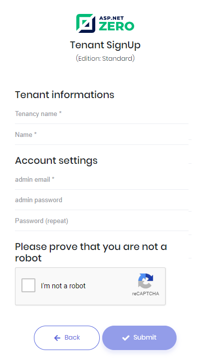
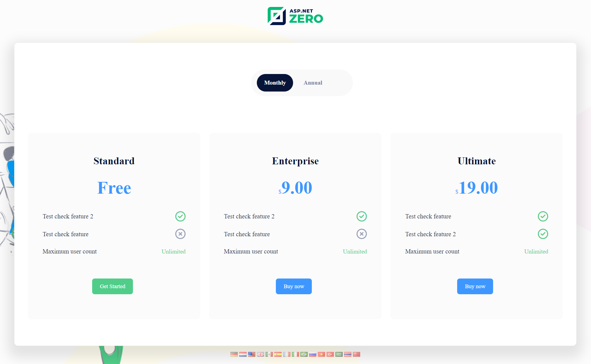

# Tenant Sign Up

Tenant sign up link is shown on the login form only if you are in the host context. When you click to the link, a registration form is shown like below if there are no Edition defined in the application:

If there is at least one Edition defined, then user will be redirected to edition selection page:

There are two type of editions, free and paid. Paid editions can have trial version. If an edition doesn't have trial version, "Free Trial" button will not be visible for that edition on the edition selection page. All selections on this page will redirect user to Tenant sign up page. If user selects "Buy Now" option, user will be redirected to payment page after the Tenant sign up page. For free and trial options, user will be logged in to system if "**New registered tenants are active by default**" option is enabled under the "**Tenant Management**" tab of Host settings page. If **New registered tenants are active by default** option is not selected, users will be redirected to tenant signup result page.

If user selects "Buy Now" option and pays for the edition subscription, user will be logged in directly even if the **New registered tenants are active by default** option is not enabled.

For more information about subscription system, you can check [Subscription](Features-Angular-Subscription) document.

## Next

- [Main Menu and Layout](Features-Angular-Main-Menu-Layout)

