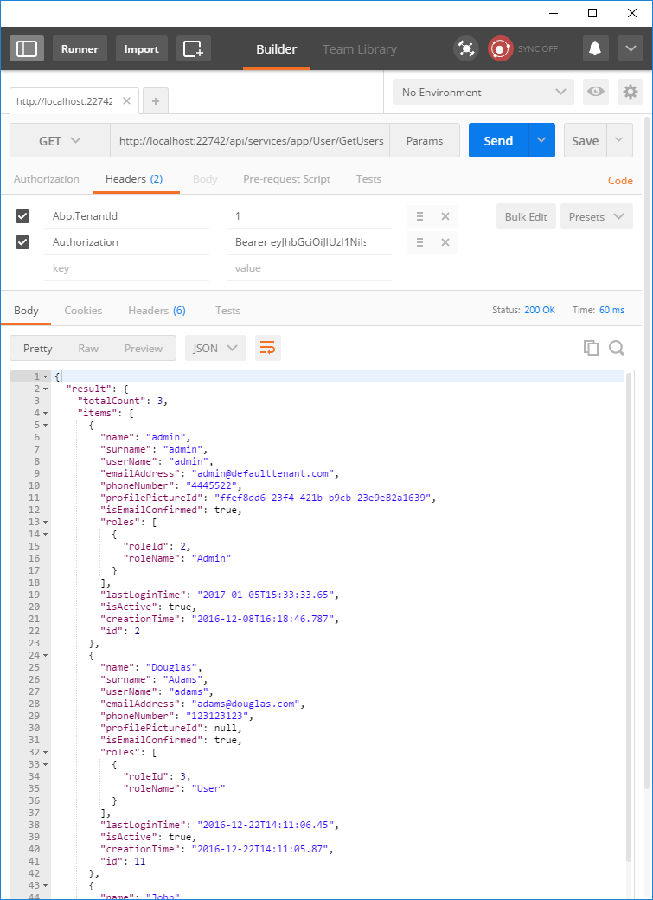

# Token Based Authentication

ASP.NET Zero Angular UI consumes the [host](Infrastructure-Core-Mvc-Token-Based-Authentication) via token based authentication. Any application can authenticate and use any functionality in the application as API. For instance, you can create a mobile application consumes the same API. In this section, we'll demonstrate usage of the API from [Postman](https://www.getpostman.com/docs/introduction) (a Google Chrome extension).

## Authentication

We suggest you to disable two factor authentication for the user which will be used for remote  authentication. Otherwise, two factor authentication flow should be implemented by the client. You can check account module source code to understand the flow. We assume that you have disabled two factor authentication for the **admin** user of **default** tenant since we will use it in this sample.

Following headers should be configured for all requests (`Abp.TenantId` is Id of the default tenant. This is not required for single tenant applications or if you want to work with host users):

Then we can send username and password as a **POST** request to https://localhost:44301/api/TokenAuth/Authenticate

In the response, `accessToken` field will be used to authorize for the API.

## Using API

After authenticate and get the access token, we can use it to call any
**authorized** actions. All **services** are available to be used
remotely. For example, we can use the **User service** to get a **list
of users**:

We sent a GET request to **https://localhost:44301/api/services/app/User/GetUsers** and added
Authorization to the header as "**Bearer &lt;accessToken&gt;**". And the result is a JSON that contains the list of users.

## Next

- [Sign Up](Features-Angular-Sign-Up)