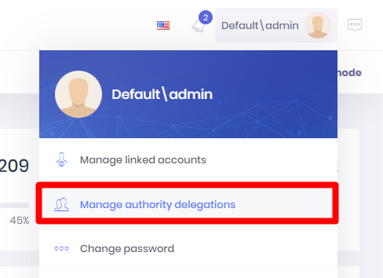
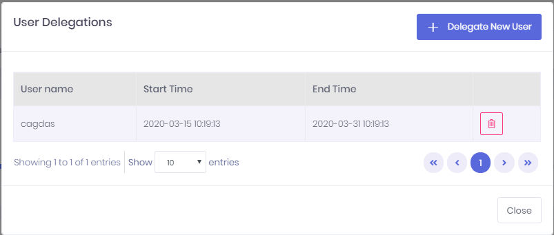
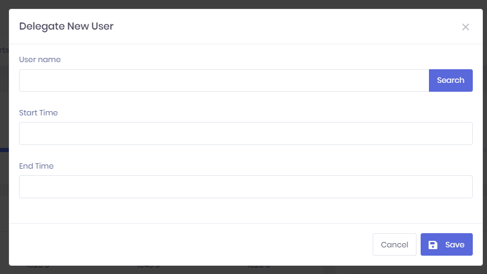

# User Delegation

ASP.NET ZERO provides a User Delegation feature. User Delegation feature provides users to delegate their accounts for a limited period of time to another user. This way, if a user will not be able to access the application for a period of time, this user can delegate his/her account to another user. 

This feature works like [Impersonation](Features-Angular-User-Management#user-impersonation) with a limited period. Audit Logs will be saved with Impersonator information, so you can see if an action is executed by actual account owner or by the delegated user.

User Delegation feature is enabled by default and can be disabled in the constructor of `UserDelegationConfiguration.cs` or in PostInitialize method of `{YourProjectName}CoreModule.cs`.

If the current user is logged in via user delegation, ASP.NET Zero checks the database to validate the **end time** of the user delegation record. This might be important for performance critic applications but notice that this check is only performed when User Delegation feature is enabled and current user is logged in via User Delegation feature. For other operations, there will be no such control.

## Manage User Delegations

User Delegations modal window can be accessed by clicking "Manage authority delegations" on user profile menu.

User Delegations modal lists currently delegated users. You can delete a user delegation on this modal.

"Delegate New User" button opens a modal which creates a new user delegation.

