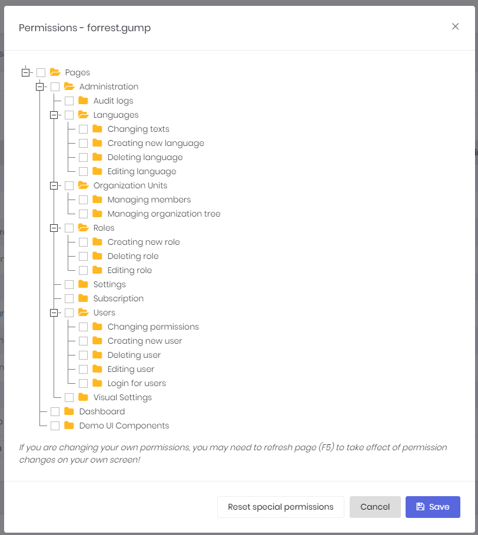
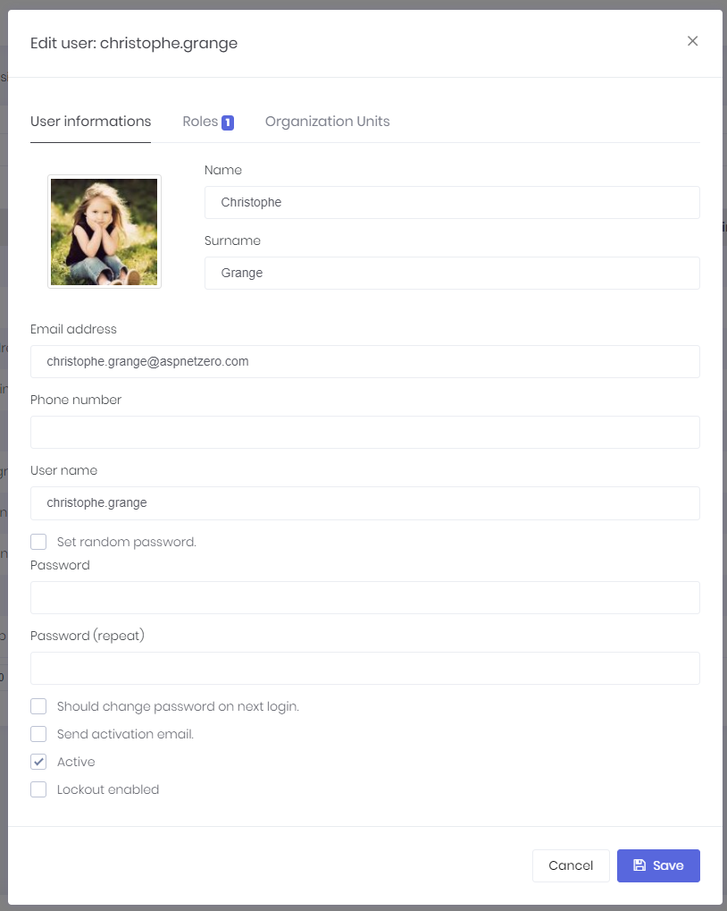

# User Management

When we click Administration/Users menu, we enter the user management page:


**Users** are people who can **login** to the application and perform some operations based on their **permissions**.

**User** class represents a user. User class [can be extended](Extending-Existing-Entities.md) by adding new properties.

**UserManager** is used to perform domain logic, **UserAppService** is used to perform application logic for users.

A user can have zero or more **roles**. If a user has more than one role, the user inherits union of permissions of all these roles. Also, we can set **user-specific permission**. A user specific permission setting overrides role settings for this permission. For example if a user has Accountant role and Accountant role has "editing invoice" permission, we can take away "editing invoice" permission from a specific user if we want to. 
The opposite is also true, so we can grant invoice editing permission for a specific user even if none of the roles of that user don't have "editing invoice" permission. 

A screenshot of user permission dialog:



*Note that not all permissions shown in the figure above.*

A dialog is used to create/edit a user:



We can change user's **password**, make the user **active/passive** and so on... A user can have a **profile picture**. It can be changed by the user (See User Menu section). **Admin** user can not be deleted as a business rule. If you don't want to use admin, just make it inactive.

### Excel operations

User list can be downloaded as an Excel file. Also, new users can be imported from an Excel file. In order to import users from an Excel file, ASP.NET Zero requires a specific excel file format. You can download a sample import template on the user list by clicking the "click here" link under the "Excel operations" dropdown button.


When you import users from Excel, if there are errors while importing users to ASP.NET Zero's database, invalid users will be saved to an Excel file with the reason (validation error message or exception message) and the user who made the import operation will be notified via ASP.NET Zero's notification system. So, the user can click the notification and see the result Excel file, fix the validation errors and import the failed users again.

### User Unlock

If a user is locked out (had a specific count of failed access), user can be unlocked on the user list page. You can click "Actions" button on the user page and click "**Unlock**" item on the opened dropdown list.

Lockout options can be configured in the **IdentityRegistrar.cs** class under the "Identity" folder in the ***.Core** project. In the sample below, MaxFailedAccessAttempts is configured as 10, so if a user makes 10 failed login attempts in a row, the user will be locked out for a period of time.

````csharp
return services.AddAbpIdentity<Tenant, User, Role>(options =>
{
	// other configurations
	options.Lockout.MaxFailedAccessAttempts = 10;
})
````

## User Impersonation

As an admin user (or any allowed user), we may want to login as a user and perform operations on behalf of that user, without knowing the user's password. When we click "**Login as this user**" icon in the actions of a user, we
are automatically redirected and logged in as this user. This is called "**user impersonation**". When we impersonate a user, a "**back to my account**" option is added to the user profile menu:


In an impersonated account, we can only perform operations allowed to that user. It means, everything **exactly** works as same as this user is logged in. The only difference is shown in audit logs which
indicates that operations are performed by somebody else on behalf of the user. 

Notice that also a **red 'back' icon** shown near to the user name to indicate that you are in an impersonated account.

## Next

- [Language Management](Features-Angular-Language-Management)

