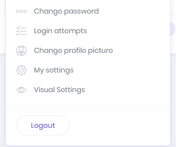
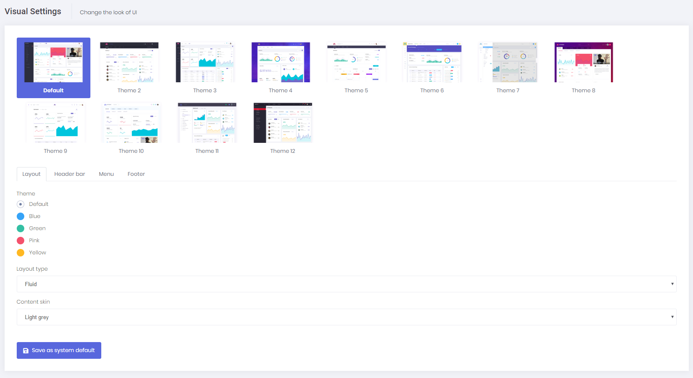

# Visual Settings

ASP.NET Zero's look of UI can be changed in visual settings page. This page is used to modify look of UI both for system default and personal user accounts. If a user doesn't have permission to see this page, then user will see an item named "Visual Settings" in his personal menu.

Users who have permission to see this page will see the same item in the application menu.

In this page, users can change visual settings for Layout, Header, Menu and Footer of the application.

ASP.NET Zero contains all 12 demos of the Metronic theme implemented and users can select one of those themes using the visual settings page. After selecting a theme, some more configuration can be made for the selected theme.

ASP.NET Zero also contains a quick theme selection icon next to the language selection dropdown on the layout of the application. By clicking this icon, users can easily switch between available themes by using the default settings of the selected theme. If you don't want to use this quick theme selection option in your app, you can login as host admin and disable it under the "other settings" tab of the settings page.

## Next

- [Host Settings](Features-Angular-Host-Settings)