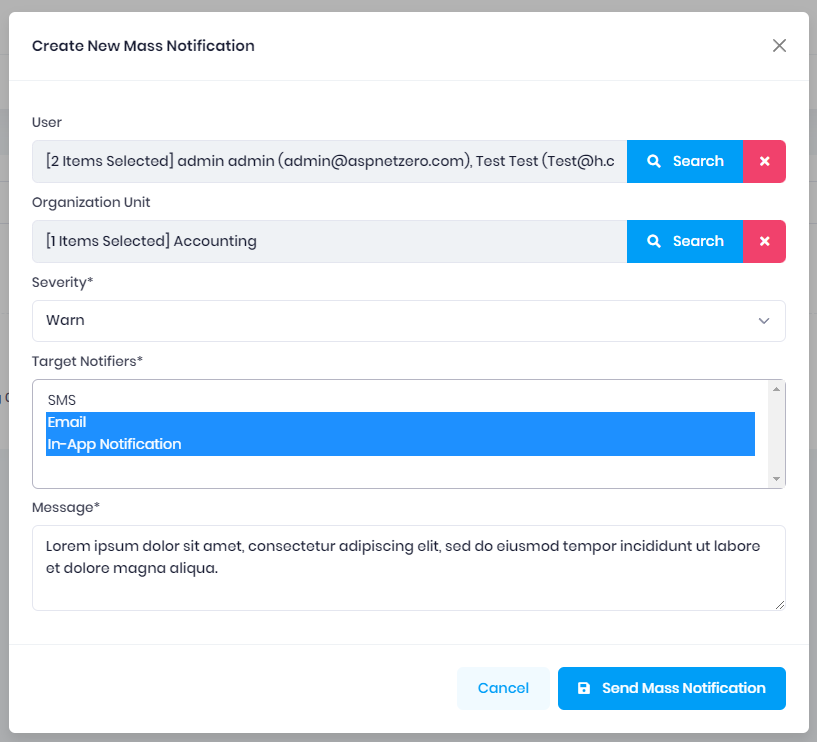
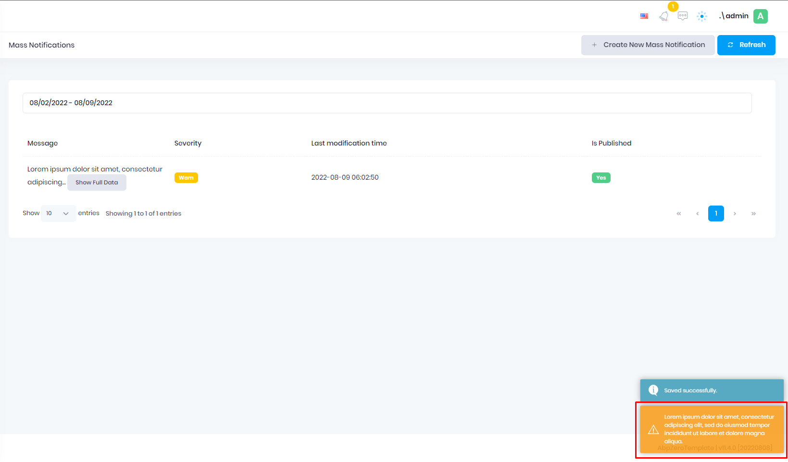
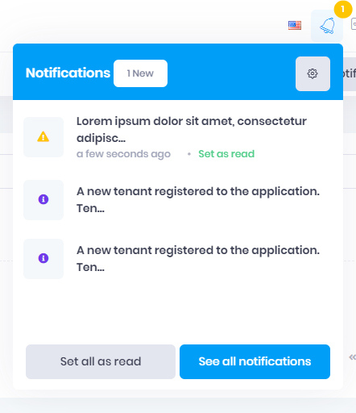
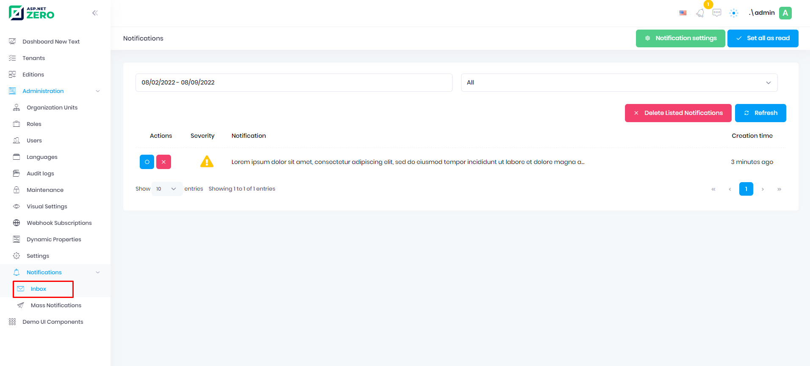

# Mass Notification

ASP.NET Zero provides mass notification system that you can use to send notification to users. 

In order to create a mass notification, go to `Administration -> Notifications -> Mass Notifications` and click to the "Create New Mass Notification" button. 

From the window that opens, you can choose who you want to send mass notification to. You can choose users and/or organization units. If you select organization unit, notification will be sent to all users connected to the organization unit you selected. Then you can set severity of the notification, target notifier and message. 
You have 3 built-in target notifier. You can use them to notify user's in different ways.

SMS: Sends sms to selected users (which has phone number defined)
E-mail: Send message as an email.
In-App Notification: Send in app notification users. If they are online notification will be shown immediatly, if not, they will be able to see notifications in their notification inbox.

After you click to the **Send Mass Notification** button, notification will be send all selected users with selected notifiers.

___________________

Note: You can open notification inbox by using **See All Notifications** button in the notification modal or Administration -> Notification -> Inbox

