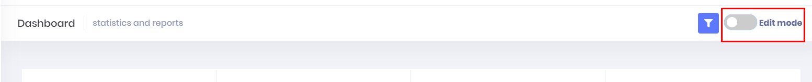
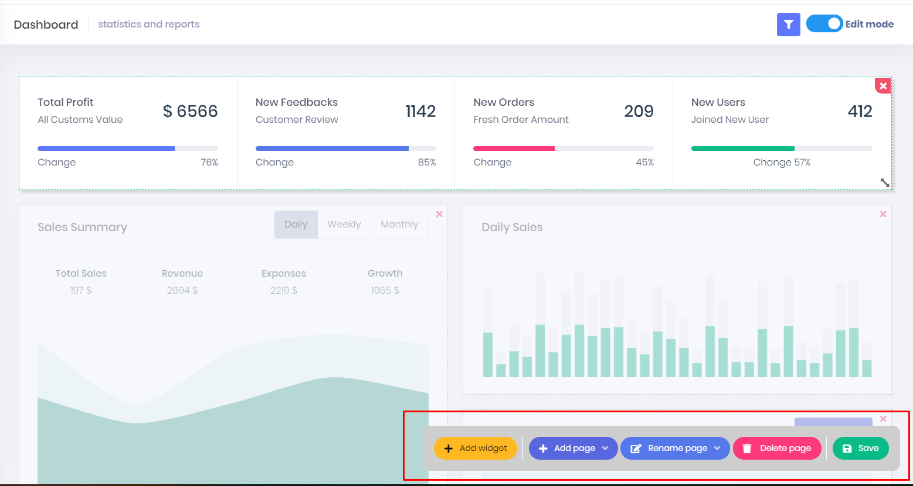
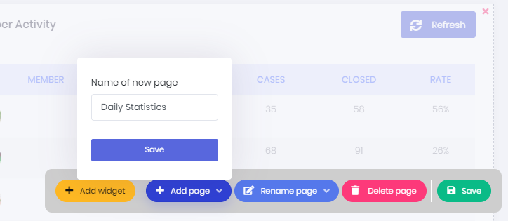
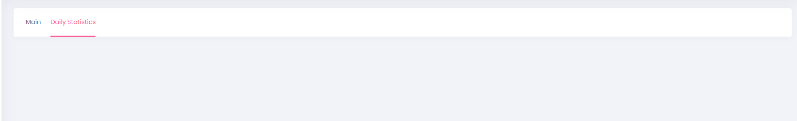
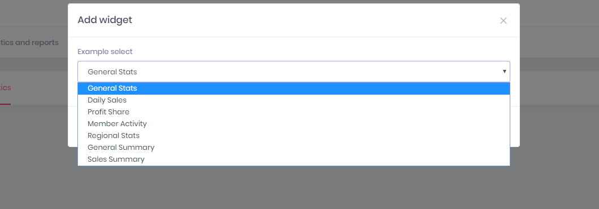
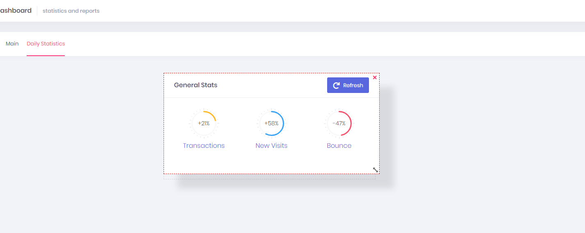
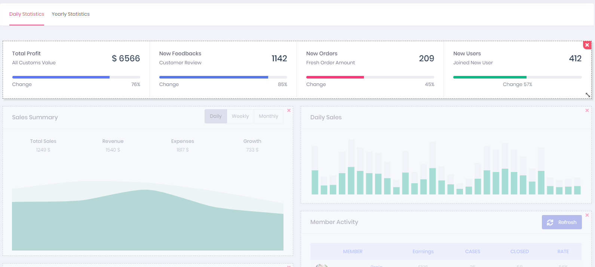

# Customizable Dashboard

Users can customize their dashboard.

To do that. Go to dashboard and enable edit mode.

Then you will see dashboard customization bar.

### Customize Your Dashboard

##### Adding New Page

You can create new page by clicking "**Add Page"**" button.

**Adding New Widget**

Click "**Add Widget**" button and select the widgets that you want to see on selected page.

**Resize and Move on Page**

Then you can resize and move widgets on page. 

