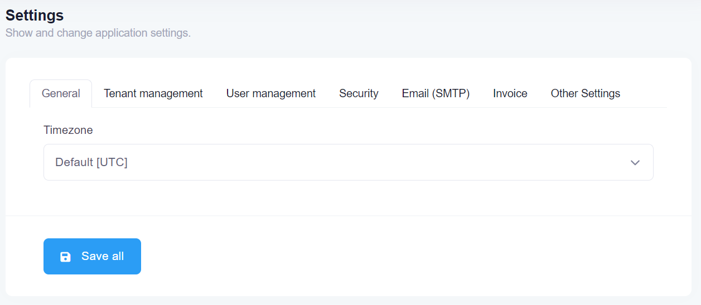
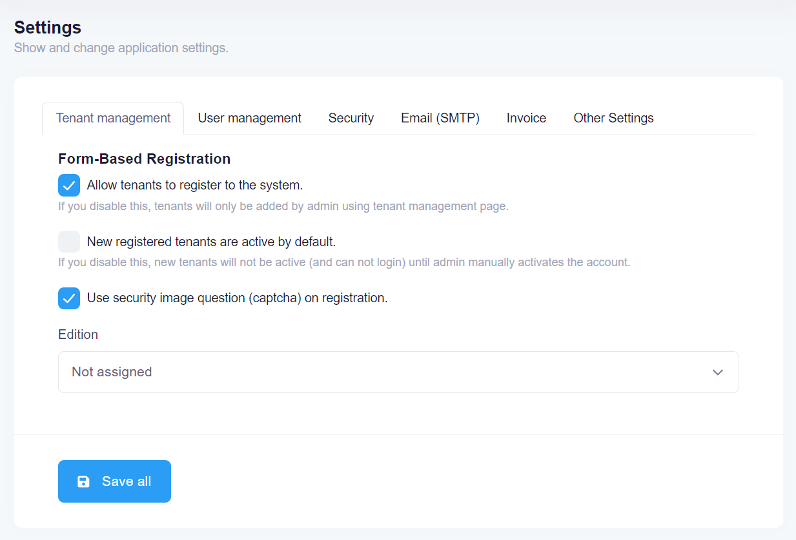
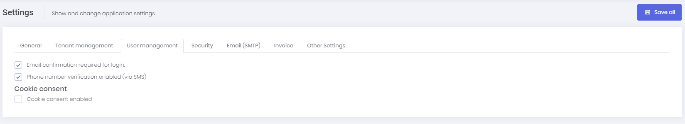
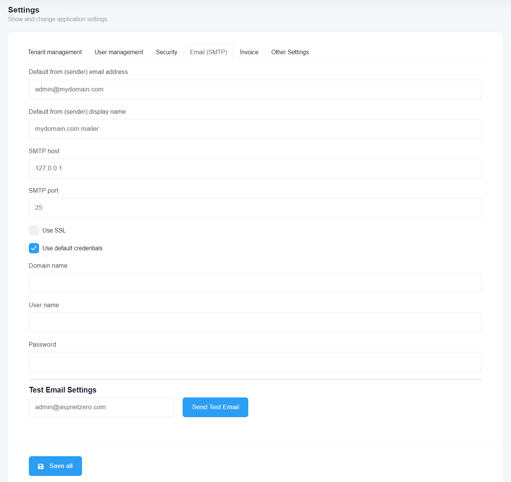
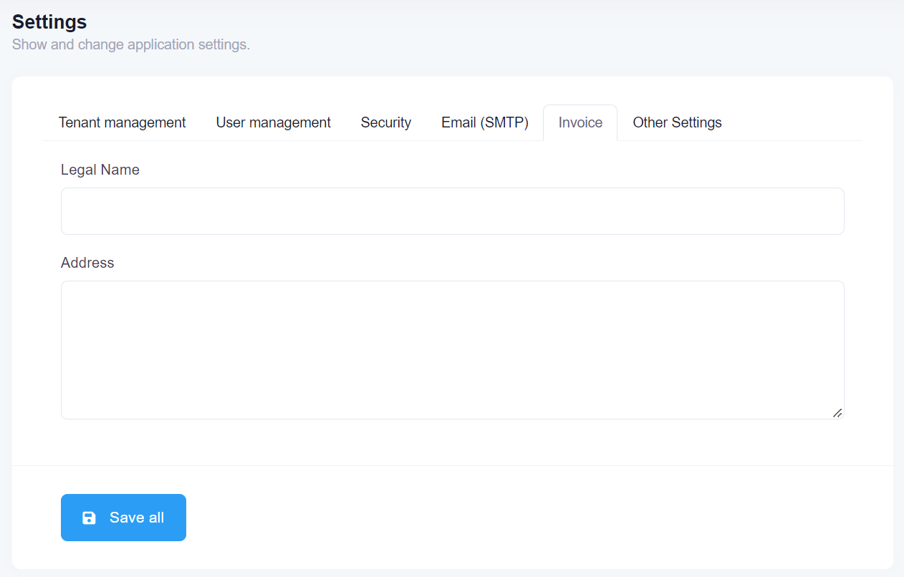
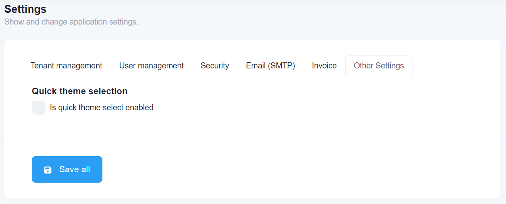

# Host Settings

Host settings page is used to configure some system settings.

## General



**Timezone** is an important setting in this page. ASP.NET Zero can work in multiple zones. Each user can see dates and times in their own time zone. Timezone setting in this page allows you to set default time zone for the application including all tenants and users. Tenants and users can change time zone in their own settings. Timezone setting is available only if you are using UTC clock provider. [See documentation](https://aspnetboilerplate.com/Pages/Documents/Timing) to
switch to UTC. By default ASP.NET Zero uses UnspecifiedClockProvider and in that case ASP.NET Zero doesn't modify dates sent from client to server and vice versa. If you configure your app to use another clock provider, then ASP.NET Zero normalizes dates according to selected clock provider.

You can change the used clock provider in the PreInitialize method of your Core module.

````csharp
Clock.Provider = ClockProviders.Utc;
````

## Tenant Management



You can configure settings related to tenant management under "Tenant Management" tab. You can enable/disable tenants from registering the system. You can also make newly registered tenants active or passive.

Enable/disable captcha on tenant registration page. 

You can also select a default edition, so a newly registered tenant will be assigned to this edition automatically unless the tenant subscribes to a specific edition.

## User Management



User related settings can be configured under this tab. You can force email confirmation for login. You can enable phone number verification. Also, you can enable cookie consent so ASP.NET Zero shows a cookie consent bar for the users to accept cookie policy of your application.

## Security


**Security** tab in host settings page contains password complexity settings. Host can define system wide password complexity settings in this tab. Each tenant can override this setting in tenant settings page. 

This tab also contains user lock-out settings and two factor login settings as well.

## Email



**Email(SMTP)** tab allows you to configure smtp settings for your app. ASP.NET Zero uses MailKit to send emails. By default, smtp certificate validation is disabled in **YourProjectNameMailKitSmtpBuilder.cs** class. If you are able to validate mail server's certificate, you need to modify **ServerCertificateValidationCallback** in **YourProjectNameMailKitSmtpBuilder.cs**.

If you want each Tenant to configure their own SMTP settings, you can go to **YourProjectNameConsts.cs** which is in ***.Core.Shared** project and set **AllowTenantsToChangeEmailSettings** to true. In that way, each tenant can configure and use their own SMTP settings.

## Invoice



Under this tab, you can configure the legal name and the address of the Host company which will be displayed on the generated invoices as the service provider.

## Other settings



Under this tab, there is only one setting which is used to enable/disable quick theme selection icon on the layout of ASP.NET Zero next to language selection dropdown. 

## Next

- [Tenant Settings](Features-Angular-Tenant-Settings)