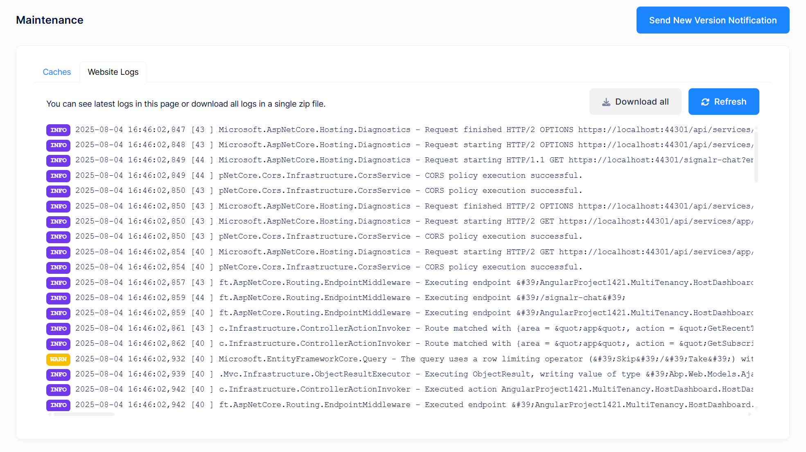
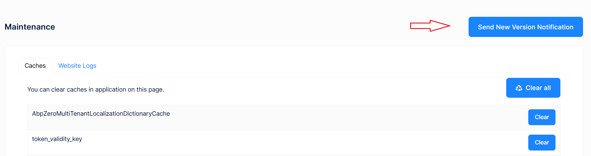

# Maintenance

Maintenance page is available to **host side** for multi tenant applications (for single tenant applications it's shown in tenant side) and shown as below:

## Caches

The **caches tab** is used to **manage the cache** of the application. You can **clear the cache** of the application by clicking the **Clear all** button or you can **clear a specific cache** by clicking the **Clear** button of the cache you want to clear.

## Website Logs

The **website logs** shows the logs of the application. You can download the logs by clicking the **Download** button.

## New Version Notification

When a **new version** of the application is available you can **send a new version notification** to the users.  The notification will be shown a **popup** to the users. After clicking the **ok** button their browser will be **refreshed** and the **browser cache** will be **cleared**.

## Next

- [Tenant Dashboard](Features-Mvc-Core-Tenant-Dashboard)