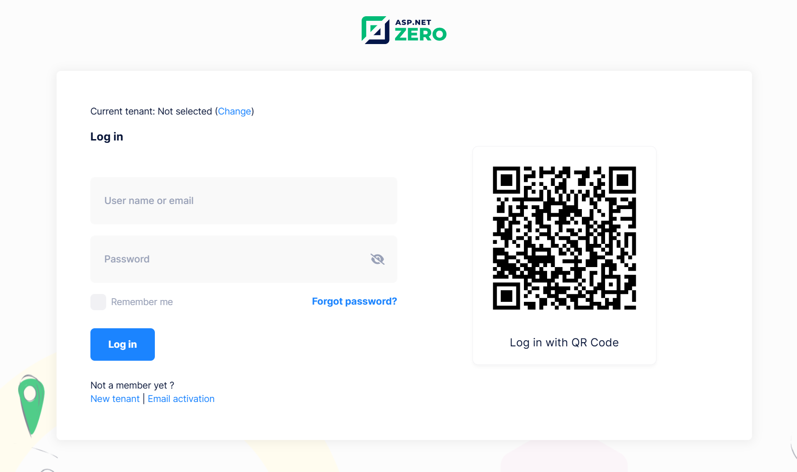

# QR Login Integration in ASP.NET Zero with MAUI

## Introduction
QR Login has been integrated into ASP.NET Zero, allowing users to log in to the web application by scanning a QR code from the MAUI application. This document explains how to enable and use QR Login in ASP.NET Zero with MAUI.

## Enabling QR Login
Before you can use the QR Login functionality, it needs to be enabled in the ASP.NET Zero web application settings. Follow these steps to enable QR Login:

1. Navigate to **Settings** in the ASP.NET Zero Web application.
2. Go to the **User Management** tab, locate the **QR Login** setting, and enable it.
3. Save the settings.

Once enabled, the login page on the web application will display a QR code for authentication.

> **Note:** After enabling QR Login on the Host Settings page, each tenant can independently enable or disable the QR Login feature in their specific tenant settings.

## Using QR Login in MAUI
The MAUI application allows users to authenticate by scanning the QR code displayed on the web login page. Here’s how users can log in through QR Login:

1. Open the **MAUI application** and log in.
2. Navigate to the **Sidebar Menu**.
3. Select **QR Login** from the menu.
4. If you haven't granted camera permission before, allow access to the camera.
5. The QR Code Reader will activate.
6. Scan the QR code displayed on the web application's login page.
7. If the QR code is valid, you will be automatically logged in to the web application.

## One-Way Authentication
QR Login in ASP.NET Zero provides a streamlined authentication flow. It supports one-way authentication, meaning that the user can scan the QR code without entering credentials manually, assuming they are already authenticated in the MAUI app.

## Summary
QR Login provides authentication method for users who are already signed into the MAUI app. By scanning a QR code from the web login page, users can instantly access the web application without entering credentials again. 

## Next

- [Sign Up](Features-Mvc-Core-Sign-Up)