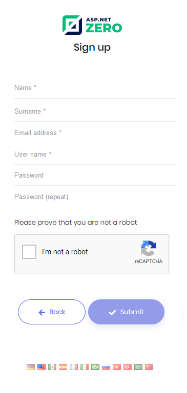

# Sign Up

When we click the "**Create Account**" link in the login page, a registration form is shown:

A user can be register for a tenant, not for host if this is a multi-tenant application. If it's single-teant, there will be no tenancy name input here.

**Recaptcha** (security question) is optional. It uses Google's Recaptcha service. Recaptcha service works per domain. So, to make it properly work, you should create your own private and public keys for your domain on <https://www.google.com/recaptcha> and replace keys in `appsettings.json` file.

## Next

* [Email Activation](Features-Mvc-Core-Email-Activation)