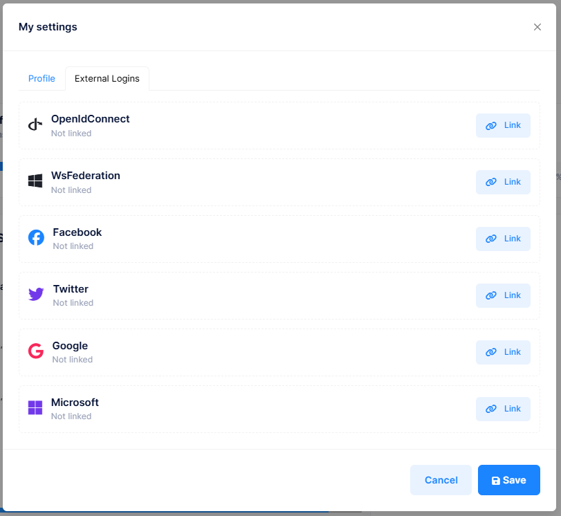
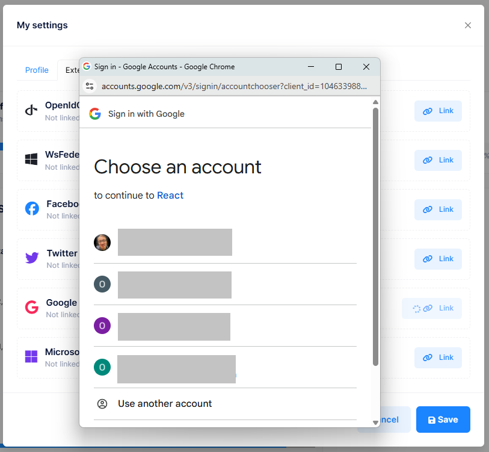
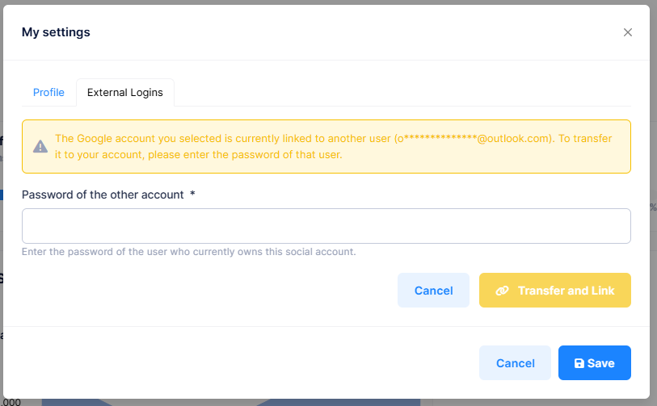
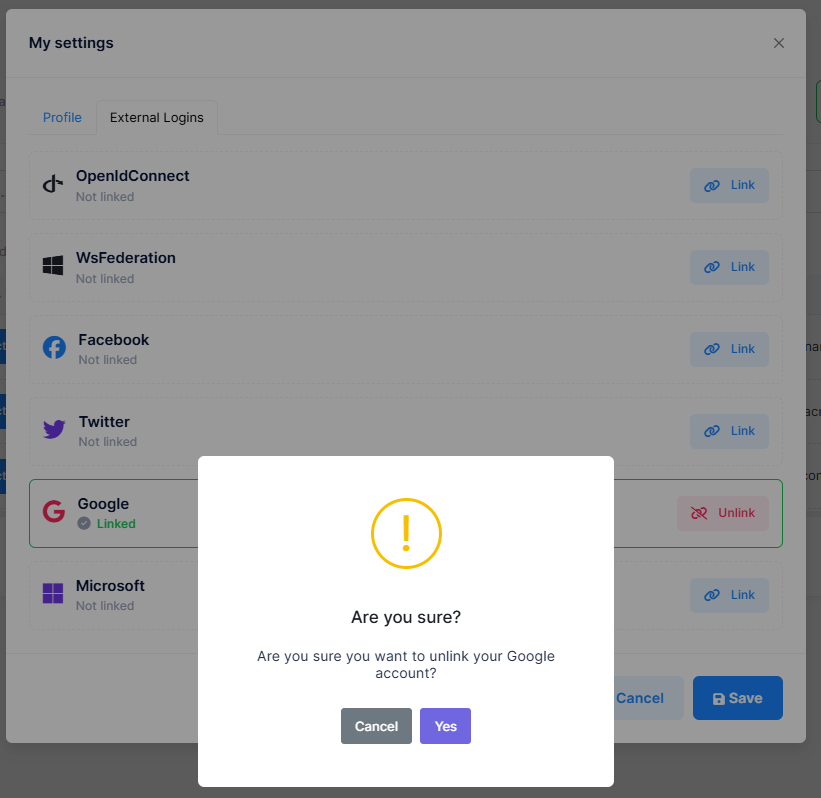

# Social Account Linking

Social Account Linking allows users to connect, transfer, and disconnect external login providers (such as Google, Facebook, Microsoft, OpenID Connect, WsFederation, and Twitter) from their existing ASP.NET Zero accounts. This feature is accessible from the **My Settings** modal under the **External Logins** tab.

There are three main scenarios this feature covers:

- **Linking**: A user with a password-based account can link one or more social providers to their account for easier login.
- **Transferring (Merge)**: If the social account being linked is already associated with a different user, the current user can transfer that link to their own account by verifying the other user's password.
- **Unlinking**: A user can remove a linked social provider. If the provider is their only login method, they must first set a password before unlinking.

## Accessing the External Logins Tab

The External Logins tab is located in the **My Settings** modal. To open it, click on your username in the top bar and select **My Settings**. Then switch to the **External Logins** tab.

This tab displays all available external login providers configured for the current tenant. Each provider card shows:

- The **provider icon** and **name** (e.g., Google, Facebook, Microsoft).
- The current **link status**: either **Linked** or **Not Linked**.
- An action button: **Link** for unlinked providers, or **Unlink** for linked ones.

> Note: Only providers that are enabled in `appsettings.json` and active for the current tenant are shown. See [Social Logins](Features-Mvc-Core-Social-Logins) for how to configure providers.

## Linking a Social Account

To link a social account to your existing ASP.NET Zero account:

1. Open **My Settings** and switch to the **External Logins** tab.
2. Find the provider you want to link (e.g., Google) and click the **Link** button.
3. Depending on the provider, either a **popup window** or a **page redirect** will occur for authentication.
4. After successful authentication, the provider is linked to your account and the status changes to **Linked**.

Once linked, you can use this social provider to log in directly from the login page without entering your username and password.

### Authentication Flow by Provider

The MVC application uses two different authentication flows depending on the provider:

| Provider | Authentication Flow | Description |
|---|---|---|
| Google | Client-side popup | Opens a popup window for Google authentication. |
| Facebook | Client-side popup | Opens a popup window for Facebook authentication. |
| Microsoft | Client-side popup | Opens a popup window for Microsoft authentication. |
| OpenID Connect | Server-side redirect | Redirects the browser to the OpenID Connect authority. After authentication, you are redirected back to the application. |
| WsFederation (ADFS) | Server-side redirect | Redirects the browser to the ADFS server. After authentication, you are redirected back to the application. |
| Twitter | Server-side redirect | Redirects the browser to Twitter for authentication. After authentication, you are redirected back to the application. |

For **server-side redirect** providers, the page navigates away from the application during authentication. Once you complete the login on the external provider's website, you are redirected back to the My Settings page, and the link is completed automatically.

## Handling Provider Conflicts (Transfer)

When you try to link a social account that is **already linked to a different user**, the system detects the conflict and offers a transfer option.

Instead of immediately linking, the system displays:

- A **warning message** indicating that the social account is currently linked to another user.
- The **masked email address** of the other user (e.g., `j***@gmail.com`) so you can identify the account.
- A **password input field** asking you to enter the password of that other user's account.

To complete the transfer:

1. Enter the **password of the other user's account** (the account that currently owns this social login).
2. Click **Transfer and Link**.
3. If the password is correct, the social login is removed from the other account and linked to your current account.

You can also click **Cancel** to abort the transfer and return to the provider list.

> This ensures that social accounts cannot be hijacked. Only someone who knows the password of the other account can transfer the link.

## Unlinking a Social Account

To remove a linked social provider from your account:

1. Open **My Settings** and switch to the **External Logins** tab.
2. Find the linked provider you want to remove and click the **Unlink** button.
3. A confirmation dialog will appear asking if you are sure.
4. Click **Yes** to confirm. The provider is unlinked and the status changes to **Not Linked**.

### When Unlink Is Not Available

If a social provider is your **only login method** (you registered via that provider and have no password set), the **Unlink** button will be **disabled**.

This protection prevents you from accidentally locking yourself out of your account.

## Setting a Password for External-Only Users

Users who registered through a social login provider (e.g., signed up via Google) do not have a password set on their account. These users have a special `ExternalLoginOnly` status.

To set a password:

1. Open **My Settings** and go to the **Profile** tab.
2. Navigate to the **Change Password** section.
3. Since you are an external-only user, the **Current Password** field is not required. Simply enter your **New Password** and **Confirm New Password**.
4. Click **Save**.

Once a password is set:

- The `ExternalLoginOnly` status is automatically cleared from your account.
- You can now log in with your username/email and password.
- You can now **unlink** any social provider, even if it is the last one linked to your account.

## Next

- [Two Factor Authentication](Features-Mvc-Core-Two-Factor-Authentication)
