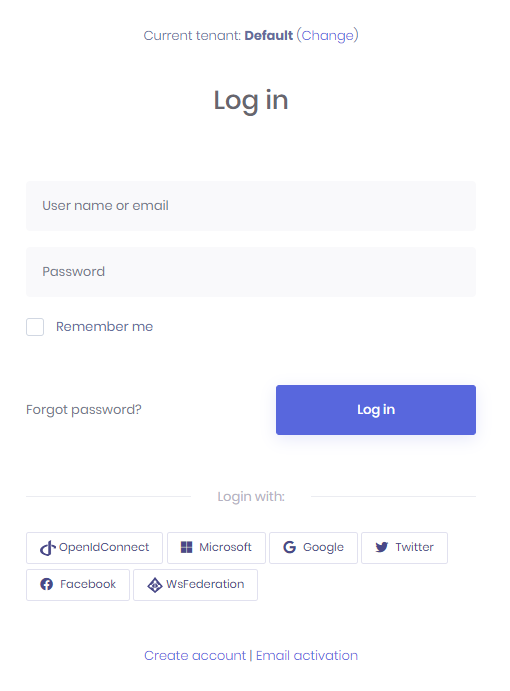
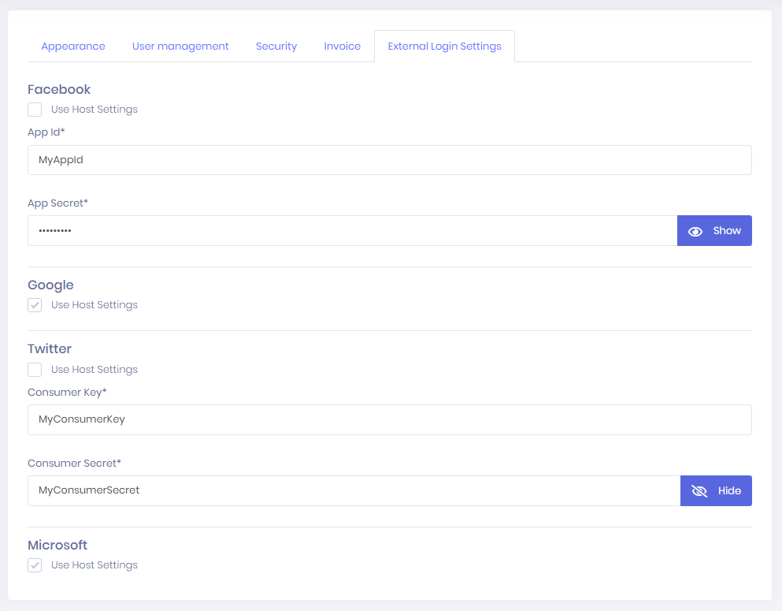

# Social Logins

ASP.NET Zero supports social media logins. To enable it, we should change the following settings in **appsettings.json** file.

```json
  "Authentication": {
    "AllowSocialLoginSettingsPerTenant": false,
    "Facebook": {
      "IsEnabled": "false",
      "AppId": "",
      "AppSecret": ""
    },
    "Google": {
      "IsEnabled": "false",
      "ClientId": "",
      "ClientSecret": ""
    },
    "Twitter": {
      "IsEnabled": "false",
      "ConsumerKey": "",
      "ConsumerSecret": ""
    },
    "Microsoft": {
      "IsEnabled": "false",
      "ConsumerKey": "",
      "ConsumerSecret": ""
    }
  },
```

You can find many documents on the web to learn how to obtain authentication keys for social platforms. So, we will not go to details of creating apps on social medias. Once you get your keys, you can write
them into `appsettings.json`. When you enable it, social media logos are automatically shown on the login page as shown below:



## Social Login Settings Per Tenant

You can allow tenants to change social logins settings. To enable it you should set `AllowSocialLoginSettingsPerTenant` to true in `appsettings.json`

```json
"AllowSocialLoginSettingsPerTenant": true
```

Then your tenant will be able to change their social login settings. If tenants don't set it, host settings will be used.




## OpenId Connect Login

In addition to social logins, ASP.NET Zero includes OpenId Connect Login integrated. It's configuration can be changed in `appsettings.json`

```json
"OpenId": {
  "IsEnabled": "false",
  "Authority": "",
  "ClientId": "",
  "ClientSecret": "",
  "ValidateIssuer": "true",
  "ClaimsMapping: []
}
```

In some cases, OpenId Connect provider doesn't return claims we want to use. For example, Azure AD doesn't return "nameidentifier" claim but ASP.NET Core Identity uses it to find id of the user. So, in such cases, we can use **ClaimsMapping** to map claims of provider to custom claims. AspNet Zero will find the claim with **key** and will map it to internal claim with **claim** value in the mapping. For the following configuration, external **objectidentifier** will be mapped to internal **nameidentifier** claim.

```json
"ClaimsMapping": [
	{
	  "claim": "http://schemas.xmlsoap.org/ws/2005/05/identity/claims/nameidentifier",
	  "key": "http://schemas.microsoft.com/identity/claims/objectidentifier"
	}
]
```

If you are using Azure AD for OpenID Connect and your app is multi-tenant on Azure side, then you need to disable issuer validation, so all Azure AD users can use your app. Note that, multi-tenant app here is the one you have created on your Azure portal, it is not related to AspNet Zero's multi-tenant feature.

```json
"ValidateIssuer": "false"
```

## Next

* [Two Factor Authentication](Features-Mvc-Core-Two-Factor-Authentication)