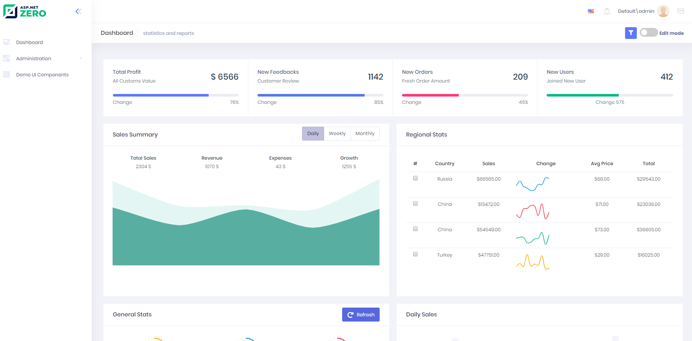

# Tenant Dashboard

ASP.NET Zero startup project also includes a **sample** dashboard. It's just for demo purposes, you can make it as a start point for your actual dashboard:

Client gets all data from server, server generates random data.

## Next

- [Notifications](Features-Mvc-Core-Notifications)