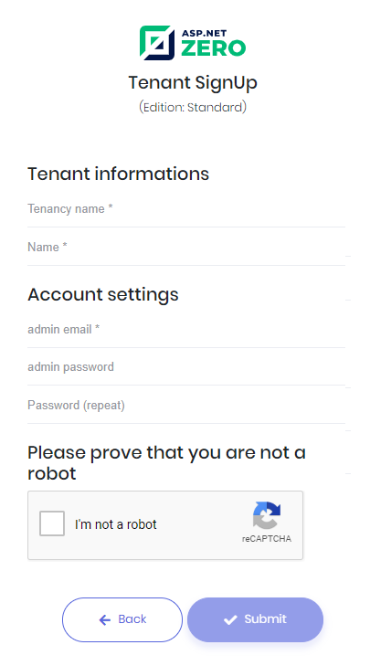
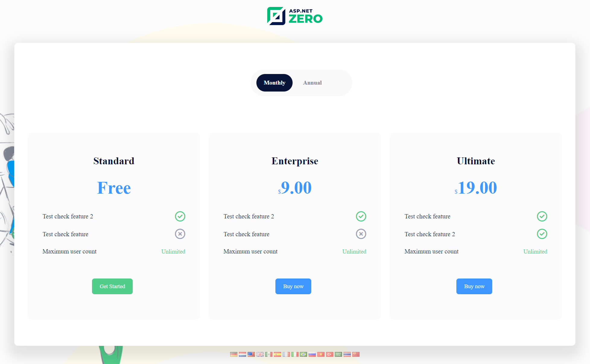

# Tenant Sign Up

Tenant sign up link is shown on the login form only if you are in the host context and tenant self registration is enabled. It points to `/TenantRegistration/SelectEdition`.

Tenant self registration is controlled by the **Allow tenants to register to the system** setting (`App.TenantManagement.AllowSelfRegistration`) under the **Tenant Management** tab of the [Host Settings](Features-Mvc-Core-Host-Settings) page. When it is disabled, the link is hidden and the registration pages throw a user friendly exception.

When you click the link, a registration form is shown like below if there are no Edition defined in the application:

If there is at least one Edition defined, then user will be redirected to edition selection page:

There are two type of editions, free and paid. Paid editions can have trial version. If an edition doesn't have trial version, "Free Trial" button will not be visible for that edition on the edition selection page. All selections on this page will redirect user to Tenant sign up page. If user selects "Buy Now" option, user will be redirected to payment page after the Tenant sign up page. For free and trial options, user will be logged in to system if "**New registered tenants are active by default**" option (`App.TenantManagement.IsNewRegisteredTenantActiveByDefault`) is enabled under the "**Tenant Management**" tab of Host settings page. If **New registered tenants are active by default** option is not selected, users will be redirected to tenant signup result page.

If user selects "Buy Now" option and pays for the edition subscription, user will be logged in directly even if the **New registered tenants are active by default** option is not enabled.

The registration is handled by `TenantRegistrationController` in the `.Web.Mvc` project, which uses `ITenantRegistrationAppService`:

| Action | URL | Description |
|--------|-----|-------------|
| `SelectEdition` | `/TenantRegistration/SelectEdition` | Lists the editions with their features, monthly/annual prices and the *Get Started*, *Free Trial* and *Buy Now* buttons. Redirects directly to `Register` when no edition is defined. |
| `Register` | `/TenantRegistration/Register` | The sign up form. Takes the selected `editionId`, `subscriptionStartType` and `paymentPeriodType` as query string parameters. |
| `RegisterResult` (view) | - | Rendered by the `Register` POST when the new tenant cannot be logged in directly, for example when it is not active yet or the email address has to be confirmed. |

reCAPTCHA is used on the registration form when the **Use captcha on registration** setting (`App.TenantManagement.UseCaptchaOnRegistration`) is enabled on the host settings page.

For more information about subscription system, you can check [Subscription](Features-Mvc-Core-Subscription) document.

## Next

* [Main Menu & Layout](Features-Mvc-Core-Main-Menu-Layout)
