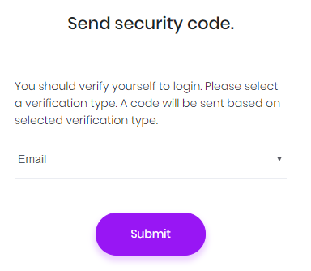

# Two Factor Login

ASP.NET Zero is ready to provide two factor login, but it's disabled as default. You can easily enable it in host settings page in security tab:


Note: In a multi-tenant application, two factor authentication is available to tenants only if it's enabled in the host settings. Also, email verification and SMS verification settings are only available in the host side. This is by design.

When it's enabled, user is asked to select a verification provider after entering user name and password:



Then a **confirmation code** is sent to the selected provider and user enters the code in the next page:


## Email Verification

This is available if user has a confirmed email address. Since email sending is disabled in debug mode, you can see the code in logs. In release mode, email will be sent (You can change this and make emailing available in also debug. See sending emails section).

## SMS Verification

This is available if user has a confirmed phone number. SMS sending is not implemented actually (because it requires an integration to an SMS vendor). Current implementation just writes security code to logs. You should complete **SmsSender** class in the solution to make it usable. Otherwise, disable SMS verification in the settings.

### Twilio Integration

In order to enable Twilio integration, just uncomment the following line in your **CoreModule** (in your .Core project):

```
Configuration.ReplaceService<ISmsSender,TwilioSmsSender>();
```

You also need to configure **AccountSid**, **AuthToken** and **SenderNumber** in `appsetting.json` file.

## Next

* [Forgot Password](Features-Mvc-Core-Forgot-Password)