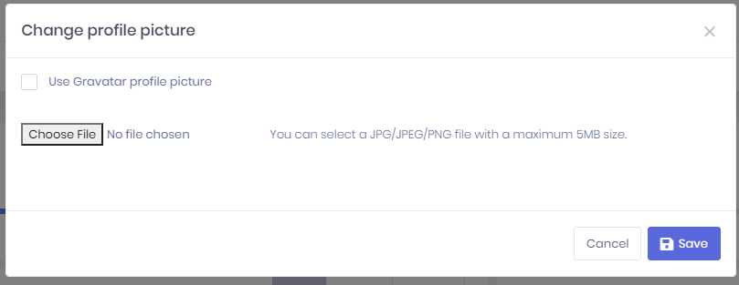

# User Menu

A user can click his name at top right corner to open user menu:

## Linked Accounts

Linked accounts are used to link multiple accounts to each other. In this way, a user can easily navigate through his/her accounts using this feature.

User can link new accounts or delete already linked accounts by clicking the "Manage accounts" link.

In order to link a new account, user must enter login credentials of related account.

**UserLinkAppService** class is used to manage application logic for account linking, **UserLinkManager** class is used to manage domain logic for account linking.

## Profile Settings

My settings is used to change user profile settings:

As shown here, **admin** user name can not be changed. It's considered a special user name since it's used in database migration seed. Other users can change their usernames. **ProfileAppService** is used to get/change settings.

## Login Attempts

All login attempts (success of failed) are logged in the application. A user can see last login attempts for his/her account. **UserLoginAppService** is used to get login attempts from server.

## Change Picture

A user can change own profile picture. **ProfileController** is used to upload and get user profile pictures. Currently, JPG, JPEG, GIF and PNG files are supported, you can extend it.

A user can also use Gravatar image for profile picture using change profile picture modal window.

## Change Password

**ProfileAppService** is used to change password.

## Download Collected Data

A user can download his/her collected data using this menu item.

## Logout

**AccountController** is used to logout the user and redirect to Login page.

## Next

- [Setup Page](Features-Mvc-Core-Setup-Page)